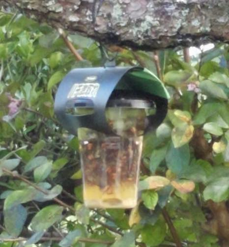

家の周りで巨大なスズメバチが飛んでいるのを目撃したことはあるだろうか。あれ怖いよね。

自宅にはハチ駆除スプレーを常備しているが、スズメバチを見つけて取りに行ってももう遅い。そういうときに役立つのが、設置式の捕獲・駆除器であるカダンのハチ激取れである。

<!--more-->

## 効果の程は

たぶんYouTubeとかAmazonのレビューとかで、スズメバチが大量に捕獲された状態の画像を見ることができると思う。苦手な人もいると思うので直接リンクは張ったりしないけれども。

ちなみにうちの場合、巨大なスズメバチが数匹捕獲できたりしてた。容器にいっぱいになるほどではないけれどね。それでもスズメバチに出くわして「うわぁ」ってなるよりは全然いい。

何か特別な薬剤が使われているわけではなく、自然素材の誘引液を使っているそうだ。環境にも優しい。

たまにハチではなくコバエやら、蝶々やら、はてはキリギリスが捕獲されたりするけれど。

意外とアシナガバチは捕獲できていない印象がある。スズメバチほどはっきり分かるサイズではないから取れてないと思っているだけかもしれないけれど。黒いツチバチなんかもよく見かけるが、あいつらもあんまり捕獲できていない印象。あくまで印象ね。スズメバチがでかすぎて見えてないだけの可能性もある。

## 設置場所の選定が難しい

この製品を使うに当たって一番難しいのが、これをどこに設置するかである。設置する場所によって捕獲できる・できないが随分違う。ある場所ではスズメバチが取れているが、ある場所では何も入ってないとかよくある。

お勧めはは2個セットのやつを買ってそれぞれ別々の場所に設置、しばらく様子を見て効果がなさそうなら別の場所に付け替えるというもの。意外と付け替え作業がめんどうくさいんだけどね。しかし、設置場所を変えるだけで効果がまるで違ったりするので、いろんな場所で実験してみるといいと思う。

製品には設置する時期についての説明もあるので、要チェック。たぶんハチが巣を作ろうとしだす時期に設置しておくのが一番いいはず。今（8月）だとすでにワーカーが動き回っているであろう時期なので、根本的解決にはならないかもしれない。ただ、飛び回るスズメバチの数が減ってくれるのはありがたいだろう。

どこかで設置時期の図があったと思うんだが、見つけられなかったので記憶で書くが、4〜6月あたりに設置するのがいいとか書いてあったような気がする。間違ってたらごめんやで。

## 設置時期について

やはり説明書というかパッケージには、4〜6月に設置するのが嬢王蜂の捕獲に繋がり、巣を作り防止にいいって書いてあった。この追記を書いているのは9月になるが、ワーカーが飛び回っているのだろう、こんなに入り込んでくるものなのかと驚くくらいスズメバチが入り込んでくる。

YouTubeなどでスズメバチだらけになった容器を見たが、まさか自分のところでもそんなになるとは思わなかった。

ちょうど室内から見える位置に設置したものがあり、それを室内からスマホで撮影したものになる。ちょっとボケボケだが、虫の苦手な人でもなんとか耐えられる程度のいい感じのボケ具合になってる気はする。

これを撮影する前日までは容器の上3分の1くらいにスズメバチがたまっている程度だった。ただ、この日は久しぶりにスカッと晴れた日だったからなのか、たった一日でいきなりこんなになっていた。それだけこのあたりにスズメバチが飛び回っているということである。

翌日にはもう容器いっぱいにスズメバチがたまっていたので撤去した。この撤去もなかなか難しい作業で、スズメバチが来ませんようにとお祈りしながらの作業となった。容器の上側には誘因液につかりきってない、生きたスズメバチが入っているのでこれもまた怖い。

さすがにハチスプレーを持って容器にかけながら対処したが、それでもやはり怖いものは怖い。すでに死んでいるとはいえ、スズメバチの面はかなり凶悪だからなぁ。

ちなみに、取り外してまた同じ場所に新しい激取れくんを設置した。取り外しの際にハチスプレーを噴霧したせいか、今のところスズメバチが入る様子はない。同じ場所に設置しても警戒されるのか、それともある程度期間を置かないとやつらも警戒するのか。とりあえずしばらく様子を見てみようと思う。

## 設置期間について

設置場所が重要と書いたのだが、実は設置期間もそれなりに必要な気がしてきた。2〜3日といわず、1週間程度は様子見しないとそもそも取れない可能性がある。

この写真の設置場所も、スズメバチが入り始めるまで1週間ほどかかった気がするからだ。一度入り始めるとあとはあれよあれよという間に埋まってしまったが。

2〜3日程度では効果の程が見えない可能性があるので、もうちょっと様子を見たほうがいいかもしれないなと思ったので追記しておく。