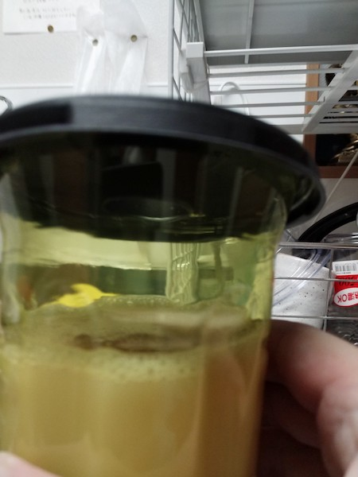

ハチ激取れを設置してから、びっくりするくらいのスズメバチが捕獲できたりしなかったりする。何度か使っているうちに、なんとなく使い方が分かってきたような気がするので、結果と合わせてレビューを改めて行おうと思う。

虫が苦手な人にはショッキングな画像があるかもしれない。

<!--more-->

## こんな簡単な構造

実はハチ激取れはかなり簡単な構造をしている。

たったこれだけの返しというか、漏斗型の入り口なのだが、これでいてなかなかスズメバチは逃げ出せないらしい。

誘引液を入れるとこのろうとの口までものすごく距離が近くなるのだが、それがよけいに効果があるのかもしれない。つまり出入り口の中央にいくためには誘因液の中を泳いでいかざるを得ず、スズメバチとしてはそれができたら苦労はしないのだろう。結果として容器の外側をよじ登っては落ちるを繰り返すのだろうと思われる。

誘引液をいれた全景はこんな感じである。これだけ出入り口に近いのだからすぐに逃げ出してしまいそうなものなのだが、逆に近いからこそ逃げれないのかもしれない。

ちなみに蓋とそれを覆う外装とでも言おうか、それは後の写真でも見せるが、私は念の為ガムテープなどで補強するようにしている。一度この外装が気づいたら外れていたことがあったからだ。

たぶんそれはしっかりと爪を挟み込んでいなかったせいなのだろうが、カバーが外れるとえらいことになるのでテープで補強している。そのときはスズメバチが大量に入り込んでいるものではなかったので事なきを得たが、スズメバチが大量にいる状態で外れると危険である。

## 設置してから実際に捕獲できるようになるまで

いまのところ3日ほど様子を見ないと、以前いれぐい状態だった場所でもスズメバチが入る気配は感じられない。3日ほど経てばいい感じに好みの匂いにでき上がるのか、それとも逆に急に現れた美味しそうな匂いに警戒して近づかないのかもしれない。ともかく設置してから3〜4日くらいは様子を見る必要があるというのは分かった。

一日置いてみて入らないから場所を変えるというのは性急過るようだ。もう少し我慢してみるのも必要ということだろう。

後は当然だが、スズメバチをよく見かける場所に設置するのが一番効果がある。よく見かける場所がわかれば苦労はしないのだが、だいたい餌場となるであろう花の近くなんかが良さそうではある。うちだとサルスベリの花の近くに設置したのだが、いれぐい状態である。それだけ頻繁にスズメバチを目撃したからこの場所を選んだわけだが・・・。

たまーにスズメバチが飛んでくるというレベルだと、なかなか効果は表れない。さすがに次に見せる画像ほどの成果になるには、頻繁にスズメバチが飛んでくる場所でなければならないだろう。

## 設置した結果

閲覧注意画像である。

撮影時間が日が落ちたあとだったので、フラッシュとまわりの暗さのせいでよけいに恐ろしさが際立った写真になってしまった気がする。

容器がスズメバチでいっぱいになってもなお入り込んでくるので、どんどん押し込められてすし詰め状態になる。

取り外すときはたいてい生きた状態のスズメバチがいるので、ハチスプレーを携帯しての作業となる。もはや入る余地はないだろうという状態でも、ハチが入ってくるのでスプレーは必須だ。

右上に薄茶色のものが移っているが、これが外カバーの補強に使っているテープである。テープがあるとハチが警戒するかなとも思うのだが、テープがあってもこれだけ入り込むのだから、補強しといた方がいいのかもしれない。

ちなみに何匹取れているのか数える気になどならない。だって怖いもの。死んでるとはいえ。

同じ場所で2個分いっぱいになるまで捕獲できた。別の場所でもいっぱいになるまで捕獲できたものが2つある。どれだけスズメバチがいるんだと嘆きたい。

ちなみにスズメバチがこれほどまでに入り込むので、アシナガバチもこの誘因液に興味を示すのだが、中に入っていく様子はない。これだけスズメバチがあがいていると流石に入れないだろう。

あとアシナガバチも一応捕獲対象として書かれているが、アシナガバチのサイズだと普通に逃げれそうな気がする。基本的にはスズメバチ用と思ったほうが良さそうである。

ちなみに激取れに入った変わり種として私が覚えているのは、キリギリスとチョウチョである。キリギリスはなんでお前入ったと思わざるを得なかった・・・。

スズメバチ以外にも蛾やコバエのような虫なども入り込む。そういうのがなかったら、スズメバチの激取れ漬けとして、捕獲後のこの状態でも売りに出せるのではないだろうかと思ってしまう。

## 捕獲後の処理

これがまた難しい。回収後は蓋を開けずにそのまま捨てろと書いてあるのだが、残っている誘因液はどうしたらいいのだろうね。いつも気になっている。

とりあえずビニール袋に二重にしまって捨てているが、それでいいのかいまいち自信がない。誘引液だけ捨てた方がいいのか、でもそんなことをしたらハチまで一緒に出てくるしなぁと思いつつ、まあ袋で二重に縛ってるからと捨てている。

もっとも、一番気を使うのは設置場所から取り外すときである。生きているスズメバチにおっかなびっくりしながら、さらに追加で周りに飛んでこないかビクビクしながらの作業なので。廃棄より取り外しが一番怖い。

意外と設置のときはそうでもない。ハチが飛び回る時間帯に設置しようとしなければ、設置と同時に集まってくるわけではないから気楽なものである。

取り外すときは本当に気をつけなければならない。

## まとめ

設置にあたってはできる限りハチをよく見かける場所を選ぶのがいいだろう。適当な選定をすると、キリギリスが入り込んだりする残念な結果になりかねない。

基本は餌場となる花がある場所の近くがいいのではないかと思っている。花がなくても捕獲できるが、捕獲できる量が少なかったりする。やはり餌場の近くが一番取れ高が多いと思う。

設置から数日の様子見は必要である。すし詰め状態になった激取れの設置場所と、まったく同じ場所に新しいものを設置しても、入り込むまで3日程度を要したからだ。

2〜3日の様子見を行って、それでも入らないようなら設置場所を変えたほうがいいだろう。

また、以前取れた場所だからといって同じ場所に設置し続けるんのもあまりよくないかもしれない。あの画像ほどのスズメバチが大量に2箱分とれたわけだから、巣の運営が立ち行かない程度のダメージを与えている可能性も考えられる。今3代目を取り付けているが、さすがに入ってくる様子が感じられない。

とにかく、その効果はしっかりと実感できたので、来年も活躍していただこうと思っている。

