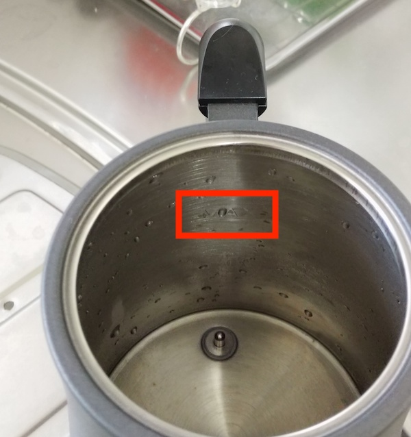

電気ケトルを買おうと思って、どうしても注ぎ口がコーヒー淹れるのにいいあのうにょっとした感じのやつにしようと心に決めていた。コーヒーを実際に淹れるかは別にして。

あの注ぎ口の形をなんと呼ぶのか知らんのだが、あのタイプの電気ケトルは探せば結構見つかる。種類はあるのだ。それこそ1万するようなやつからお手頃価格のものまで。

そんな中私は中堅に位置する価格帯の山善の電気ケトルを購入した。決め手はAmazonのレビューだったかなぁ。

まあ購入自体は随分前、それこそ数ヶ月前とかなんだが、ようやく自分で使うことができたのでレビューを書いておこうと思う。

<!--more-->

## 一人暮らしにピッタリ

まず容量が0.8Lである。逆に言うと、多人数で使うのには向かないのだが、電気ケトルで扱う容量としてはまぁまぁではないだろうか。0.8Lを具体的に言うと、でかいサイズのカップ麺にお湯を入れていい感じに使い切れるくらいのサイズ感である。

電気ケトルとしてはちょっと小ぶりかもしれないが、逆に0.8Lしか入らないので沸かすのも早いといえる。細かくお湯を使いたい人にはうってつけかもしれない。私は今の所カップ麺食べるときしか出番がないけれど、いつかコーヒー淹れるのに使おうと思っている。

## 機能が豊富

この電気ケトル、指定した温度にお湯を調整する機能がある。沸騰させるだけしかできない電気ケトルとはここがちょっと違う。

たとえばコーヒー淹れるのに何度がいいかとか忘れたが、少なくとも沸騰したお湯は使わない。もうちょい低い温度で入れたい、なんてときにこの温度指定機能が光るわけだ。

しかしいちいち調整しなくても、沸かしている最中に現在の温度がリアルタイムで表示されるので、希望の温度になったら外して使えばすむ。そんなわけで今のところ、温度調整機能は使った試しがない。でも選択肢としてあるのはいいことだよ。

さらにこの電気ケトルは沸かすのみならず、保温機能がある。保温機能はあるが、まあ基本使わない。なぜなら容量が少ないので保温しなければならないほど中身が残ることがあまりないからだ。そもそも保温したいならポットを買えという話である。

機能的にはこんなとこだが、やはり温度調整機能があるのはかなり珍しい部類だと思う。調整単位も一度単位で細かくできるし。細かく設定する必要があるのかといわれると反論に困るけれど。

さっと沸かしてさっと使える。沸かした後しばらく放っておいても保温機能で保持してくれる。そう考えるとめちゃくちゃ便利なやつである。

基本使わないばっか書いているが、何度もいうが選択肢があることはいいことだよ。たぶんね。

## MAX表示が見えない

大抵の電気ケトルには水を入れられる最大値を示す部分がある。それ以上入れると沸騰した際に吹きこぼれるから、無視すると危険なやつだ。

問題なのはこの山善の電気ケトルは、その最大値表示が異様に見づらいということである。

特になぜか持ち手側にMAX表示がある。なんでこっちにつけたの。普通逆でしょ・・・。持ち手をもって水を入れるのだから、注ぎ口側にMAXの線が書いてないと見えないではないか。

さらにMAXの表示が見づらい。線が認識しづらい。これもマイナス点だ。

携帯で撮影したものであること、水滴がついていることを差し引いてもこの見づらさ・・・ここだけは大きなマイナス点だと思う。

赤枠で囲っているが、それでも見づらい。写真だから見にくいとかではなく、実際に直視しても分かりづらい。

沸かす量が少ないなら適当でいいが、そもそも最大容量が0.8Lであるからして、沸かす際は限度まで沸かさないと必要な量に満たないことが多い。だからいつもこいつと格闘するわけである。

1. だいたいこのあたりかなというラインまで適当に水を入れる
1. 水平な位置に置き、持ち手側のMAX表示を確認する
1. 多すぎたら水を捨てる、少なすぎたら水を入れるという調整を行う

これがめんどくさい。注ぎ口側にMAX表示あればいくぶん違うのに、そもそもなぜ持ち手側に配置した・・・。

## 総評

価格としては中価格帯である。安いのはもっとある。

しかし他の電気ケトルに比べると、機能が豊富である。そして注ぎ口がコーヒー淹れるのにちょうどいいコントロールしやすいタイプでもあり、デザインもそれなりにおしゃれだ。

MAX表示がみづらすぎるのを除けば、とても使いやすい電気ケトルだと思う。ちょっと蓋が取りづらい印象はあるけれど。

容量的には一人暮らしにぴったりであるだろうと思う。カップ麺食べたいときにさっとわかせるしね。確か沸騰した後は保温でキープしてくれるはずだったと思うので、沸かしてる最中に他のことをしていても問題はない、はず。

電気ポットとどちらが電気代的にお得かは寡聞にして知らないので自分で調べて欲しい。ついでに結果を教えてくれるとうれしい。

購入対象に電気ポットもあったのだけど、コーヒー淹れるのに絶対こいつのほうが便利だからといってこれを買った。いまだにコーヒーは淹れていない。