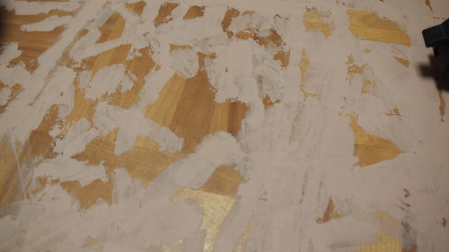
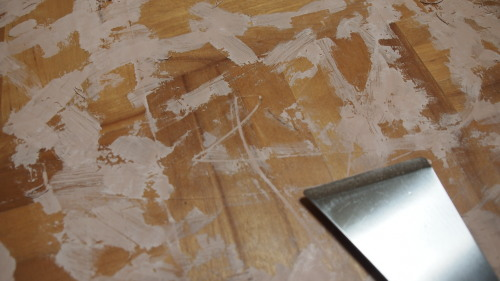
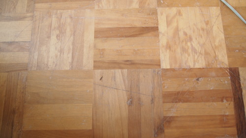

私の部屋の床は壮絶なまでに傷だらけ。模様替えをするときに、机やベッドをそのまま引きずって移動させたせいで、かなり広範囲に渡って傷と凹んでいる部分が目立ちます。床を掃除をするときに、クイックルワイパーをかければ、その凹み部分に引っかかる程です。

前々から足触りも気になるので、ちょっと<em>補修</em>してみることにしました。

## 試してみた

まずは木工パテAを試してみました。選んだ理由は、<em>補修した後でも塗装したり、ワックスをかけることができるから</em>です。

付属のヘラで、パテを盛ってはすき取るというのを繰り返していきます。するとプラスチック製のヘラが次第にすり減っていき、綺麗にすき取れなくなります。

仕方がないのですき取ることは諦め、とりあえず塗りたくって隙間を埋めて、後からヤスリをかけて平にすることにしました。塗装すれば綺麗になるだろうと。

後から分かりましたが、これは<strong>間違った使い方</strong>なので<em>真似しないように</em>。

結果・・・

・・・とても・・・汚いです・・・。

後からヤスリをかければなんとかなると思っていたのですが、<em>乾いた後はかなり硬くなる</em>ので、少々削ったところで綺麗になりません。完全に失敗してしまいました。

## 剥がす

<em>スチール製のスクレイバー</em>を買ってきてゴリゴリ削る。広範囲に塗りたくっているのでとても大変です。

せっかく埋めた隙間の部分も含めて剥がれていくので、<em>何のためにやったのか</em>意味がわからない状態になってしまいました。

削りカスで汚れるので、濡れた雑巾で拭きながら作業をする。<em>湿らせると剥がしやすくなります</em>。そして私はここでようやく気づきました。

説明書きをよくよく確認してみると、「<strong>はみ出した部分は濡らした布で拭き取る</strong>」と書いてありました。ヘラですき取れなんてどこにも書いてなかった！

## 最終的にはこうなった

木工パテAには、タモ白とラワンという色があって、私は<em>色の濃いラワン</em>というのを使ったのだが、それでも色が明るく床に盛った部分が明らかに目立ちます。そのため、住まいのマニュキュアを使って軽く着色してみました。

<a href="http://www.amazon.co.jp/exec/obidos/ASIN/B0020FPUJY/illusionspace-22/ref=nosim/" rel="nofollow" target="_blank">建築の友 住まいのマニキュア ミニ 10色セット</a>

posted with <a href="http://kaereba.com" rel="nofollow" target="_blank">カエレバ</a>

 建築の友住まいのマニキュア     

<a href="http://www.amazon.co.jp/gp/search?keywords=%8C%9A%92z%82%CC%97F%20%8FZ%82%DC%82%A2%82%CC%83%7D%83j%83L%83%85%83A&#038;__mk_ja_JP=%83J%83%5E%83J%83i&#038;tag=illusionspace-22" rel="nofollow" target="_blank" title="アマゾン" >Amazonで購入</a>

<a href="http://hb.afl.rakuten.co.jp/hgc/0e95387f.f2aef20d.0e953880.25e412bd/?pc=http%3A%2F%2Fsearch.rakuten.co.jp%2Fsearch%2Fmall%2F%25E5%25BB%25BA%25E7%25AF%2589%25E3%2581%25AE%25E5%258F%258B%2520%25E4%25BD%258F%25E3%2581%25BE%25E3%2581%2584%25E3%2581%25AE%25E3%2583%259E%25E3%2583%258B%25E3%2582%25AD%25E3%2583%25A5%25E3%2582%25A2%2F-%2Ff.1-p.1-s.1-sf.0-st.A-v.2%3Fx%3D0%26scid%3Daf_ich_link_urltxt%26m%3Dhttp%3A%2F%2Fm.rakuten.co.jp%2F" rel="nofollow" target="_blank" title="楽天市場" >楽天市場で購入</a>

使ったのは3色だけですが、木工パテAラワンの上に塗った場合の使い心地は以下の様な感じです。

<ul>
<li>ウッディナチュラル：予想以上に薄く色がつかない。床の木に直接塗っても<em>色がついているようにはあまり見えない</em>。</li>
<li>うす茶：どこが薄いんだというくらい<em>黒い</em>。</li>
<li>ブラウン：ちょうどいい感じ。（といってもライトオークくらいの色の木の上に塗ると濃いすぎてやや目立つ）
</ul>

完成後の右下にある黒い部分がうす茶で塗った部分。うす茶といいつつこれくらい濃いのです。

## かくれん棒と比較

木工パテでの補修に失敗した後に、<em>かくれん棒（ハードタイプ）</em>も試してみました。

<a href="http://www.amazon.co.jp/exec/obidos/ASIN/B001VLCYQ0/illusionspace-22/ref=nosim/" rel="nofollow" target="_blank">建築の友 かくれん棒 4色セット フローリング用</a>

posted with <a href="http://kaereba.com" rel="nofollow" target="_blank">カエレバ</a>

 建築の友 かくれん棒     

<a href="http://www.amazon.co.jp/gp/search?keywords=%8C%9A%92z%82%CC%97F%20%82%A9%82%AD%82%EA%82%F1%96_%81%40%83t%83%8D%81%5B%83%8A%83%93%83O%97p&#038;__mk_ja_JP=%83J%83%5E%83J%83i&#038;tag=illusionspace-22" rel="nofollow" target="_blank" title="アマゾン" >Amazonで購入</a>

<a href="http://hb.afl.rakuten.co.jp/hgc/0e95387f.f2aef20d.0e953880.25e412bd/?pc=http%3A%2F%2Fsearch.rakuten.co.jp%2Fsearch%2Fmall%2F%25E5%25BB%25BA%25E7%25AF%2589%25E3%2581%25AE%25E5%258F%258B%2520%25E3%2581%258B%25E3%2581%258F%25E3%2582%258C%25E3%2582%2593%25E6%25A3%2592%25E3%2580%2580%25E3%2583%2595%25E3%2583%25AD%25E3%2583%25BC%25E3%2583%25AA%25E3%2583%25B3%25E3%2582%25B0%25E7%2594%25A8%2F-%2Ff.1-p.1-s.1-sf.0-st.A-v.2%3Fx%3D0%26scid%3Daf_ich_link_urltxt%26m%3Dhttp%3A%2F%2Fm.rakuten.co.jp%2F" rel="nofollow" target="_blank" title="楽天市場" >楽天市場で購入</a>

床の凹みを埋めるだけなら、かくれん棒の方が楽チンです。ただかくれん棒だと、ロウを塗って埋めるような感覚で、<em>塗った部分がテカテカ</em>してしまいます。着色してごまかそうにも<em>塗料を弾く</em>のでごまかしが効きません。

作業はしやすいですが、補修する部分が広いと、<em>テカテカするせいで</em>違う意味で目立ってしまうかもしれません。

## 注意書きはちゃんと読んでから使おう

木工パテは、<em>手間をかければ</em>綺麗に補修ができます。やり方は、ヘラで塗りこみ、はみ出した部分は濡れ雑巾で拭き取る。パテが乾く前であれば、拭くだけで綺麗に取れます。

ただ濡れ雑巾で拭くと、せっかく盛った分まで拭い去ってしまうので<em>加減が難しい</em>です。また、<em>拭いた部分が痩せる</em>ので、<em>何回か重ね塗り</em>していかないと綺麗に埋まらないかもしれません。ちなみに、完全に乾いてしまう（盛ってから大体1日くらい？）と、濡れた雑巾で拭くだけでは除去できないので、はみ出した部分は盛ってすぐに拭き取った方がいいと思います。

チューブの口が結構大きいので、なかなか狙ったところにピンポイントで補充することができません。チューブの先が細くなっていて、ピンポイントで補充できると使いやすいのになと思うんですが、改良してもらえませんかね・・・？

そして綺麗に盛り終わったとしても、その後塗装をしなければ、<em>木の部分との色の違いが顕著</em>なのでとても目立ってしまします。

そんなこともあって、広い部分を補修しようとするとかなり面倒です。

  