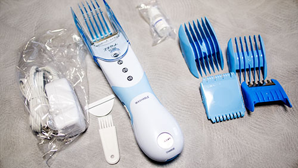

自分の頭をバリカンで刈ってみたい。だって、なんか面白そうじゃないですか？

昔から髪型には特にこだわりがなく、我慢できないくらいまで伸ばす → 一気に短くするというパターンを繰り返してきています。一時期は散髪代をケチるために、ギャッツビーヘアセルフカットで<em>自分で髪を切ってた時期もあります</em>。

<a class="amazonjs_indicator_title" href="#">ギャツビー ヘアセルフカットセット</a>

床に新聞紙を敷いて、パンツ一丁になって、後は手の感覚だけでチョキチョキ切っていくという、ある意味器用なことをしていました。お金はないが時間だけはあった学生時代には重宝していたものです。

自分で切っても、生来のくせ毛のおかげもあってか、人前に出られないほどひどい髪型にはなっていなかったはず（単に誰も指摘しなかっただけかもしれませんが・・・）。

そんな経験もあり、このほど念願（？）のバリカンデビューを果たすことになったので、早速レビューしてみます。

## 究極のコストカット

何と言っても<em>値段が安い</em>のがこの製品の特徴でしょう。1回使えば元が取れるのではないか、それくらい安いです。散髪代をケチろうと思ったら、これはかなり優秀だと思います。

値段の割に<em>アタッチメントも充実</em>しています。

アタッチメントは、<em>最長が4cm</em>ですが充分な長さでしょう。

## 長さを揃えるには何往復も必要

ハサミで切るのと違って、<em>長さを一定にできる</em>のがバリカンの利点だと思います。

といっても最初は刈り過ぎが怖いので、とりあえず4cmのアタッチメントだけを使って髪を切ってみました。

ちゃんと長さを揃えるためには、バリカンを<em>ゆっくり</em>と、<em>何度も</em>往復させないと長さが揃いません。切れ味の問題というよりは、刃の構造とアタッチメントの仕組みの問題だと思います。

イメージとしては、<em>すきバサミで刈り上げているような感じ</em>。軽く刈り上げるだけに留めると、髪のボリュームを落とすのにいいかもしれません（もっとも、スキ刈り用のアタッチメントは別にあるのですが）。

## 後片付けが大変

セルフカットで大変なのが、<em>切った後の処理</em>です。切った髪の毛が服につくわ、床に散らばるわで、髪を実際に切っている間だけでなくその後片付けにも時間がかかります。

バリカン自体の掃除は水洗いも可能ですが、それよりもハケを使って掃除した方がキレイにできる気がします。刃に油をさして手入れをする必要があるので、水洗いは逆に面倒くさいかもしれません。

床の掃除については、新聞紙を敷いていたとしても周りに飛び散るのでかなり大変です。いっそのこと排水口にヘアキャッチャーを取り付けて、風呂場で切ってしまった方がいいかもしれません。

この製品はコンセントから給電しながらでも、<em>充電池でコードレスでも使えます</em>。<em>防水でもある</em>ので、風呂場でカットするのも賢い選択かもしれませんね。

## ケープがあった方がいいかもしれない

切った後の髪が服に付着したり、床に散乱してしまうことを気にすると、髪を切ることに集中できません。特に頭の後ろ側を切るのに、<em>ケープがあった方がいいな</em>と感じました。床への散乱を気にして、後ろ側だけ長さがいびつになってしまったからです。

<em>後片付けを楽にする</em>意味でも、<em>キレイに刈り上げる</em>ためにも、ケープはあった方がいいのかもしれません。

## 最終的には風呂場で刈ることにした

後処理の問題から、最終的には素っ裸になって風呂場で刈るスタイルに行き着きました。これが一番楽だと思います。

<ul>
<li>服に髪の毛が付着することを気にしなくて良い</li>
<li>髪を刈った後には頭を洗わないといけない（じゃないと気持ち悪くてつらい）</li>
<li>髪を切った後の掃除が楽</li>
</ul>

リカンで刈った後の毛は、長い塊になっているものは簡単に処理できますが、細かい奴は掃除が大変です。服につくと払うだけでは取れませんし、カーペットに落ちた奴は掃除機で吸い込むのもなかなか大変です。その点風呂場でやれば、洗い流せば済む話なので断然楽です。

切った後の髪が散らばることを気にしながら刈るのは、結構なストレスになります。風呂場であれば刈ることだけに集中できるので、服を着たまま刈ることと比べたら遥かに効率的です。

ただこの方法にも欠点はあります。

まずは作業を始めたら風呂場から出られないことです。トイレに行きたくてもいけません。体中に切った髪の毛がこびりついているからです。掃除する場所を風呂場に限定したいのに、途中で風呂場から出るのは本末転倒です。途中で便意を催したら死を覚悟するしかありません。

また冬場は寒くて髪の毛を刈るどころではありません。素っ裸で30分〜1時間くらいの間いることになるので風邪を引きます。浴室暖房があってもツライです。お腹に響くので便意を催してしまいますし、冬場は素直に床屋さんに行ったほうがいいでしょう。

## コストカットに大活躍

散髪代を節約できるし、自分でカットするのも面白いです。

家族が反対したりしても、とりあえず買ってしまってみてはどうでしょうか。<em>ちょっと刈らせてみると意外とハマったりするかもしれません</em>。髪の毛をバッサバッサと刈り上げるのは、意外と楽しいのです。

後片付けが大変であり、コストはカットできても、その分余計に時間が必要になってしまうのが考えものではあります。ただ美容院に行く場合でも、移動にかかる時間と、自分の番が回ってくるのを待つ時間が必要であるということを忘れてはいけません。そこを考慮にいれると、時間がかかるという点に関しては意外とどっこいどっこいなんじゃないだろうかと思います。

もっとも自分で髪の毛を刈るのは、見た目を犠牲にするということであります。自分ではうまくできていると思っても、仕上がりがガタガタになっていたり、ところどころ長い部分が残っていたりすることでしょう。多少おかしくても許容できるという場合でない限り、手を出さないのが懸命でしょう。

私は髪の毛は短くなればそれでいいんだよという程度にしか考えていないので、床屋に行く時間と、かかる散髪代とが節約できていいなと思っております。そしてなにより「どんな感じにしましょう？」と聞かれた時に、うまいことオーダーできないのがもどかしくて苦手なのです。

そんなわけで、髪の毛がうっとおしくなってきたらバリカンでごっそりセルフカットするのです。
