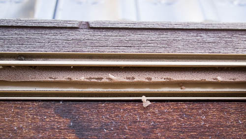
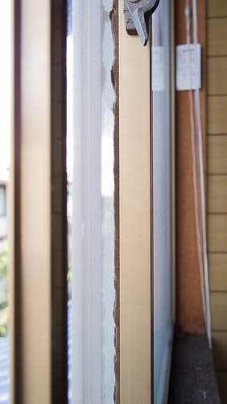
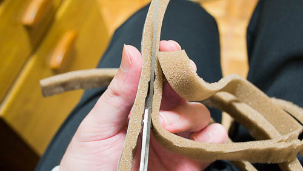
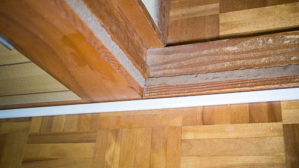
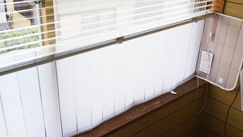

涼しいを通り越して寒くなりつつありますが、皆さんいかがお過ごしでしょうか。私は既に寒さに耐えられなくなってきております。むしろ寒さで体調を崩す始末であります。

夏の終わり際あたりに、部屋のカーテンをブラインドに取り替えたのですが、窓からやってくる冷気がかなり辛いことに気づきました。いやいや、これはきっとドア側からくる冷気のせいであってブラインドにしたせいじゃない。ほら、部屋のドアを締めてみたらマシになるはず・・・って寒いやんけと、窓側からくる冷気を否定できませんでした。残念無念。

ちなみにブラインドに変えたから、寒さのダイレクトアタックが辛いとは言い切れません。1年前のカーテンだった頃でも同じように寒かったかもしれません。しかし現実問題として窓側からなんかヒンヤリした空気が寄ってきていることに間違いはないのです。

だからといって、いまさらカーテンの生活には戻れないので（出費的にも見た目的にも）、隙間風対策グッズ＋アルファを買ってきて、何とか改善しないものかと試してみることにしました。

## 対策1　すきまテープ

まずは窓枠の隙間を埋めることにしました。密閉度が増して寒さが和らぐかもしれません。

<a class="amazonjs_indicator_title" href="#">ニトムズ すきまテープ徳用ロング 2巻パック 10mm×15mm×5m E1280</a>

窓のサッシ部分と、窓と窓の間に貼り付けました。

微妙に毛羽立っているのは、窓に接触した部分です。窓の開閉で抉られてしまったみたいです。

窓の間に貼りつけたものは、貼った後で窓が閉まらなくなってしまいました。慌ててスポンジ部分を切り取りなんとか閉まるようになりましたが、おかげで高さがガタガタです。

スポンジで柔らかいとはいえ、1cmの物が挟まるとさすがに窓の動きを阻害してしまいます。場所にもよるとは思いますが、ハサミ等で切って予め高さを調整しておいた方がいいかもしれません。

テープを貼った後からスポンジを切り取るのはなかなか難しいです。カッターナイフを使って切れないことはないですが、指を切らないように気をつけてくださいね。

ちなみに窓だけでは余ってしまったので、部屋の入口のドアのところにもとりつけてみました。

## 対策2　冷気ストップパネル

<a class="amazonjs_indicator_title" href="#">冷気ストップパネル M</a>

窓のところに立てかけるボードです。私が購入したのは、このタイプの製品の中でもボードの厚さが薄いタイプのものです。ボードの位置が目線の高さになるので、光が透過する分この製品がいいかなと思ったのです。

窓とブラインドの間に設置するだけなので取り付けは簡単です。

ただしこのボードは左右をマジックテープで止めるだけの構造です。さらにボードが11cmくらいの間隔で折れ曲がるような仕様のため、ピッタリと窓枠に収まるわけでもありません。立てかけてみたものの隙間風を完全に防げているのか微妙に感じます。

光を阻害しないのはいいところですけどね。

## 対策3　断熱スプレー

<a class="amazonjs_indicator_title" href="#">結露抑制 夏はヒンヤリ 冬はポカポカ 窓用省エネスプレー 寒い暑いその時</a>

隙間風対策ではありませんが、窓ガラスに窓用断熱スプレーを吹きかけてみました。これは今回のために買ってきたものではなく、夏場の断熱用に買ってきて余っていたものを流用しただけです。

効果の程は多分気休めレベルだと思います。

## 結果はどうだったか

3つの対策を施したわけですが、気休めレベルの対策でも、3つ重ねてみれば多少の効果は表れるのではないでしょうか。というか表れていて欲しいです。

実感としては、窓際から感じる冷気は多少和らいだような気がしますが、対策したから効果があるはずだという思い込みによるものだとも言い切れません。ただ、1000円ちょっとの出費で多少ましになったと感じられるなら、これはこれで良かったのかなと思います。

しかし相変わらず足元は寒いです。隙間風のせいかもと思って今回対策してみたわけですが、そもそも床自体が冷たいのかもしれません。

床からの冷気対策はまた別途考えるとして、とりあえず窓からの冷気が和らいだ気がするレベルになってよかったなと思います。

  