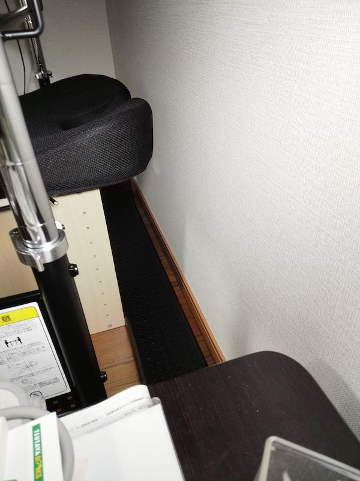

引っ越しに伴い作業机を新調することにした。今までずっと昔からある学習机を再利用していたので、高さが微妙に合わず、PC作業に向かないという悩みがあったのだ。

高さの微調整ができればよかったので、昇降式である必要はなかった。だいたい高さが調整可能な机で検索すると、ガス式昇降式デスクみたいなのばかりだったので、どちらかというと消去法でこのBauhutteの机になったといえる。

HDタイプではなく木目調のものも考えたのだけれど、天板の耐荷重が100kgあるHDタイプにしておいた。このあたりは耐荷重が大きいほうが丈夫でいいだろうという程度の考えである。

<!--more-->

## 組み立てについて

たぶんBauhutte製品を買う上で気になるのが、レビューで散見される組み立てに関する諸問題であろう。いわく制度が悪いとかそういうやつ。それは私も気にはなっていたのだが、えいやっと購入したわけである。

幸い、私のところに届いたこの机については、組み立て精度はそんなに悪くはなかった。ネジも普通に手で軽く締められる程度の精度であり、組み立てには特に困りはしなかった。組み立て2人以上でやれとのことだったが、1人で組み立てることができた。

ただし、高さの調整についてはやはり2人いないと無理。両側から少しずつ引っ張り上げる感じで調整が必要だ。この辺りは使う椅子と相談しながら高さ調整をかけるといいだろう。

## 微妙な点

高さ調整がかけられる関係上、机の脚が机の中心にある。これは特段問題にはならないが、問題となるのが奥のスペースである。

これがすごい扱いに困る。物を載せるには狭すぎるし、かといってこの部分の除いて物を置くには物が手前に来すぎて邪魔になるという。

とりあえず足置きとしてカラーボックスを置いてみたのだが、手前にきすぎである。机にはデスクラックを別途とりつけてあるため、あまり机の奥まで入り込んで作業することはないのだけれど、やっぱ邪魔である。

何か活用方法があればいいのだが、いいアイデアがない。幅というか奥行きになるか、それは壁にくっつけるとして15cm程度なので、あまり物を置くスペースとしては活用できなさそうだ。というより何かいい活用方法がないか教えて欲しい・・・わりと切実である。

## 全面マウスパッド

HDタイプの机には全面マウスパッドがついているのだが、正直いって私は不要である。一応今のところ強いてはいるものの、ゲームをするために買ったわけではないので、机全面にマットがあってもなぁという感じである。

フリマアプリで出品してもいいかなとは思っているが、これ要る人いるのだろうか。

## 天板の感じ

Bauhutteの机で、天板が文字を書くのに適さないという話があって、私も気にはなっていた。しかし実際にコピー用紙や裏紙に文字を書いてみたが、そこまで不都合は感じなかった。私が主に万年筆を使っているからかもしれないけれども。

もしくはHDタイプの天板はややなめらかなのかもしれない。全面マウスパッドの上でもかけなくはないくらいなので、あまり心配しなくてもいいかもいしれない。ボールペンだと影響が出るかもしれないけれど、そういうひとは万年筆使いなよ。カクノが安くて使いやすくてお勧めである。インクの消費量は多いので、頻繁なインク交換が必要なのが玉に瑕だけども。

<iframe style="width:120px;height:240px;" marginwidth="0" marginheight="0" scrolling="no" frameborder="0" src="//rcm-fe.amazon-adsystem.com/e/cm?lt1=_blank&bc1=000000&IS2=1&bg1=FFFFFF&fc1=000000&lc1=0000FF&t=illusionspace-22&language=ja_JP&o=9&p=8&l=as4&m=amazon&f=ifr&ref=as_ss_li_til&asins=B074698V4Y&linkId=8f636617234d752cd618be34d456ef77"></iframe>

## まとめ

総じてデスク単体についての満足度は高い。机の高さを微調整できて、幅が120cと広々としており、それでいて耐荷重も100kgまでとしっかりしている。この辺りは申し分ない。

一方で、構造上の問題で、机奥下のスペースが活用しづらいのが悔やまれる。ここの活用方法についてはマジでアイデア募集中である。現時点では電源タップをここに通すくらいしか思い浮かばない。そして、ケーブルがそこを這うと余計に何も置けなくなってしまってどうしようもない。

ちなみにこのデスクした奥のフレームの前にカラーボックス置いているが、椅子を奥にやろうとすると足に当たって邪魔である。カラーボックスは奥行きを短くして使えばなんとかなるかなとか思っている。が、やはりこの部分の空間の活用方法がなにか欲しいところである。

ちなみにカラーボックスを置いているのは収納のためではなく、椅子を使うときに足を伸ばすときの足置きとして置いてある。何か物を入れるためではないのだけど、ものも入れられるオットマンと考えると悪くない。

あとは梱包の問題なのか、棚板などに汚れがついているのがちょっと気になった。神経質すぎるかもしれないが、まあ拭けばきれいになる程度のゴミの付着だったので、致命的ではない。致命的ではないが、出そうとしてる高級感とそぐわないのでそこはがんばってほしかった。