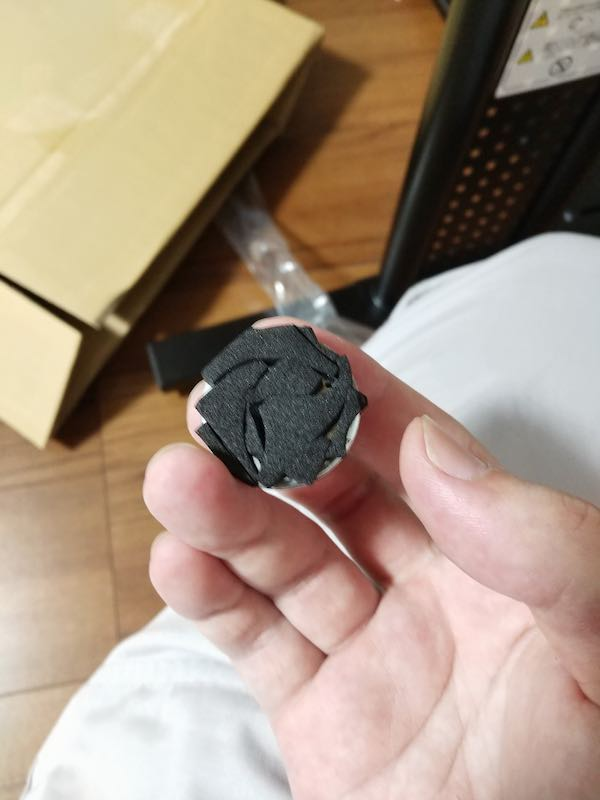

Bauhutteの机を買うにあたり、このデスクラックだけは追加で購入しようと心に決めていた。理由としては、机の上部に本などを置くスペースが欲しかったからだ。

中断にはモニタを配置することもできて便利だなと思い、机の上の収納スペースを確保する意味でも購入した。

<!--more-->

## 割と机の奥行きを専有する

購入したBauhutteの机の奥行きが55cmなのだが、このデスクラックの天板の奥行きはだいたい26cある。ということは、このラックがあることによって、机の上で実質使える空間は奥行き30cm程度になってしまうという弱点がある。

ノートパソコンを開いて作業する場合に、若干狭く感じてしまうのがマイナスポイントかもしれない。開けないことはないし十分作業できるんだが、奥までモニタを倒そうとすると普通にぶつかる。そんな距離感である。割とノートパソコンを机の前端ぎりぎりまでもってきていないと広げきれない。

ただ実際に机を使っていると、奥の部分はあまり利用しないので、実際にはそう影響しないのかなと思っている[^1]。といいつつ、今現在Macbook PROが半分宙に浮いた状態で作業しているけれど。

## 組み立て精度

制度自体は特段悪くはない。ただし、木ネジをねじ込む必要がある箇所がいくつかあるのがちょっとポイントである。

私は上段の棚の上下を間違えて背もたれつけてしまった。実は上下があるので気をつけられたし。

また、下の天板にはパット見だとわからないが鉄のフレーム2本で支えられている。それでもモニタを2台置くと天板がたわむというレビューを見かける。ちょっとそこが心配ではある。

最悪DIYでこの天板と机の間につっかえ棒となるような板を配置してやれば強度の補強になるだろうと楽観視はしているのだけれど。

## 悩ましい下天板の高さ

悩ましいのが下天板の高さである。3段階調整できるのだが、一番上はないとしても、2段目を使うか一番下を使うかが悩ましい。

私は当初2段目にしていたが、若干高すぎるかと思って1段目に組み直した。そうすると、机とデスクラックの天板の間が狭くなりすぎて、この空間の活用が難しくなる。とはいえ2段目だとモニタの位置が上すぎるような気がしてならない。非常に難しい問題である。

## 組み立てについて

組み立て精度については特に問題はなかった。木ネジがしっかりしまりきらないというか、常に回転を続けるので、ちゃんと固定できているのか心配なところはあるけれど。

組立時に天板や補強フレームなどは仮止めした状態で机にクランプ部分をはめ込むようになる。補強フレームなどの本締めをしてしまった後では、クランプが机にきっちりはまりこまないというよりか、幅が微妙に狭くなってしまってうまく取り付けできなくなるので注意しよう。

ついでに机に取り付ける際はクランプを狭くしすぎないことも重要である。私は横着してひとりでとりつけたせいもあるが、一箇所クランプのクッションが剥がれ落ちてしまった。

しょうがないので、クッションパーツの周りの部分の残りを寄せ集めてクランプクッション代わりにした。

見た目汚いけどしょうがない。私のミスであるからして、まあこんな感じでなんとかリカバーできただけでも良しとしよう。

取り付け時にはクランプの位置に注意しよう。というか、素直に二人で作業するのがいい。特に120cm幅だと大きいのでひとりでは大変である。

棚板や補強フレームを仮締めした状態で取り付けることさえ守れば、特に組み立てに困ることはないだろう。上段の天板の背板の取り付けの上下には気をつけたほうがいいが。

## まとめ

机の上の収納スペースを広げるという意味で、個人的には必須だと思っていたので机と同時に購入した。

総じて満足なのだが、次の点はもうちょっと工夫してもらえたらなと思った。

1. 上段の天板はやや斜めになるように取り付けてほしかった
1. 下段の天板の高さは1と2の間の高さが欲しかった

1については要は多少重心が後ろに来るように棚を並行ではなく傾けてほしかったということだ。そうすればここに置いた書類や本が落ちてきづらいだろうというのが私の考え。もっともこれは、DIYで背板と棚板の接合部分になんかたしてやれば実現できるので、やる気があればできると思う。その場合、書籍を置いたら背板に当たる部分が微妙にへこむ可能性があるけれど。前に落ちてくる可能性をとるかどっちをとるっていわれたら、斜めにした方がいいんじゃないだろうかと私は思うわけ。

もしくは棚の前面に落下防止用のワイヤーかなにかを設置するのも手かもしれない。何にせよ、この部分に物を置く前に落下防止措置が必要そうってのが気になるポイントの1つである。もし落下してきたらパソコンにダイレクトアタックだから気も使うわけである。それなりの高さから落ちてくるわけだから。

2については机とラックの下段棚板の間のスペースの活用の問題である。1番下にするとほぼ平たいものを滑り込ませる（ただし取り出しづらい）という状態にしかならない。間が狭すぎるのである。かといって2段目にすると広くはなるが、モニタの位置がちょっと高すぎるかなという感じになる。モニタアームを取り付けて高さを調整するという手も取れなくはなさそうだが、この棚板モニタアームつくんかいな？

もしくは机に取り付けるか。そしたら壁との間にモニタアームが入る分の隙間ができてしまうが
どうしたものかって感じ。

私としてはこの下段ラックと机の間にコンセントを配置して、ノートPCなど持ち運びするけど電源が必要なタイプのもの用の電源置き場として活用したいなと思っており、それをするには2段目くらいのスペースがないと難しい。モニタがちょっと高い位置に来るというのは、画角を下げることで対応できそうではあるから、そう致命的ではないかもしれない。

そんなところがちょっと気になるかなと言うレベルだろうか。

後は梱包の問題だろうが、机とときと同じで棚板などがやや誇りというか汚れをかぶっているのが気になった。私がつけたのかもしれないが、上段棚板の裏面には傷が入っている。他に不具合らしい不具合はなかったので、比較的良品を引けたと思ってよいのかもしれない。

[^1]: 机の奥のところは基本的に物置と化していることが多い。机の奥側にノートパソコン置いて作業することなどほぼないからだ。手が届かなくて逆に使いづらい。