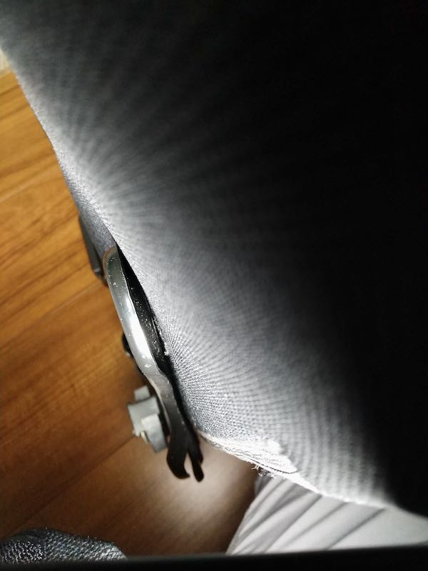
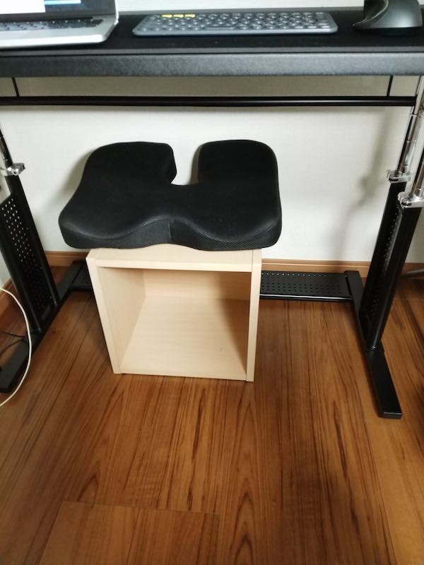

これまで机のサイズは体に合わず、椅子を一番下まで下げた状態で作業をしていた。普通の事務用の椅子ではないけれども、ぼろい中古で買った椅子を使っていた。リクライニング機能とかはないし、肘置きの調整もほぼきかないようなやつだった。

今回机を新調するに当たり、椅子も作業に快適になるよう新調しようと思っていた。エルゴノミックチェアに興味があったのだが、エルゴヒューマンはあまりに高すぎたし、机はBauhutteにしたので椅子もBauhutteにしてみたわけである。

ゲーミングチェアだがゲームはほぼしない。これからするかもしれないが、メインの目的としては、PCでのプログラミング等の作業用の椅子としての購入である。

<!--more-->

## 精度が悪い

とにかく届いた椅子の作りの精度の悪さにまず辟易とした。説明書には「ネジは最初手でねじ込んで、それからレンチなどを使って本締めしてください」と書いてあるのだが、そもそも最初の手で回して入れる段階がもう無理だった。普通に回らない。

この回らないというのは、何も部品を取り付けようとしながらだと回らないという意味ではない。単にネジ穴にネジだけ差し込んで回そうとしても回らないという意味である。どういう精度してるんだ。

ちなみにBauhutte家具シリーズを今回まとめて買って同日に組み立てているのだが、最初に組み立てたのがこの椅子である。ネジの精度というよりネジ穴の精度の悪さに半分ブチギレていたので、他の机等は普通にネジがハマったのでそれは良かった。

ちなみにネジがはまらないことについてどうしたかというと、しょうがないから最初から六角レンチでねじ込むしかなかった。部品を取り付けながらやると絶対にへんなことになるので、ネジ穴にネジだけ先に入れて、できるだけ垂直になっていることを確認した上でえいやとねじ込むわけだ。

まあとにかく精度が悪くて組み立てにすごい苦労した。その点だけで☆1つにしてもいいくらいな気分である。

ネジの精度以外にも、座面と背もたれをくっつける金具が開きすぎていてネジをはめ込むのに苦労するとか、制度面ではかなりあらが目立つものだった。

わかりにくい写真で恐縮だが、ネジをはめ込む部分と背もたれの部分にかなり大きめの隙間があり、ネジをはめ込むのにめちゃくちゃ苦労した。ちなみに反対側はちゃんと背もたれの形に沿った形になっていたので普通にネジ締めできた。こっち側のフレームはちゃんとなってなくて、止めるのに苦労したわけである。

もう一度この製品を組み立ててくれと頼まれたら、1万円積まれたら考える。ボランティアでは絶対にやらないと私はいい切る。二度とやりたくない。

ちなみに文句言いまくっているが、なんとか完成にはこぎつけた。むしろ完成しなかったらブチギレどころの話ではない。不良品として交換するにしても、物がでかすぎるので返品・交換対応するだけでも大変だからである。

ある程度購入には覚悟がいると思ったほうがいい。それとも私が引いた製品がたまたま精度が悪かっただけだろうか。

しかしながら、たまたまでも精度の悪い製品が混じっている事自体、購入をためらうのに立派な理由となりうる。それなりの値段のする製品なので、せめてネジ穴くらいちゃんとしとけよと私は言いたい。

## 完成後について

文句はこのあたりにして、完成した椅子の座り心地はよい。

リクライニングしない状態だとヘッドレストが若干じゃまになる。しかしそれは1段後ろに倒せば気にはならない。

最初はちゃちい作りだな[^1]と思った背もたれのクッションも、ゴムで止めてあるだけ故に自由に位置を調整できると考えれば便利な気がする。

リクライニングしたときは結構気持ちいい。正直今の私の寝具のあってないベッドで練るよりも、この椅子で寝たほうが気持ちいいんじゃないかというレベルで気持ちい。このリクライニングした状態でゲームとかすると楽でいいんだろうなぁと思う。

さすがにプログラミング作業はリクライニングした状態ではできないけれど。

ただ、ゲームはせずとも気分転換に本を読んだりすることはある。そういうときに、ちょっとリクライニングして足を伸ばしてやると、いい感じで本が読める態勢になれるのは超グッドである。

これはオットマンがほしくなるわと思った。

ちなみに私は机のレビューでも紹介したが、カラーボックスを足置きの代わりに使っている。

ちなみにカラーボックスの上に乗っているクッションっぽいものは、本当はお尻の下に敷いてムレを防止したり、骨盤を起こしたりするためのクッションである。

しかしこのゲーミングチェアに使うと座高が高くなりすぎてヘッドレストが意味なくなるので、オットマンとして使うときのクッションとして利用している。別途1万円ほどするオットマンをわざわざ買わなくとも、こうすれば足が伸ばせるわけである。偶然ながら高さ的にもちょうどよかったので、実にいい感じで足が伸ばせている。

というよりは、カラーボックスが邪魔で普通に足をおろした状態で作業するのにはじゃまになっているので、基本このクッションの上に足を放り投げた状態で作業している。

なぜか椅子の上に座っているのに座椅子で作業してるような状態になっている。座椅子生活が長かったから足伸ばしたいのかもしれない。

## 事務用の椅子として

やはりゲーミングチェアだから、事務用の椅子としては若干不向きな面も否めない。というのも、リクライニングしたときに快適すぎて、作業復帰が難しくなるという意味で向かないという意味だ。

背もたれぶぶんのクッションのおかげで事務作業するときにも自分でいい感じの位置に調整してやることで、作業しやすい姿勢が取りやすい。実のところ事務にも使える椅子ではある。

ただ、魔性のリクライニング効果から抜け出すにはなかなか勇気がいるので、多様は禁物である。仮眠するにはちょうどいいけどね。

あとは私はカラーボックスで代用しているが、リクライニングで使うならオットマンはあった方がいいだろう。

<iframe style="width:120px;height:240px;" marginwidth="0" marginheight="0" scrolling="no" frameborder="0" src="//rcm-fe.amazon-adsystem.com/e/cm?lt1=_blank&bc1=000000&IS2=1&bg1=FFFFFF&fc1=000000&lc1=0000FF&t=illusionspace-22&language=ja_JP&o=9&p=8&l=as4&m=amazon&f=ifr&ref=as_ss_li_til&asins=B07Q5L5RF5&linkId=5462016b4577ab214c581ecf7c737be2"></iframe>

足置きがあるのとないのとではかなり快適さに差があるので、セットで考えたほうがいいかもしれない。

ただしBauhutteの机と合わせて使うなら、机下奥側のフレームが邪魔になって、オットマンの位置調整が難しくなるかもしれない。実際私はカラーボックスが微妙にじゃまになっているから。

机を壁にくっつけたりしないのであれば、上記のオットマンはいい感じで固定できるらしいけれど。

総評として、組み立ては最低の体験だったが、完成品によるリクライニング効果は最高の体験だった。もう座椅子生活には戻れない。

ただ、やはり組み立てに関してはすごい苦労したので、万人にお勧めできるかと言うと微妙なところである。たまたま私が微妙な品を引いただけかもしれないが、つまりはそういう品を引く可能性があるということだ。値段の割に精度が悪いのはちょっとどうなのと思う。

あとはキャスターにロックがついているのだが、5つのキャスターすべてに個別にロックがついている。完全に固定しようと思ったらわざわざ5つ全部ロックしなくてはならないので、非常にめんどくさい。私はロックせずに使っている。常に滑るのは嫌だというひとには面倒くさい仕様かもしれない。

ただ、意図せず足で踏んづけてキャスターのひとつをロックしてしまう自体が起こりうるので、そこはちょっとめんどくさい。

あとは低座面仕様らしいんだが、あまり座高が高くできない。もっと高くして足が浮くくらいの方が使いやすいというひとにも向かないので注意が必要である。足が短い私でも、もうちょっと高くてもいいかなと思わなくもないところが限度なので。

無事完成させられるかどうかというところには目をつぶって、体格にきちんと合えば最高の椅子として活躍してくれるのではないだろうか。

特にそもそもはゲーミングチェアなので、リラックスしてゲームやりたいなんてときには最高の椅子だと思う。

[^1]: ゴムと留め具でぱちんと止めるだけ。