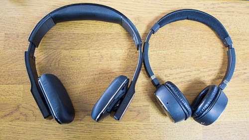
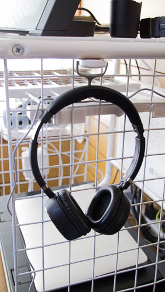
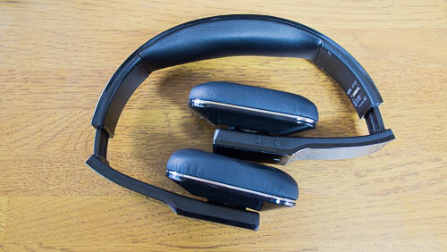

だいぶ前から使っていた<a href="https://wantit.gcreate.jp/wp-300/">Bluetoothのワイヤレスヘッドホン（WP-300）</a>の調子が悪くなったので買い換えることにしました。

以前から電源ボタンが反応しなくなってきていたのですが、ヘッドホンの電源を入れるのに5分以上も格闘しなければならず、「こんなの使ってられるか！」とようやく買い替えに至りました。

買い替えに二の足を踏んでいたのが、手頃で良さそうなものがなかなか見つからないというただ1点につきます。

以下の様な条件で探した結果、この製品を買うことにしました。

<ul>
<li>手頃かつ安すぎないこと（3,000円以下ではなくかつ1万円を超えないこと）</li>
<li>aptXに対応していること</li>
<li>マイクロUSBで充電できること</li>
<li>Bluetoothであること</li>
</ul>

3000円以下の安かろう・悪かろうな製品を買うことも検討したのですが、ほどほどなものがいいなと思っていたところ、この製品は5000円台で買えたので良かったです。

私は主にパソコンで音楽を聞くのに使うだけなので、通話機能については試していませんのであしからず。

## WP-300との比較

今まで使っていたWP-300と比較して、気になった点を表にしてみました。

<table>
<thead>
<tr>
<th align="center">項目</th>
<th align="center">WP-300</th>
<th align="center">LBT-AVOH03ABK</th>
</tr>
</thead>
<tbody>
<tr>
<td align="center">重さ</td>
<td align="center">軽い（110g）</td>
<td align="center">重い（180g）</td>
</tr>
<tr>
<td align="center">つけ心地</td>
<td align="center">挟み込まれる感じ</td>
<td align="center">ふわっと添える感じ</td>
</tr>
<tr>
<td align="center">充電しながら使用</td>
<td align="center">できる</td>
<td align="center">一応できる</td>
</tr>
<tr>
<td align="center">受信可能距離</td>
<td align="center">長い</td>
<td align="center">短い</td>
</tr>
<tr>
<td align="center">連続稼働時間</td>
<td align="center">短い（8時間）</td>
<td align="center">長い（16時間）</td>
</tr>
<tr>
<td align="center">対応コーデック</td>
<td align="center">SBC,APTX</td>
<td align="center">SBC,AAC,APTX</td>
</tr>
</tbody>
</table>
WP-300で気に食わなかった部分が解消されて、完全上位互換じゃないかと最初は思いました。しかし、使っているうちにWP-300の方が良かったところが出てきて、手放しで喜べない結果となってしまいました。

### WP-300と比較していいなと思ったところ

まずは音質がいいような気がします。音質の違いを聞き分けられるほど肥えた耳はしていませんので、何となくの感想ですけど。

商品写真を見て気になった変な形状の耳あて部分も、実際に装着してみると思いの外心地よくて良かったです。優しく包み込むような、耳に添えるだけっていう感じの装着感でして、長時間つけていても耳が痛くなりません。

私が今まで使っていたヘッドホンは耳を押さえつける感じで、私がメガネをかけているせいもあってか、長時間つけていると耳が痛くなってしまっていました。そのためヘッドホンを耳につけるより、ボリュームを大きめにして首にかけて音楽を聞くことの方が多かったです。

その点このヘッドホンは耳にかけっぱなしが苦ではありません。冬の間は耳の防寒対策にも使えて逆に外したくありません。これはうれしい誤算です。

WP-300と比較して本体の重量は重いのですが（+70gほど）、ふわっとした装着感のおかげであまり気になりません。逆に軽いけど強く挟み付けるWP-300の方が、ヘッドホンをつけていることが気になるかもしれません。

対応コーデックが多いこともいいところです。SBC、AAC、APTXと主要なコーデックに全対応しているので、送信側の機器に縛られることが少ないと思います。（WP-300だとAACには対応していませんでしたからね）

まあ私がメインで使っているSurface PRO2はSBCでの接続しか使えないんで、あまり関係ないことですけどね・・・。

### 逆にWP-300の方が良かったところ

WP-300に軍配があがることは3点です。

まず1つは受信可能距離の問題。WP-300だと2FのPCから音楽を再生しつつ、1Fに移動してもほぼ全ての部屋で音楽が聞こえていました。家全体をカバーできるくらいの広さです。

対してLBT-AVOH03ABKは階段の中程まで降りるともう聞こえなくなります。以前はパソコンで音楽を再生したままキッチンへ移動し、コーヒー淹れて一息つくなんてことができていました。これが割と快適だったんですけど、そんな使い方ができなくなりました。無念。

これは勝手な推測ですが、WP-300が音楽を聞くことしかできない単純な製品だったのに対して、このヘッドホンがヘッドセットであることが関係しているのかなと思っています。マイクから音声を拾って送信する必要があるため、電波の強度が低くなると接続を維持できなくなるのでしょう。

WP-300は受信だけでよかったので、弱々しい電波でも何とか再生できていたのだと思います。この点はLBT-AVOH03ABKが悪いのではなくて、WP-300が優秀すぎたと思うことにします。

2点目は充電しながらの使用に関してです。LBT-AVOH03ABKも充電しながら音楽を再生出来ましたが、USBケーブルを本体につなぐと一旦電源がきれます。充電しながら聞こうと思うと、USBケーブルをつなぐ→本体の電源を入れる→音楽を再生するという手順を踏む必要があって面倒くさいです。WP-300は音楽再生中にケーブルを繋いでもそのまま再生を続けてくれていたので、微妙なところではありますが残念です。

ただし連続再生時間がWP-300の倍近くあるので、充電しながら再生したいという場面にはそうそう遭遇しないかもしれません。充電を怠りさえしなければ、一日中再生していても電池は持つ計算ですからね。

もう1つは、割とどうでもいいことなんですけど、本体が大きくてしまい方にこまる点です。WP-300は頭頂部の部分が細かったので、こんな感じでフックに引っ掛けていました。

しかし、LBT-AVOH03ABKは幅が広くなったせいで、同じようなしまい方ができません。

こんな感じで折りたたむこともできるのですが、机の上に置いておくより、引っ掛けて空中に置いておきたいんですよね。

そもそも折りたたんだところで、場所をとることには変わりありません。

最終的に大きめのフックを取り付けてそこに引っ掛けることにしました。フックが大きくなって見た目がスマートじゃなくなりますが我慢することにします。

## マルチペアリングについて

マルチペアリング対応ということですが、音楽再生1，通話1で2台同時にOKという意味のようです。

パソコン2台と接続して、両方から音楽聞くみたいな使い方はできません。そういう使い方をするのであれば、パソコン側で接続の切り替えをしてやらなければなりません。

ペアリング先は8台まで記憶できるそうです。ただし複数のデバイスとペアリングすると、意図したデバイスとつながらなくてやきもきしたりするので、メインで使うものとだけペアリングして使うのがいい気がします。

特に携帯電話とペアリングしていると、意図せず電話をかけてしまうので注意が必要です。（ヘッドホンの電源ボタン2回押すとリダイヤルしてしまうため）

こういうことがあるので、マイク無しの純粋なヘッドホンが良かったんですけどね・・・。

総合的に考えて買い替えてよかったなとは思いますが、こうして考えてみるとWP-300はかなり理想的なデバイスだったなと思います。（ただ1点、電源ボタンが反応しなくなる点を除けばですが）

  