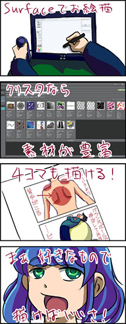

Surface PRO 2を購入してから、お絵描きには<em>CLIP STUDIO PAINT PRO</em>（以下クリスタ）を利用しています。それまではSAIを使っていたのですが、Windows8での動作がしっくりこなかったこともあって乗り換えました。

描き心地はSAIと比べると大差ないかなぁという印象です。Windows8で比較すると、比べ物にならないほど軽快ではあります。ただ、SAIと比較するとツール類がごちゃごちゃしているなぁと思ってしまいます。

## クリスタを使って便利だなと思ったところ

クリスタユーザが使用しているペンツール等の設定や、吹き出しや効果線といった素材などが公開されており、クリスタに取り込んで使用することができます。私はredjuiceさんの公開されているペン設定を利用させて頂いております。色塗りはほとんどベタ塗りペンを使っています。ありがたやありがたや。

その他にも、クリスタにはコマ割り機能があり、4コママンガなんかも簡単に描くことができます。今回の4コマも、このコマ割り機能を利用して描いています。

といっても、私はこの程度の機能しか利用していません。他にもいろんな機能が豊富にありますが、私はまっく使いこなせておりません。

レイヤーツールの挙動はSAIの方が分かりやすいなと思うのですが、ペンツールの動作は、私はクリスタの方が好みです。

その辺りの好みは人それぞれだと思うので、好きなツールを使ってお絵かきすればよいと思います。クリスタは1か月間試用できるので、気になる方は試してみてはいかがでしょうか。

## 描いている様子

今回の4コマを描く様子を動画にしたので、良かったらご覧ください。倍速での再生ですが、Surface＋クリスタでのお絵描きの様子が少しでも伝わればと思います。Suface PRO 2単体でも充分にお絵かきできます。

<iframe width="500" height="281" src="//www.youtube.com/embed/oAIbBcDPecQ?feature=player_embedded" allowfullscreen></iframe>

最近ではCintiqで描くより、Surface単体だけでパパっと描いてしまうことが多いです。たまにブログに載せている4コマはすべてSurface単体で描いたものです。
