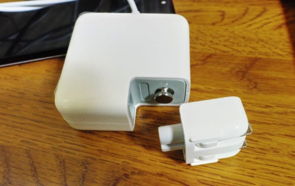

Macbook Air用に互換アダプタを購入した。以前使っていたMacbook Air（2011年モデル）が充電できなくなったのが購入した理由である。

充電できないと一言に言っても、その原因はアダプタ・バッテリ・はては本体が考えられる。しかし手元に原因を切り分けるための機材もなく、どうしたもんかなぁと思っていた。今ではMacbook Proをメインに使っているので、Airが使えなくても一切困ってはいない。困ってはいないがもったいないという気持ちがあった。

Proのアダプタはコネクタの形状がT型であり、AirはL型のコネクタになる。つまりアダプタを使いまわすことができない。変換コネクタがあればいいのだが、T→Lのコネクタはどうもなさそうだった。仕方がないから互換アダプタを買ったというわけである。

ほとんど使う予定のないAirのために、純正品のアダプタを買うのはあまりにも馬鹿らしいので、価格が4分の1ですむ互換アダプタを買った。使用頻度が低いので互換アダプタでいいかと思ったのだ。ちなみに充電できない原因はアダプタにあったようで、互換アダプタで充電できるようになった。

ただしその品質は、当たり前だが純正には遠く及ばない。まあ安い互換品だからねという感じの作りである。通電するだけ良かったねという感じなので、メインマシンのアダプタとしては私は使いたくないと思っている。

理由その1、アダプタ部分が加熱する。純正アダプタと比較すると明らかに熱をもつ。挿しっぱなしにしておくのが怖い。挿したまま放置していたらなんか発火しそうで怖い。普段のようにアダプタ挿しっぱなしでの運用はやらないようにしようと心に誓った。

理由その2、本体とのコネクタ部分（マグネット部分）の接続がぎこちない。パチっとマグネットでくっついたあとにちゃんとハマるように位置調整する必要性がある。互換品だから仕方ない。

理由その3、コンセント部分がゆるい。コンセントからアダプタを抜くときに、先端部分だけコンセントにささったままで、アダプタが抜けてしまうことがあった。そんなことになって大丈夫なのかと心配になる。

この写真のようにコネクタを付け替えるときは楽でいいが、コンセントに先端だけ残ってしまうと、どうもいい気分にはならない。あくまで気分的な問題である。

理由その4、ケーブルの品質がいまいち。梱包時に束ねてあったせいなのかは知らないが、癖がついていて純正品に比べると見栄えが良くない。これは別に使い勝手に影響するわけではないけれども。

そういう理由から、メインで使っているMacに互換アダプタを使うべきではないと思う。通電はしているし、使えてはいるけど、正直それだけである。メインマシンでは絶対に使いたくないと思う。
