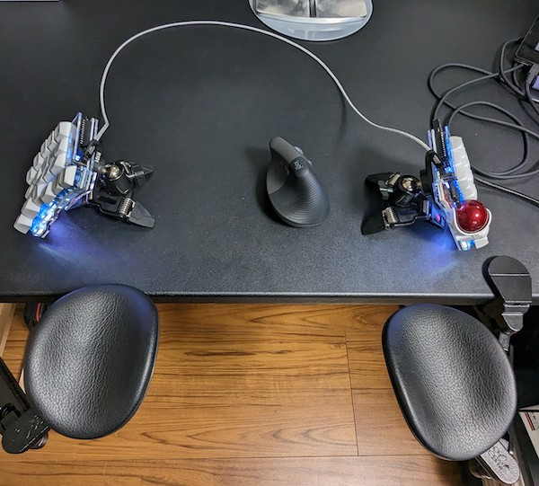
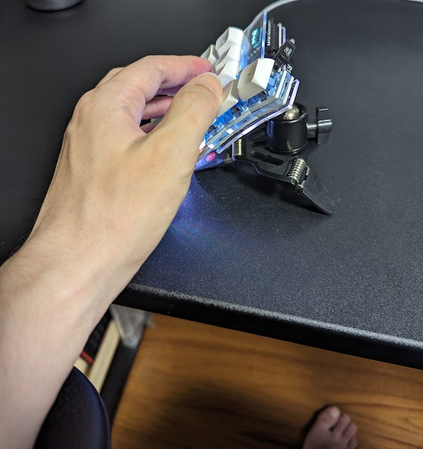
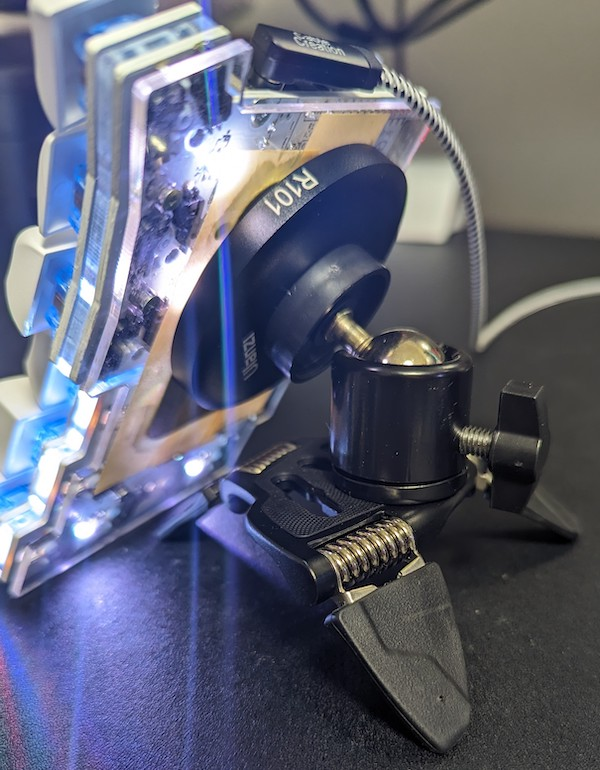

キーボードをKeyball39に切り替えて、分割キーボードを堪能している。分割キーボードによってかなり姿勢が楽にはなったが、さらに環境を突き詰めるべくエルゴレストを購入した。

高いだけあってなかなか快適だ。

<!--more-->

##　　テンティングを支える腕置き

エルゴレストを購入した一番の理由は、キーボードを打つときの腕置きにするためだ。特に、キーボードをテンティング（傾斜をつけることを界隈でこういう）させる際のサポートとして購入した。

しばらくはほんのり中央が高くなる程度で使っていたが、ものは試しと角度を50度くらいにして使っている。さすがにここまで角度をつけると、腕を机の麺よりも高くしないと入力が安定しない。

これまでは椅子のアームレストでなんとかなっていたが、それも限界ということでエルゴレストに白羽の矢が立ったというわけ。

キーボードをここまで角度つけて使うことに意味があるのかと思われるかもしれないが、最初はちょっと違和感がある程度で、慣れると手首に負荷がかかっていたことに気づく。手首が縦に近づくほど腕にとっては自然な姿勢となる。偶に普通のキーボードに戻ったときにそれは特に実感する。

Keyballをテンティングすることで得られるメリットとしては、腕や肩が自然な姿勢となる以外に、トラックボールを意図せず触ってしまうことが防げることが挙げられる（私の場合はだが）。普通に横置きしてたときはやたらとトラックボールに触れてしまっていたが、角度をつけることでそれがなくなったのは嬉しい誤算だ。

ちなみにテンティングをどうしているかというと、三脚に自由雲台をとりつけている。Keyballとの固定は、マグネット雲台とスチールプレートを使っている。

スチールプレートはたんにマスキングテープでアクリルプレートに固定しているだけ。ちなみにこれが両方に必要なので結構な出費となる。安定性と価格とを天秤にかけこの辺は皆さん工夫しているようだ。

<iframe sandbox="allow-popups allow-scripts allow-modals allow-forms allow-same-origin" style="width:120px;height:240px;" marginwidth="0" marginheight="0" scrolling="no" frameborder="0" src="//rcm-fe.amazon-adsystem.com/e/cm?lt1=_blank&bc1=000000&IS2=1&bg1=FFFFFF&fc1=000000&lc1=0000FF&t=illusionspace-22&language=ja_JP&o=9&p=8&l=as4&m=amazon&f=ifr&ref=as_ss_li_til&asins=B019SZ9YUY&linkId=e2212e053f482d0502ad8386a887e760"></iframe>

[ウランジ Ulanzi 3004](https://www.yodobashi.com/product/100000001007427356/)

<table border="0" cellpadding="0" cellspacing="0"><tr><td>
<table><tr><td style="width:240px"></td><td style="vertical-align:top;width:248px;">
<a href="https://hb.afl.rakuten.co.jp/ichiba/339c5c1b.797d4b25.339c5c1c.680e0f2f/?pc=https%3A%2F%2Fitem.rakuten.co.jp%2Ffunlifestore%2Forg02115%2F&link_type=picttext&ut=eyJwYWdlIjoiaXRlbSIsInR5cGUiOiJwaWN0dGV4dCIsInNpemUiOiIyNDB4MjQwIiwibmFtIjoxLCJuYW1wIjoicmlnaHQiLCJjb20iOjEsImNvbXAiOiJkb3duIiwicHJpY2UiOjEsImJvciI6MSwiY29sIjoxLCJiYnRuIjoxLCJwcm9kIjowLCJhbXAiOmZhbHNlfQ%3D%3D" target="_blank" rel="nofollow sponsored noopener" style="word-wrap:break-word;"  >ボールヘッド雲台 自由雲台 360度回転可 1/4ネジ穴 ダイヤル 角度調整 アルミ合金 ホルダー/マウント、パノラマ雲台、セルカ棒、三脚、一眼レフ等に 回転雲 KDBQ29</a> 価格：898円（税込、送料無料) (2023/7/5時点)

<a href="https://hb.afl.rakuten.co.jp/ichiba/339c5c1b.797d4b25.339c5c1c.680e0f2f/?pc=https%3A%2F%2Fitem.rakuten.co.jp%2Ffunlifestore%2Forg02115%2F%3Fscid%3Daf_pc_bbtn&link_type=picttext&ut=eyJwYWdlIjoiaXRlbSIsInR5cGUiOiJwaWN0dGV4dCIsInNpemUiOiIyNDB4MjQwIiwibmFtIjoxLCJuYW1wIjoicmlnaHQiLCJjb20iOjEsImNvbXAiOiJkb3duIiwicHJpY2UiOjEsImJvciI6MSwiY29sIjoxLCJiYnRuIjoxLCJwcm9kIjowLCJhbXAiOmZhbHNlfQ==" target="_blank" rel="nofollow sponsored noopener" style="word-wrap:break-word;"  >
楽天で購入
</a>
</td></tr></table>
 

</td></tr></table>

<iframe sandbox="allow-popups allow-scripts allow-modals allow-forms allow-same-origin" style="width:120px;height:240px;" marginwidth="0" marginheight="0" scrolling="no" frameborder="0" src="//rcm-fe.amazon-adsystem.com/e/cm?lt1=_blank&bc1=000000&IS2=1&bg1=FFFFFF&fc1=000000&lc1=0000FF&t=illusionspace-22&language=ja_JP&o=9&p=8&l=as4&m=amazon&f=ifr&ref=as_ss_li_til&asins=B08WHNHCTQ&linkId=c952217d4645984f67537f7601ed5af4"></iframe>

## エルゴレストの使い心地について

稼働はスムーズで違和感がない。高さはスムーズに変更することはできないが（ネジで調整するため）、一度高さを決めてしまえば前後左右の移動はスムーズ。

平行移動はスムーズだが動いてほしくないときはしっかり保持される。この微妙な塩梅がよくできている。動くのを邪魔せず、かといって動かしたいときはスムーズに。下方向への荷重によって動かないのかなとも思うが、どうもそうではないらしい。絶妙なバランスで成り立っているんだろう。

動きがスムーズというのは聞いていたが、たしかにこれは気持ちがいい。

机が拡張したかの錯覚してしまい、マウスが机からこぼれ落ちるなんてことが起こる。肘が保持されているから調子に乗ってマウスを手前に持ってきてしまうのである。Keyballにしてからマウスの操作頻度が減ったが、マウス操作時は気をつけたい。

椅子の肘当てと干渉するので、そこは変えざるを得ない。というよりも、エルゴレストにしてからというもの、机を昇降デスクに、椅子も新調してしまうおうかという誘惑にかられてしまう。

とりあえず昇降デスクに手を出すのはわりとありかもしれない[^1]。

アームの耐荷重はそこそこ信頼できそうな感じで、頻繁に肘をついて体重をかけているがびくともしない。片側によりかかる感じで頬杖ついたりしているので、その辺は大丈夫そう。

強いてあげるとすれば、アームが直線状態から曲げるときに途中で曲がらず突っ張る感じがあるのが気になるかなあ。二次側アームが曲がりさえすればあとの動きはスムーズなんだけどね。

## 設置方法について

設置方法は本体のクランプで机に固定するだけ。工具不要で設置できる。どういう机に取り付けられるかは公式のよくある質問を確認してほしい。

[ergorest よくある質問](https://www.ergorest.jp/03.html)

クランプで固定するため、天板がコの字型をしている場合は取り付けは難しい。

私はスタンダードタイプを購入した。しばらく使ってみて右側だけロングアームにするというのも手だったかなあと思った[^2]。

マウスパッドはないモデルを選んだ。マウスを置く位置にキーボードがあるので邪魔になるかなと思ったのがその理由。

机にクランプで出っ張りができるのだが、あまり気にはならない。机の上をめっちゃきれいにしている人なら若干気になったりするんだろうか。私の机の上は基本的にちらかっているので単に気にならないだけかも。

## まとめ

腕の位置が安定したので買ってよかったなと思う。椅子のアームレストでも十分と思っていたが、やはり幅が固定されるなど制約が多かったんだなと感じる。腕の高さもそうなのだが、前後左右の微妙な位置取りでも姿勢が変わる。エルゴレストに慣れるともう椅子の肘当てには戻れない。

腕の置き場所が安定したが、気をつけないと肩が前に来てしまい痛める原因になってしまうので注意したい。机もそうだが、椅子も新調したほうがよいのかもしれない。

[^1]: 昇降デスクに手を出さないのは、今使っている机をどうするかがネックとなっている。机自体が大きいので、なにかに利用するとしても入れ替えがおいそれとできない。
[^2]: 右手はキーボードの真ん中で文字を書いたりと動かすことが多いので、その分長いのがあったほうが便利かなと思った。ただし今の状態でもその程度の可動範囲ならカバーできているので使いづらいとは思わない。