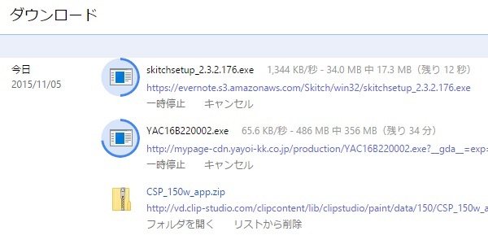

自宅のネット回線はフレッツ光です。フレッツ光にしてから2年経過したタイミングでプロバイダを変えました。今まではぷららを使っていたのですが、値段のやすさに惹かれてASAHIネットというプロバイダを選びました。

そもそもなぜプロバイダを変えようと思ったかというと、それは若干本筋からそれるので後回しにします。

## ASAHIネットを選んだ理由

ASAHIネットはフレッツ光対応のプロバイダの中で、2番目に月額料金が安いプロバイダです（私が2015年10月時点で私が調べた範囲内での話）。一番安いのはBBエキサイトの月額500円、2番目はASAHIネットの月額750円、その後は1000円横並びという感じです。

そんな中で更にASAHIネットは、プロバイダ乗り換えキャンペーンなるものを展開していて、12ヶ月間無料になるのです。1年間タダで使えるならお得じゃねと思って、乗り換えました。

## 通信速度について

私はそこまで通信速度にうるさい方ではないのですが、ASAHIネットの通信速度は遅いです。ファイルのダウンロードに関してはですが。

普段使う分には全く気にならない速度です。YouTubeやニコニコ動画見るのに何も不自由しませんし、応答がなくなったりはしません。そういう意味では普段使いには困りません。

しかし、ファイルのダウンロードを行うときはめちゃくちゃ遅いです。あからさまに帯域を絞ってきます。

これはChromeでファイルをダウンロードしているところですが、こういったファイルのダウンロードを行っていると通信速度はだいたい1M付近で頭打ちになります。しかも同時に2以上のファイルをダウンロードすると、上記画像のように片側の速度は極端に絞られます。両方1M出るのではなく、片側だけ1Mくらいで、もう片方は「これいつの時代の回線だよ」ってレベルの通信速度です。

そしてそこまで絞られた挙句、ダウンロードに失敗することもしょっちゅうです。通信が切断されましたとかのエラーになるわけではなく、ダウンロードできたように見えるけれども、ファイルサイズが足りてないなど正しくダウンロードできていない状態になります。基本的に並行ダウンロードはするなということです。

ファイル共有ソフトの帯域絞るのはどこのプロバイダでもやってるのでしょうが、ASAHIネットは普通のファイルダウンロードでこれです。ちょっといただけません。

これがいつ困るかというと、例えばパソコンを新調した、OSを再インストールした、なんてときです。普段使うアプリケーションをインターネットからダウンロードしようとすると、この帯域制限を食らうわけです。

回線のスピードテストサイトなどを利用して通信速度を確認すると、見た目は結構いい数値が出るんですが、このファイルダウンロードの速度を見ると、スピードテストのサイトだけ帯域制限外してるんじゃないかと疑いたくなります。

安いにはそれなりの理由があったということですね。

ネットサーフィンだけする、動画を見たりしかしないという人であれば、月額料金安いしちょうどいいのかもしれません。そんな使い方だけであれば特段速度が気になったりすることはありませんし。

私もそんなに頻繁にファイルを落とすわけではないので、ネットしてる間の9割は気にならないです。OS再インストールしてアプリやらドライバやらをダウンロードするときに、あまりに遅くてイラっとするくらいですから。

ただまあ、1年経ったら乗り換えると思います。

## 余談：なぜ乗り換えようと思ったか

そもそもなぜプロバイダを乗り換えようと思ったかというと、「光回線に乗り換えませんか」という飛び込み営業がやってきたことがきっかけでした。夕飯どきに（19時くらい）にいきなりやってきて、安くなりますからといって契約を迫ってくるあれです。

ちなみにあの手の営業は強硬な姿勢で断るべきだと私は思っています。そもそも話を聞くことすらしてはいけない。敵だと思って追い払うくらいの姿勢がよいと思っています。

まあともかく、飛び込み営業の回線を契約→後日やっぱりキャンセルの手続きをとるというすったもんだがあったんですが、その営業がきっかけでプロバイダの変更に思い当たったというわけです。

我が家では2年前、フレッツ光にするときのキャンペーンで、ぷららの料金が2年間割引されていました。それが満了になるので、何もしなければ月額料金が上がってしまいます。そこでネット利用料金の検討を始めたわけです。

選択肢はプロバイダがやってる光回線に乗り換えるか、プロバイダだけ乗り換えるかでした。

プロバイダが提供している光回線は、NTTから転用承諾番号をとれば現在利用中の電話番号をそのまま継続できるものです。なんだか携帯電話のMNPのように思えますが、そこまでフレキシブルなものではないようです。一度NTT以外に転出してしまうと、後でNTTに戻りたいと思っても電話番号をそのままにできなくなるらしいという話を目にしたこともあります。気をつけたほうがいいと思います。

プロバイダだけなら変更のコストはそこまで大きくありません。うちではプロバイダメールも使っていないので、本当に気軽に変更できます。そこで変更しやすいプロバイダを変えることに落ち着き、今回ASAHIネットと契約するに至ったわけです。

まあ安いには安いなりの理由があるのだということが分かって良かったと思います。相対的に、ぷららも悪くないなということが分かった、よい経験になりました。

  