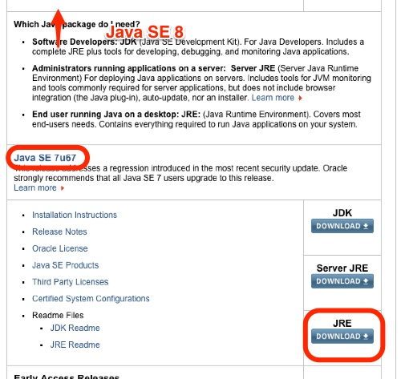

電子申告（e-Tax）を利用するべく、ICカードリーダーを購入しました。

何ができるのかというと、毎年の所得税確定申告をはじめ、各種の税務手続きをオンラインで行うことができます。大半の方々とはまったくもって無縁な仕組みではありますが、フリーランスや個人事業主にしてみると便利な仕組みなのではないかなと思います。そんなのよく分からんから税理士任せだわ、という人が大多数と思うので、本当に活用しているのは税理士くらいだったりするかもしれません。そんなシステムです。

事業開始届とか青色申告の承認申請だとか、そんな手続きはネット経由でできるならそうした方がいい。そういった手続きをするのにいちいち税務署に行ったり、書類を作って郵送したりするのが面倒くさいです。そこで今回電子申告を利用するべくいろいろと準備をしたわけです。ここでやっと話が繋がりますが、そのためにカードリーダーがいるよって話なんです。

カードリーダーのセットアップ自体は非常にあっさりと終了しました。パソコンに繋いだら自動的に認識してくれるので。問題はそこから先で、実際に電子申告ができるようになるまでの道のりが非常に険しかったです。

そこで今回その手順を備忘録として残して、パソコンを再セットアップしたときに備えます。はじめて電子申告をやる人向けに書いてますが、あくまで私はこうやったというだけの話なので、実際にやる場合は自己責任でお願いします。

## 電子申告には電子証明書が必要

電子申告を利用するためには電子証明書が必要になります。電子証明書は区役所に行って発行してもらってください。

電子証明書は住基カードに格納されるため、カード持っていない場合は住基カードの発行とセットになります。ちなみに岡山市は1000円（住基カード500円、電子証明書500円）です。自治体によって金額は異なるらしいです。

身分証明のための書類が2種類いるので、その点は注意がいります。私は免許証と保険証でクリアしました。

ここは開庁時間に区役所に行けるのかとかいう問題はあるものの、比較的さらっと終わります。

## カードリーダーのセットアップ

電子証明書を取得したら、カードリーダーでちゃんと情報が読み取れるか確認する必要があります。

カードリーダーのセットアップはとても簡単です。後に続く電子申告の準備を思ったら泣けるくらいに簡単でした。

ドライバのインストールはパソコンに繋げば自動的にやってくれるので困ることはありません。

<a href="https://www.jpki.go.jp/">公的個人認証サービスの利用者クライアントソフトのインストール</a>では「JRE7.0」をインストールが必要です。8ではなく7が必要です。（8だけの状態だとうまくセットアップできなかったです）

これを書いている時点ではJava SE 7u67だったので、このJREをダウンロードしてインストールしました。一番上にはJva SE 8u20があり、JRE7.0はそこから少し下にスクロールしたところにあります。

## 電子申告を行うための作業（ショートカット集）

<ul>
<li><a href="https://www.e-tax.nta.go.jp/todokedesho/kaishi3.htm">（電子申告の）開始届出</a></li>
<li><a href="https://www.nta.go.jp/tetsuzuki/shinkoku/shotoku/tokushu/jyunbi.htm">事前準備セットアップツールのインストール</a></li>
<li><a href="https://www.e-tax.nta.go.jp/download/index.htm">e-Tax共通ソフトのインストール</a></li>
<li><a href="https://www.nta.go.jp/tetsuzuki/shinkoku/shotoku/tokushu/kigen.htm">電子証明書の登録</a></li>
</ul>

前準備ツール→共通ソフトのインストールのとこだけ順番間違わないようにすればオッケー。手続きを行うところ、ソフトをダウンロードできる場所を探すのが一番大変です・・・。

電子証明書の登録は上記リンクではなく、e-Tax共通ソフトからもできます。むしろそっちからやった方が楽な気がします。

### 開始届出

これは電子申告を利用する際に必要な利用者識別番号を取得するための手続きです。電子申告を利用するためのIDとパスワードを設定するものだと思ってください。

ちなみにこの手続を行うときには電子証明書は必要ありません。

この手続で分かりにくそうなのは、納税用確認番号と整理番号くらいかなと思います。

納税用確認番号は電子納税をしたりするときに使うもので、自分で適当に決めればオッケーです。パスワードみたいなものみたいですが、忘れたら困るものなのかどうかいまいちよく分かりません。「111111」とかでもいいのかもよく分かりません。

整理番号は分からなければ空欄でオッケーです。確定申告を行って税金の還付を受けたことがある人であれば、国税還付金振込通知書（これだけ還付しましたよという税務署から送られてくるハガキ）に書いてあります。別に無理して探す必要はなく、書いてあげれば税務署の職員さんが助かる程度のものだと思います。

### e-Taxソフトのインストール

まず<a href="https://www.nta.go.jp/tetsuzuki/shinkoku/shotoku/tokushu/jyunbi.htm">こちらのページ</a>から事前準備セットアップツールをダウンロードしてインストールします。

それがすんだら<a href="https://www.e-tax.nta.go.jp/download/e-taxSoftDownLoad.htm">e-Tax共通ソフト</a>をダウンロードしてインストールします。

私はここで大ハマリしました。e-Taxの共通ソフトのセットアップが完了してくれなくてハマりました・・・。

[Program Files x86]→[etax]と[Program Files（x86）]→[InstallShield Installation Information]→[1ECF5EFFから始まるフォルダ]を削除した後、OSの再起動をしたら無事インストールできました。

この事前準備セットアップツールのインストールが終了したら、e-Taxソフトが利用できるようになります。後はe-Taxソフトを起動して、自分の利用したい手続きのためのプログラムを別途インストールして使うようになります。

## 非常にわかりづらく便利なのか不便なのかよく分からない

正直こうやって記事にするために改めてどこから作業したかを探すのさえ苦労します。自分でダウンロードしてきたはずのe-Taxソフトをどこからダウンロードしたらいいか分からない。こうやって記事を書くためにどこからダウンロードしたんだっけと、探しまわって1時間くらい費やした気がします。わざと使いづらくしてあるんでしょうか・・・。

インストールの手順の説明、利用するプログラムをどこからダウンロードできるのかなど、いろいろととっちらかっていて分かりにくいです。もう二度と探しまわりたくないので、この記事に書いたリンクがURL変更でリンク切れを起こさないことを願うばかりです。
