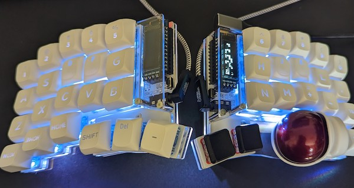

Keyball44を買ってまだ一月も経っていないが、Keyball39に乗り換えた。

44を使っている最中から、これは39でも大丈夫なんじゃないかと思っていた。そんなときに入荷案内が来て、1分くらい迷ってえいやで購入手続きしたら買えてしまった。39デビューである。

今回は44との比較しながら、39の使い心地を書いていこうと思う。

<!--more-->

## キー数について

108だかのキー数があって、それが44キーしかない状態で大丈夫かと普通は考える。実際私がそうだった。しかしKeyball44を使っていてその不安は払拭される。意外となんとかなるぞと。実際問題108もキーがあって、そのうちメインで触るのは半分もないことに気づいてしまった。

そうして慣れてくると、44キーでも多いのではないかと感じてくるから不思議である。44を使うと基本快適なのだが、ホームポジションから動かした際にその快適さが崩れるのが気になった。それは外周部分、ESCだとかBSとかを押す際に発生する。小指でこれら外周のキーを押すと、手の位置がズレてしまう。その結果タイプミスが発生してしまいがちだった。これが39への移行のきっかけだった。

もっとも39はさすがにキー数が足らないと感じる。44から外周のキーがなくなっただけではあるが、これが意外と効いてくる。レイヤー移動のキー割当をしつつ、なくなったキーの割当をやるとなると、レイヤー数を増やして対応せざるを得ない。ESCはともかく、BSは結構頻繁に叩くので配置には悩まされた。左手親指に割り当てたが、未だにちょっと迷う。たまにスペースと混乱してしまう。

基本的にはKeyball44の外周キーがなくなった配置であって、移行を悩んでいる人は44で39キーキーマップを試してみてから考えてもいいかもしれない。ただ若干の違いはあって、トラックボールと親指キーの間が39のほうが若干狭いような気がする。あとキーピッチも広い気がするが、これはキーキャップによる違いかなぁ。

## ファームウェア

39はファームウェアを自力でカスタマイズできないとちょっと厳しいのではないかと思う。そもそも自分で作る必要があるので、ファームウェアもいじれる人ばかりなのかもしれないけれど。

私は次のようなカスタマイズを施している。

- レイヤー数の増加
- タップダンスの導入
- キーごとのタップ判定時間の調整
- トラックボールの移動によるマウスレイヤーの自動有効化
- スクロールボタンのカスタマイズ

ファームウェアはGitHubに上げている。そのままでは動かないかもしれないけど。

https://github.com/gen0083/keyball

マウスレイヤーの自動有効化は参考にさせてもらったものに手を加えて今の形に。けれどたとえばマウスレイヤーが有効になった状態で「j」をタイピングしたいときなどに、すんなり切り替わらなくてどうしようか迷っている。ESCを押して通常レイヤーに戻してやればいいんだけど、何かいい方法がないか悩み中。

## Keyball44をどうするか

39への移行はほぼ終わった。キー入力もプログラミング時にはまだ戸惑うけれど、それは44も同じなのでいいかなと思っている。

39購入時にパーツの流用をするかどうかは最後まで迷ったんだけど、何かあったときのために予備としておいておくために全部用意した。ProMicroやキースイッチなどは流用しても良かったかなぁ。

そもそも予備機としておいておくにしても、39に慣れたあとで44に戻ると違和感しかない気がする。さりとてフリマアプリで出すのも面倒くさい。まあ予備があるということで安心感はあるかなぁ。

## キーキャップ

キーキャップはXVXプロファイルのものを基本的に使用している。一部キーは同ロープロファイルのキーキャップを使っている。

<iframe sandbox="allow-popups allow-scripts allow-modals allow-forms allow-same-origin" style="width:120px;height:240px;" marginwidth="0" marginheight="0" scrolling="no" frameborder="0" src="//rcm-fe.amazon-adsystem.com/e/cm?lt1=_blank&bc1=000000&IS2=1&bg1=FFFFFF&fc1=000000&lc1=0000FF&t=illusionspace-22&language=ja_JP&o=9&p=8&l=as4&m=amazon&f=ifr&ref=as_ss_li_til&asins=B0BXWVZG55&linkId=b13444df9c0f37af92352a4cb30e3486"></iframe>

<iframe sandbox="allow-popups allow-scripts allow-modals allow-forms allow-same-origin" style="width:120px;height:240px;" marginwidth="0" marginheight="0" scrolling="no" frameborder="0" src="//rcm-fe.amazon-adsystem.com/e/cm?lt1=_blank&bc1=000000&IS2=1&bg1=FFFFFF&fc1=000000&lc1=0000FF&t=illusionspace-22&language=ja_JP&o=9&p=8&l=as4&m=amazon&f=ifr&ref=as_ss_li_til&asins=B0BM4BY21N&linkId=0a767f8aa59ee7e1332a9cf9f532b139"></iframe>

Keyball44のときにも書いたが、キーの高さがある程度ないとトラックボールに引っかかるので、キーキャップの高さは結構重要である。特にトラックボールがある側は高くないと困る。

さらに右（トラックボールがある）側の親指キーに関しては、Kailh Chocロープロファイルスイッチでの運用を余儀なくされた。

私の使い方の問題かもしれないが、MX互換スイッチを使うと、親指にキーが当たって不快感があった。

jkdfとDelキーはロープロファイルのキーキャップにしてあるが、高さとしてはそんなに変わらない。ロープロファイルのキーキャップ買ったから使ってみた程度の理由づけである。

上下逆さまにキーキャップをつけているところはあえてこうしている。もはや刻印は気にしないことにした。大事なのは高さと形がしっくりくるかだから。

キースイッチの選択が良かったのか、割と気持ちのいいタイピング感が得られてその点は満足している。キーキャップも影響するらしいので音までこだわりだしたら沼にハマるんだろうなぁと感じている。

## 肩が楽に

分割キーボードの恩恵は、肩が楽になったということにつきる。普通のキーボードをたまに使うと窮屈でびっくりする。

ワイヤレス好きでキーボードはワイヤレスしか使わないという人間だったけれど、ケーブルがあるのも悪くない。・・・とはならない。いずれBLEにとも思うけれど、電池の問題がなぁ・・・。

とりあえず紙をキーボードの間においてメモをとることができるようになったので、その点はよいかなと思っている。でも一番は肩や手に余計な負担がかからないこと、これに尽きる。

手首の負担はマウスを[エルゴノミクスデザインのもの]()に変えたときにも感じたが、手首が自然な形で操作できるので非常に快適である。

肩にかんしては、正直なところ肘置きがいるなぁという感じがしている。普通のキーボードより肩が開いた状態でタイピングできるので楽なのは確かだが、腕の置き場に若干困るかもしれない。エルゴレスト買おうかなぁと迷っているところだ。

<table border="0" cellpadding="0" cellspacing="0"><tr><td>
<table><tr><td style="width:240px"></td><td style="vertical-align:top;width:248px;">
<a href="https://hb.afl.rakuten.co.jp/ichiba/33204cb8.e08e04fe.33204cb9.40d51e06/?pc=https%3A%2F%2Fitem.rakuten.co.jp%2Fseas-web-shop%2Fe332-020%2F&link_type=picttext&ut=eyJwYWdlIjoiaXRlbSIsInR5cGUiOiJwaWN0dGV4dCIsInNpemUiOiIyNDB4MjQwIiwibmFtIjoxLCJuYW1wIjoicmlnaHQiLCJjb20iOjEsImNvbXAiOiJkb3duIiwicHJpY2UiOjEsImJvciI6MSwiY29sIjoxLCJiYnRuIjoxLCJwcm9kIjowLCJhbXAiOmZhbHNlfQ%3D%3D" target="_blank" rel="nofollow sponsored noopener" style="word-wrap:break-word;"  >【ERGOREST】エルゴレスト　アームレスト　Model：332-020スタンダードアーム/ブラック/マウスパッドトレー無し【アームサポート 肘かけ 目 眼 肩 腰 腕 眼の疲れ 改善 軽減 保護 パソコン 長時間 作業 入力作業 画像制作 動画制作 デスクワーク】</a> 価格：27,060円（税込、送料無料) (2023/6/16時点)

<a href="https://hb.afl.rakuten.co.jp/ichiba/33204cb8.e08e04fe.33204cb9.40d51e06/?pc=https%3A%2F%2Fitem.rakuten.co.jp%2Fseas-web-shop%2Fe332-020%2F%3Fscid%3Daf_pc_bbtn&link_type=picttext&ut=eyJwYWdlIjoiaXRlbSIsInR5cGUiOiJwaWN0dGV4dCIsInNpemUiOiIyNDB4MjQwIiwibmFtIjoxLCJuYW1wIjoicmlnaHQiLCJjb20iOjEsImNvbXAiOiJkb3duIiwicHJpY2UiOjEsImJvciI6MSwiY29sIjoxLCJiYnRuIjoxLCJwcm9kIjowLCJhbXAiOmZhbHNlfQ==" target="_blank" rel="nofollow sponsored noopener" style="word-wrap:break-word;"  >
楽天で購入
</a>
</td></tr></table>
 

</td></tr></table>