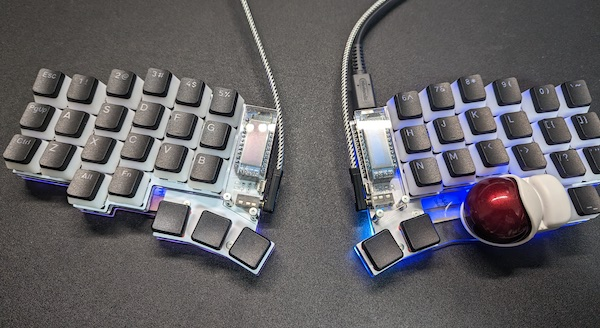

これまでキーボード（あとマウス）は無線のものを使ってきたのだけれど、あえて有線に戻るという決断をさせたキーボード。その名もKeyball。トラックボールとキーボードが一体となった、自作キーボードだ。

今回運良く手に入れることができたので、自作キーボードの紹介がてらつらつらと思ったことを書いてみる。

<!--more-->

## 自作キーボード

自作キーボードがあるというのは知っていたけれど、まさか自分がハマるとは思いもしなかった。

左右分割キーボードにトラックボールが一体となったモデルがユニークだったからというのもあるけれど、私の場合ははんだ付けというか、電子工作に興味があったのが理由として大きいかもしれない。

作ってみて思ったことは、はんだ付け楽しいということ。キットのビルドガイドにしたがって作るだけではあるが、それでも楽しいものは楽しい。

それにキットは用意されたものを使うだけであっても、カスタマイズできるところはかなり多い。キーキャップ、スイッチなどの物理的な要素から、キーマップやファームウェアといったソフトウェア面など多岐にわたる。

すでにキーキャップは変えたけど、今度はスイッチをいじりたい欲求に駆られている。キーを押したときのスコスコいう音が気になってきた。もっとメカニカルな音でテンション上げたい。（キーキャップのせいかもしれないけど）

## 組み立て

組み立てについてあーだこーだ書いても仕方がないから、ビルドガイドにないところでいくつか書いておこうと思う。意外とKeyballがはじめての自作キーボードだったという人は私以外にもいるみたいなので、何かの役に立つかもしれないので。

ハンダゴテはこれから買うのであれば、温度調整ができるものを買ったほうがよい。ビルドガイドにもLEDをはんだ付けする際には270度で作業するようにとある。私はLED以外も270度で作業した。

<iframe sandbox="allow-popups allow-scripts allow-modals allow-forms allow-same-origin" style="width:120px;height:240px;" marginwidth="0" marginheight="0" scrolling="no" frameborder="0" src="//rcm-fe.amazon-adsystem.com/e/cm?lt1=_blank&bc1=000000&IS2=1&bg1=FFFFFF&fc1=000000&lc1=0000FF&t=illusionspace-22&language=ja_JP&o=9&p=8&l=as4&m=amazon&f=ifr&ref=as_ss_li_til&asins=B09Q7R32BG&linkId=a903d90c7b6b9f429f46656f5f94a485"></iframe>

はんだは精密基盤用のを使った。特にこだわりがあったわけではないけれど、融点も200度付近で作業には困らなかった。

<iframe sandbox="allow-popups allow-scripts allow-modals allow-forms allow-same-origin" style="width:120px;height:240px;" marginwidth="0" marginheight="0" scrolling="no" frameborder="0" src="//rcm-fe.amazon-adsystem.com/e/cm?lt1=_blank&bc1=000000&IS2=1&bg1=FFFFFF&fc1=000000&lc1=0000FF&t=illusionspace-22&language=ja_JP&o=9&p=8&l=as4&m=amazon&f=ifr&ref=as_ss_li_til&asins=B0029LGAMA&linkId=648663353f3c747acbb8105a5983d5c3"></iframe>

他にもフラックスやらなんやらあるのだけど、このあたりはどこまでこだわるかの話になってくる。また、作業に失敗したときの保険としてハンダを取り除く手段を用意しておくといいかもしれない。ただ、これは初心者にはかなり難しいので、作業失敗時のことは考えない方が最終的にはいいかもしれない[^1]。

作業はビルドガイドにしたがってやれば問題なくできる。ただしブリッジ作業を除く。苦労してブリッジに一箇所成功したとしても、そのすぐ隣の作業に悪戦苦闘している間に成功した箇所のブリッジが崩れるということが何度も起こった。初心者には難しい作業だ。

この点スズメッキ線を使ってブリッジ箇所を繋いでしまう方法もあるようだ。はじめてはんだ付けをする人はスズメッキ線も用意したほうがよいかもしれない。

それかいっそのこと、組立サービスを利用するのが確実だ。再開はいつになるかわからないけれど。

### トラブルシューティング

当然だが、作成にあたってはすべてが自己責任の世界である。組み上げたけれど動かない場合の対処も自分でできるという人だけが手を出すべきだろう。ある程度同じ境遇の人や先輩たちに相談することはできるけれど、最終的には自分でなんとかするしかない。

かくいう私もKeyballがUSBさした側しか動かない問題にぶち当たった。キーボードを繋ぐTRRSケーブルが悪かったようで、ケーブルを変えたら普通に使えるようになった。

テスターで導通チェックしたり、実装部品をつけ直したりいろいろ試したが、生きた心地がしなかった。問い合わせを行ったりもしたけれど、こういう輩の相手をするのも大変だろうなあと申し訳無かった。

https://github.com/Yowkees/keyball/discussions

こちらのGitHubのページで調べたり聞いたりするとよいかもしれない。

## 使ってみて

Keyballシリーズは、39/44/61とあるのだけど、一番自分にあってそうな44を選んだ。39だと流石にキー数が足らないだろうし、61は逆に持て余しそうだったから。しかし今思うと、39でもギリギリなんとかなりそうな感じもしている。左手の外側のキーはあんまり押してないからこのキーなくてもいいかなあ。

この記事はKeyball44を使って書いているけれど、日本語入力は基本的には問題ない。数字が交じるとちょっと困るが、このあたりは慣れかなと思っている。

長音の入力が普通のキーボードだと右上だからよく間違える（右下に配置しているので）。エンターキーも普段と配置が違うから戸惑いがちである。

足りないキーはレイヤー機能でカバーすることになる。そのため指の動く範囲が普段よりずっと少ない。慣れたら快適である。

キーマップがある程度固まったらファームウェアを直接ビルドしようかなと考えている[^2]。とはいえ、まだキーマップをいじっている最中なのでまだ先の話ではあるが。

また、とりあえず完成したものの、キーを押したときの音が気に食わない[^3]。このあたりも調整したいなあと思っている。しっかりと沼にハマっているようだ。

[^1]: 失敗したら保守用の基盤を買って1からやり直すというのもありだと思う。私はハンダ吸い取り器を買った。2万円する道具を使ったとしても、部品を基盤に実装したあと取り外そうと思うとかなり大変だった。しかも基盤の実装の問題ではなかったので、無駄な出費となってしまった。いずれ手を出す電子工作で使うかもしれないので、無駄とは言えないけれど・・・。
[^2]: [Remap](https://remap-keys.app/)という大変便利なものがあるので、直接ファームウェアをいじらなくともキーマップを調整することはできる。しかしファームウェアを直接弄らないとどうにもならない機能もあるという認識でいる。
[^3]: スコスコという感じが気になっているので、もうちょっとテンション上がる感じにしたい。キースイッチを変えればいいのだろうか。やはりある程度のキーを試してみて「これ！」というキースイッチを探し当てないといけないかなぁ。