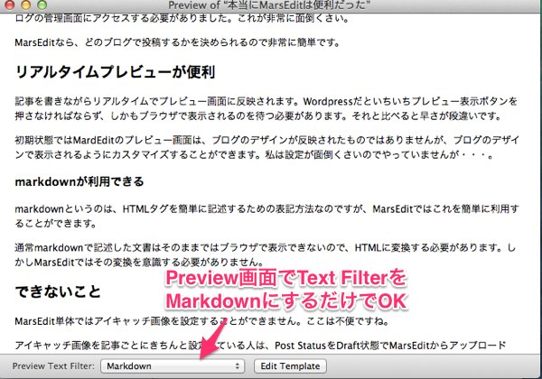

## MarsEditで便利なところ

設定は特に面倒ではないですし、カテゴリやタグなどはWordPress側で設定しているものを自動的に読み込んで選択できるようになります。

ブログでカスタムフィールドを利用していても、設定さえすればMarsEditで設定することができます。カスタムフィールドが多すぎるとちょっと見づらいことになりますが・・・。

これだけ対応しているなら、WordPressの管理画面にアクセスする頻度を格段に省くことができるでしょう。

ここ数日使っているだけではありますが、もはやこれなしでは記事書くのがムリになりそうです。中でも私が特に便利だなと思うのが次の3つですね。

### 複数のブログを一括管理できる

個人的に一番便利だと思ったのが、複数のブログを一元管理できることです。

今までWordPressの管理画面から記事を投稿していたので、複数のブログで記事を書こうと思ったら、それぞれのブログの管理画面にアクセスする必要がありました。これが非常に面倒くさい。

MarsEditなら、どのブログで投稿するかを決められるので非常に簡単です。

### リアルタイムプレビューが便利

記事を書きながらリアルタイムでプレビュー画面に反映されます。WordPressだといちいちプレビュー表示ボタンを押さなければならず、しかもブラウザで表示されるのを待つ必要があります。それと比べると早さが段違いです。

初期状態ではMardEditのプレビュー画面は、ブログのデザインが反映されたものではありませんが、ブログのデザインで表示されるようにカスタマイズすることができます。私は設定が面倒くさいのでやっていませんが・・・。

### markdownが利用できる

markdownというのは、HTMLタグを簡単に記述するための表記方法なのですが、MarsEditではこれを簡単に利用することができます。

通常markdownで記述した文書はそのままではブラウザで表示できないので、HTMLに変換する必要があります。しかしMarsEditではその変換を意識する必要がありません。

ちなみに、MarsEditでmarkdownが使えるとはいっても、そのままではWordPressに送った時にHTMLに変換されません。対策はMarsEditで記事を送信する際にmarkdownからHTMLに変換した上でアップロードするか、WordPress側でmarkdownを変換するプラグインを導入するかです。

私はWordPressにプラグインを導入することで対応しています。ちなみに入れるプラグインですが、Jetpackを私は利用しています。markdown以外にも機能が豊富なプラグインなので、markdownのためだけに導入するのはやや大げさかもしれません。

ちなみにJetpackを入れただけではmarkdownは有効になっていないので、設定画面から有効にしてやる必要があります。

## できないこと

MarsEdit単体ではアイキャッチ画像を設定することができません。ここは不便ですね。

アイキャッチ画像を記事ごとにきちんと設定している人は、Post StatusをDraft状態でMarsEditからアップロードし、WordPressの管理画面で改めてアイキャッチ画像を設定してから記事の公開を行う必要があります。

もし記事中に使用している画像を自動的にアイキャッチ画像に設定するだけでよいなら、WordPressに<strong>Auto Post Thumbnail</strong>というプラグインを導入することで実現できます。記事中にアイキャッチ画像を表示するようなテーマの場合は、同じ画像が連続して表示されないように一工夫が必要です。

画像のアップロードはMarsEditから行えるので、アイキャッチ画像だけ別個にアップロード、設定が必要なのはちょっとめんどうです。今後のアップデートでなんとか対応してもらえるとありがたいなぁと思う次第です。

### Draftで記事をアップロードした時の弊害

私はブログの投稿をTwitterに連携させるために、WP to Twitterというプラグインを利用しています。記事が公開されたときに自動的にそのURLをツイートしてくれます。

当然MarsEditから投稿しても自動的にツイートしてくれます。ただし、それはMarsEditから「published」ステータスで記事を投稿した場合の話です。アイキャッチ画像を設定するためにいったんDraftで記事を送信してしまうと、その後記事を公開しても自動的につぶやいてくれません。

MarsEditからいったんDraft（下書き状態）で記事をアップすると、WordPressに送られた記事に公開日時が設定されてしまいます。これはXMLRPCというMarsEditなどのリモート投稿クライアントを受け付けるための仕組みのバグだそうです。MarsEditが悪いわけでも、WP to Twitterが悪いわけでもないようです。

幸いなことに最新のWP to TwitterにはTweetボタンが用意されるようになったので、多少面倒くさくはありますがこのTweetボタンを押すことで対処することができます。MarsEdit＋WP to Twitterというニッチな環境だからか、情報が少なくて困りました。

今のところ対処法はこういう泥臭いものしかないみたいです。

## 高いけどこれは便利だ

Macでしか使えませんし、有料（しかもそれなりに値が張る）アプリなので、ちょっと二の足を踏んでいましたた。ですが30日間試用できるということで試してみました。実際に使ってみると非常に便利です。今までブラウザで管理画面を使って更新していたのが馬鹿らしくなります。これは手放せなくなりそうです。
