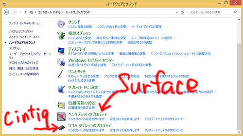

Cintiq 13HDはパソコンとはHDMIで接続します。

HDMIポートがなく、ミニディスプレイポート経由で接続する場合に、<em>この変換コネクタはちゃんと使えたよ</em>と、ただそれだけの話です。特にドライバのインストールも必要なく、繋げばちゃんと映り問題なく使用できました。Cintiq 13HDで使えるミニディスプレイポート変換コネクタをお探しの方へはそれだけなので、後の話は読み飛ばしてください。

<iframe style="width:120px;height:240px;" marginwidth="0" marginheight="0" scrolling="no" frameborder="0" src="//rcm-fe.amazon-adsystem.com/e/cm?lt1=_blank&bc1=000000&IS2=1&bg1=FFFFFF&fc1=000000&lc1=0000FF&t=illusionspace-22&language=ja_JP&o=9&p=8&l=as4&m=amazon&f=ifr&ref=as_ss_li_til&asins=B0052GQ498&linkId=a0463938dea62a740653eda6bb22e877"></iframe>

残りの話は、私が悪戦苦闘している<strong>Surface PRO 2とCintiq 13HDの接続の話</strong>です。

## Surfaceとの接続は動作保証対象外

まずはじめに、Surface PRO 2やCintiq 13HDに限った話ではないのですが、<strong>ワコムのペンタブレット製品は「タブレット機能を内蔵したコンピュータ」での使用は動作保証外</strong>だそうです。おそらくドライバが競合したり干渉したりするからでしょう。

試行錯誤の末、最終的にどちらもちゃんと動くようにはなっていますが、たまに挙動がおかしくなったりします。ここに書いてあるとおりにやったのにうまく動かないという可能性もあるので、<strong>実行するのはあくまで自己責任</strong>でどうぞ。

## ドライバのインストール

Cintiq 13HDは、Surfaceに繋いだだけでは使えません。Cintiqの液晶に画面は表示されるし、Cintiqの上でペンを動かすとマウスカーソルも動作もします。しかしそれはその動きは<em>マウスを動かしている</em>かのようで、ペンの位置にマウスカーソルが出てくるわけではありません。そのためCintiqのドライバをインストールしなければなりません。

### 復元ポイントの作成

Surfaceで作業に入る前に、<strong>必ず復元ポイントを作成しよう</strong>。ドライバインストール後に、おかしなことになって大変な目に遭う可能性があるからです。回復ポイントを作成していない場合、設定を戻すためには初期化するしか方法がなくなるかもしれません。そうならないためにも、<em>復元ポイントは作業前に必ず作成しておきましょう</em>。

画面右端からスライドしてチャームを表示 → 検索から「<em>回復</em>」を検索 → [<em>高度な回復ツール</em>]の[<em>システムの復元の構成</em>] → [<em>システムの保護</em>]タブの[<em>作成</em>]ボタンを押して<em>復元ポイントを作成</em>。とりあえずこれをやっておけば、ドライバのインストールでおかしくなったりしても、この時点の状態に戻すことができます。

もうすでにおかしくなってしまっている人は、<em>Surfaceを初期化するしかない</em>でしょう。初期化はチャームを表示して設定 → [PC設定の変更] → [保守と管理] → [回復] → [すべてを削除してWindowsを再インストールする]です。

### ドライバのインストール

私が作業した時点での必要なソフトへのリンクは次のものです。これより最新のものが出ているかもしれないので、各自確認して<em>最新のものを入れる</em>ようにしてくださいね。

<ol>
<li><a href="https://us.wacom.com/en/feeldriver" target="_blank">Wacom Feel driverのインストール</a></li>
<li><a href="https://tablet.wacom.co.jp/download/" target="_blank">Cintiqのドライバインストール</a></li>
</ol>

<strong>先にWacom Feel Driverのインストール</strong>を行い、Cintiqのドライバインストールはその後で行います。逆にすると<em>Surfaceのペンが認識されなくなって困った</em>ので・・・。

[コントロールパネル] → [ハードウェアとサウンド]でペンタブレットが2つ表示されていれば、SurfaceもCintiqも、<em>それぞれペンを認識してくれます</em>。

## キャンバス上でペンの位置がズレる

筆圧もペン位置もちゃんと認識してくれはしますが、その<em>動作は不安定</em>です。何が不安定かというと、SurfaceからCintiqを付け外しをすると、筆圧を検知するソフトウェアのキャンバス上だけで<em>ペンの位置がズレる症状が出る</em>のです。その場合は、一度<em>再起動をすると直ったりします</em>。実によく分からない症状です。試したソフトウェアは<em>Clip Studio Paint PRO</em>と<em>Adobe Photoshop CC</em>です。

Surfaceの電源を切ってからCintiqとの付け外しをしたら起こらないかなとも思いましたが、どうもそういう問題でもないようです。これはCintiqのドライバをインストールすることによって、WintabとTabletPCという2つのサービスが動作するようになり、それぞれが干渉したりするために起こっているのかもしれません。Cintiqを付け外しすることで、タブレットの認識できる描画領域が変わるために、動作がおかしくなるのでしょう。

CLIP STUDIO PAINT PROであれば、環境設定で両者を切り替えることができるので、<em>再起動せずとも使用するタブレットサービスを切り替えることで認識してくれるようになります</em>。他のソフトであれば、素直に再起動するしかないでしょう。

## 肝心なところが動作保証外だった

Surfaceを持ち運び場所に制約を受けず絵を描き、腰を据えて作業したいときはCintiqでガッツリ作業をする。それが私の思い描いた理想的なスタイルでした。

一応できてはいるんですが、<em>保障対象外というのがちょっと気持ち悪い</em>です。この症状はCintiqに限らず、Intuosなどの板タブレットでも同じようになると思います。<em>あくまでWacomの動作保証外の使い方である</em>ことを念頭に、併用しようという方の参考になれば幸いです。

## 追記

最初のうちは不安定だったのですが、最近は安定して使えています。なぜ安定しだしたのかよく分からないのは気持ち悪いところです。

Surafceのアップデートで安定したのかもしれませんし、たまたまなのかもしれません。そこまで気にしなくてもいいのか、私の環境が偶然安定しているだけなのかはっきりしないのがもどかしいです。
