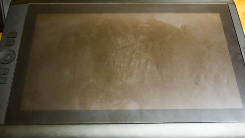

Cintiq 13HDの液晶保護フィルムは<a href="https://wantit.gcreate.jp/film_for_cintiq13hd_mediacovermarket/" title="Cintiq 13HD用の液晶保護フィルムを比較して、メディアカバーマーケットのフィルムをおすすめ">メディアカバーマーケットのもの</a>を利用して<em>約半年</em>になります。さすがにこれだけ使っていると、フィルム表面がかなり傷だらけになってきてしまいました。もういい加減に限界なので、新しいものに取り替えることにしました。

今回はCintiq用のフィルムとしてはかなり前からあった、<em>ミヤビックスのフィルム</em>を使ってみることにしました。ミヤビックスのフィルムは、映り込みが激しいという噂を聞いて避けていたのですが、いつの間にか「<em>低反射タイプ</em>」なるものが出ていたので、これならいけるんじゃないかと思ったのです。

### 半年使用したフィルムの状態

メディアカバーマーケットのフィルムは、半年間の使用で表面がこんな感じになっています。汚れと細かい傷で、画面もかなり見づらいものになっています。

## 商品内容

商品のパッケージは<em>しっかりとした厚紙で包装</em>されています。ただ<em>中身はフィルムしか入っていない</em>というなんとも潔い内容になっています。液晶を拭くためのクロスや、空気を抜くためのヘラなんかついていません。作業に必要なクロスなんかは別途用意する必要があるでしょう。

作業の際には<em>マスキングテープがあると非常に便利</em>です。貼り付け位置を決めてから、マスキングテープを使って仮止めをしておくと、貼り直しを防ぐことができます。

貼り直しをしてしまうと、フィルムと液晶の間にホコリが入り込む機会をいたずらに増やすことになってしまいます。液晶保護フィルムを貼る際には、この<em>ホコリの混入が一番の大敵</em>です。面倒臭がらずに仮止めをしてやると、非常にキレイに貼ることができると思います。

## メディアカバーマーケットのものとの比較

前回のフィルムの記事を踏襲して、使用してみた感想を比較してみました。

<table>
<tr>
<th></th>
<th>ミヤビックス</th>
<th>メディアカバーマーケット</th>
</tr>
<tr>
<td>すべり具合</td>
<td><strong>滑りやすい</strong></td>
<td>そこまで滑らない</td>
</tr>
<tr>
<td>サイズ</td>
<td>液晶部分より1mm程小さい</td>
<td>液晶部分より1mm程度大きい</td>
</tr>
<tr>
<td>かたさ</td>
<td>安心して筆圧をかけられる</td>
<td>安心して筆圧をかけられる</td>
</tr>
<tr>
<td>映り込み</td>
<td>気にならない</td>
<td>気にならない</td>
</tr>
<tr>
<td>画面の見やすさ（発色）</td>
<td><strong>美しい</strong></td>
<td>ややくすんでいる</td>
</tr>
<tr>
<td>パッケージ</td>
<td>しっかりしてる</td>
<td>簡素</td>
</tr>
</table>
大きな違いは、スタイラスの<em>滑り具合と画面の見やすさ</em>でしょうか。

メディアカバーマーケットのフィルムは、程よい抵抗（滑りにくさ）が非常に好感が持てましたが、その代わりに画面がややくすんで見えるのが欠点でした。下絵などのときは問題がありませんが、着色する際には別途モニタを用意して確認しないと、色がまともに確認できないくらいでした。

対して、ミヤビックスのフィルムは<em>ペンがやや滑りやすい</em>ですが、その分<em>画面が非常にキレイ</em>です。これなら別のモニタで色を確認せずともすむかもしれません。

貼りやすさに関しては、メディアカバーマーケットのフィルムの時にどの程度苦労したかを忘れてしまったので比較から外しました。動画をご覧いただけばわかると思いますが、今回のフィルムの貼り付けにかかった時間は10分少々といったところです。もっとも、<em>張り替えだから早かった</em>だけとも言えますが・・・。

<em>描画の際の抵抗</em>を選ぶか<em>画面の見やすさ</em>を選ぶかで、どちらのフィルムが適しているかは変わるように思います。

## 張替え・試し書き動画

<iframe width="480" height="270" src="//www.youtube.com/embed/nZb6pZ4jRWw" allowfullscreen></iframe>

実際にフィルムを張り替えているところと、試し書きをしたところを動画にしてみました。良かったら参考にして下さい。

Amazonでの評価は妙に低いですが、そこまで悪いフィルムだとは思いません。書き味は確実にメディアカバーマーケットのフィルムの方が私は好みなんですが、画面がキレイに見えるというのはこれはこれでうれしいものです。滑りやすいと言っても我慢できないほどではないので、しばらく使って使用感を追加レポートしたいと思います。

  