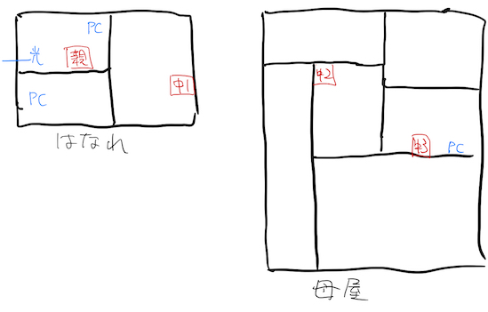

ようやく引越し先に光回線が開通したのだが、自宅内のネットワーク環境はよくはなかった。光回線のモデムは自分の部屋にあり、無線の親機も同じくだったので、自分にはほぼ影響はない。しかし、うちは離れと母屋がある構成となっており、母屋に行くとスマホなどの接続が不安定になるのだ。

それまでWiMAXと無線LAN中継機でなんとかカバーできていたのだけれど、光回線が入ると親機の位置も制約がかかってしまう。結果無線LANによって自宅内をカバーすることが困難になってしまった。そこで光回線が開通したことだし、ネットワーク機器もリプレースしようかなと考えたのである。

<!--more-->

## NEC初挑戦

何を考えたか、今まで使っていたBuffaloではなくNECのAtermを選んだ。戸建て3階建てまでいけるようなことを書いてあったので、電波強いんだろうと思って買った。実際はそんなことなかった。たぶん上方向には強いんだろうけれど、横方向は点でダメだった。

今まで使っていたBuffaloの無線機器を中継機として設定するも、これがまたうまくいかない。そもそも設定自体にかなり苦労したのだが、3台では電波のリレー自体がうまくいかなかった。なんてこったい。

## 設定画面はBuffaloの方が好み

今までずっとBuffalo製品使ってきたせいか、どうにもNECのAtermの設定画面は慣れない。意外とBuffalo馬鹿にする人多い印象があるが、設定画面とかかなり親切な作りをしていると思う。設定項目とそれに対する説明が同じ画面で表示されるのが親切だと思う所以だ。

一方Atermは、使い方というリンクを押せば設定項目の説明が表示されるが、それは設定画面とは別画面である。いちいちこの設定項目の意味はなんだろうと思う度に使い方画面出すのはかなり面倒だ。

しかし、そもそも設定できる項目自体が少ない印象である。Buffaloに比べたらシンプルな設定画面で、逆に設定しやすいと感じる人もいるかもしれない。なんかゲスト用の無線LAN設定とかあったけど、めんどくさいんでそんな設定はしなかったがな。

## 中継機含めてNECにリプレースだ

もうしょうがないんで、Buffaloの製品を使うことは諦めた。なんといってもBuffalo製品、かなりの年月を使っており、肩はかなり古い。今回買ったWG2600HP3とはそもそも性能の次元が違う。なんだよ同時ストリームってって感じである。

そんなだから中継機もNECで揃えることにした。

ちなみに間取りはこんな感じなので、中継機3台追加するという太っ腹作戦に出た。

そもそも離れに置いた親機の電波が、離れの玄関を出るともうほとんど無線LANの電波を拾わない。そのため離れの玄関近くに中継機1を置く。中継機1からどの程度の電波が届くかは未知数だが、やはり母屋の玄関近くに1台置くべきだろうと、中継機2を置く。そして中継機3で母屋のPCを使う場所まで電波をリレーする作戦だ。

ちなみにNEC製品は、このような多段接続による中継が可能である。直列つなぎで3台までできるということだったので、この作戦で行くことにした。

このように割と大規模な直列つなぎを計画する人はそうはいないと思うが、設定についてもあわせて説明しておこうと思う。わりと私は困ったので、誰かの役に立てばなぁという感じである。

ちなみに中継機にはWG1900HP2という製品を利用した。本来ならWG2600HP3を使うとよいのだろうが、すでにこの製品自体の価格が予算オーバー気味なのに、さらに3台買い足すのは無茶というものである。

そんな折、楽天でわけあり商品ということでWG1900HP2が販売されているのを発見し、渡りに船と飛びついたのであった。

<table border="0" cellpadding="0" cellspacing="0"><tr><td>

</td><td>
<table><tr><td style="width:240px"></td><td style="vertical-align:top;">
<a href="https://hb.afl.rakuten.co.jp/hgc/191a3579.c1c71762.191a357a.f61bb369/?pc=https%3A%2F%2Fitem.rakuten.co.jp%2Ffarson%2F000000123400%2F&m=http%3A%2F%2Fm.rakuten.co.jp%2Ffarson%2Fi%2F10001894%2F&link_type=picttext&ut=eyJwYWdlIjoiaXRlbSIsInR5cGUiOiJwaWN0dGV4dCIsInNpemUiOiIyNDB4MjQwIiwibmFtIjoxLCJuYW1wIjoicmlnaHQiLCJjb20iOjEsImNvbXAiOiJsZWZ0IiwicHJpY2UiOjAsImJvciI6MSwiY29sIjowLCJiYnRuIjoxfQ%3D%3D" target="_blank" rel="nofollow noopener noreferrer" style="word-wrap:break-word;"  >【訳あり】NEC PA-WG1900HP2 無線LANルーター 11ac 3ストリーム 対応 説明書なし LANケーブルなし 設定カードなし メーカー保証なし 無線ルーター 1300Mbps IPv6 2.4GHz ルータ 親機 パソコン 無線 一戸建て 強力 親機 無線LAN ワイヤレス Wifi 送料無料</a>

<a href="https://hb.afl.rakuten.co.jp/hgc/191a3579.c1c71762.191a357a.f61bb369/?pc=https%3A%2F%2Fitem.rakuten.co.jp%2Ffarson%2F000000123400%2F%3Fscid%3Daf_pc_bbtn&m=http%3A%2F%2Fm.rakuten.co.jp%2Ffarson%2Fi%2F10001894%2F%3Fscid%3Daf_pc_bbtn&link_type=picttext&ut=eyJwYWdlIjoiaXRlbSIsInR5cGUiOiJwaWN0dGV4dCIsInNpemUiOiIyNDB4MjQwIiwibmFtIjoxLCJuYW1wIjoicmlnaHQiLCJjb20iOjEsImNvbXAiOiJsZWZ0IiwicHJpY2UiOjAsImJvciI6MSwiY29sIjowLCJiYnRuIjoxfQ==" target="_blank" rel="nofollow noopener noreferrer" style="word-wrap:break-word;"  >
楽天で購入
</a>
</td><tr></table>
</td></tr></table>

訳あり品なのでいつまで購入できるかは知らないけれど。

ちなみに訳ありの理由は、うちに届いた商品については説明書が入っていないというただそれだけだった。該当ショップの説明では、箱に汚れがあったりとかいう説明があったが、私としては本体が使えさえすればよかったので問題なかった。というか、マジで救世主だった。

WG2600HP3に比べるとストリーム数（アンテナ数？）が少ないが、それでも当初考えていたコンセントに刺す中継機のW1200EXよりは性能がよい。

<iframe style="width:120px;height:240px;" marginwidth="0" marginheight="0" scrolling="no" frameborder="0" src="//rcm-fe.amazon-adsystem.com/e/cm?lt1=_blank&bc1=000000&IS2=1&bg1=FFFFFF&fc1=000000&lc1=0000FF&t=illusionspace-22&language=ja_JP&o=9&p=8&l=as4&m=amazon&f=ifr&ref=as_ss_li_til&asins=B01DX0H1CS&linkId=cec61f6fc4195e71ee9de1d437b10042"></iframe>

しかも訳ありだったので、これよりも安く手に入ると、本当に渡りに船だった。注文してから届くのも早かったのがありがたい。

## 設定

親機はすでにブリッジモードにて設定済みであったので、今回は中継機の多段設定についてのみ解説しておく。

私は1台ずつ中継機の設定を行った。それぞれ中継機の設定画面に入り、その中継機が何段目の中継を行うのかを設定する必要があった。それを外部から見て分かるようにマステで「x段目」とメモを貼り付けるため、1台ずつ順番に設定を行ったのである。

手順はおおむね次のとおりである。ちなみに有線LANで接続できるパソコンが必要になる。中継機モードに設定した端末の設定画面にログインするためには、有線接続するしかないからだ。

1. WG1900HP2の背面スイッチをCNV（中継機モード）に切り替える<https://www.aterm.jp/function/wg1900hp2/guide/converter.html>
1. 設定画面に入るため[この手順](https://www.aterm.jp/function/wg1900hp/guide/quickweb_cnv.html)に従い強制DHCPサーバを起動し必要な設定を行う
1. 必要な設定は、設定画面に入るためのIPアドレスの固定と、中継接続の段数
1. 設定が終わったら親機とWPS接続を行う

一番探すのに手間取ったのが、中継モードにしたWG1900HP2の設定画面にどうやってアクセスするかであった。CNVにスイッチを変更し、いったんコンセントを抜いて10秒ほど待ち、らくらくスタートボタンを押しながらコンセントを刺す。らくらくスタートボタンは押しっぱなしで、Converterランプが点滅するまで押し続ける。Converterランプが点滅したら有線接続したPCから192.168.1.245にアクセスすると、その端末の設定画面にアクセスできる。初期パスワードは端末に書かれているのでそれを使ってログインすればよい。

私はあとからIPアドレス直打ちで設定画面にアクセスできるようにしたかったので、端末のIPアドレスを自宅のネットワークに合わせて調整した。ちなみにこれは詳細設定を表示しないと設定項目として出てこなかったと思う。

その後は再起動をかけずに続けて中継機能の段数を指定する。1台目は特に必要がないのだが、私はついでに端末名もわかりやすいように設定し直した。重要なのは接続の段数指定なので、ここを間違えないようにしたい。端末も分かりやすいように「この子は何段目」とマステを使って分かるようにしておいた。

その設定が終わればあとは **「中継機に指定した段数にかかわらず」** 親機とWPS接続を行えばよい。2段目の中継機も3段目の中継機も、すべて親機とWPS接続するのだ。そうすることで、2段目にした中継機は1段目と3段目と接続するようになる。2段目に設定したものを1段目とWPS接続するのではないので注意してほしい。

## 多段中継の注意点

多段中継を行うとその分無線の通信速度が落ちる。中継機との接続のためにアンテナ帯域を消費するためで、PC等の無線に割けるアンテナが減るからだろう。だが、我が家にとっては古い無線LAN機器を使っている頃に比べたら早いものである。特段問題は感じない。

あとは中継設定と親機とのWPS接続が終わった端末を、予定の場所に設置して終わりである。幸い、すべての端末がちゃんと接続できた。さすがにこれだけの端末数を用意しておいてつながらなかったはショックがでかすぎる。

後は中継機の置き場所に微妙に困るので、適当に壁掛けしてやることにした。電動ドライバーとネジはいっぱいあるのでそのへんは自由気ままにという感じである。

## リプレース完了

こうして我が家のネットワーク環境は、私の多大なる労力とお財布パワーにより、快適な環境が構築されたのであった。今のところは平穏そのものである。

もっとも私の部屋は親機で接続しているので、問題があったとしても気づかないのだけれど。後は3台も機会が増えて常時電気を食うわけだから、電気代も馬鹿にならなくなるかもしれない。今までは2台だったからなぁ。

しかし本当に訳あり出品があって助かった。これがなかったら私の財布へのダメージは計り知れなかっただろう。

あとは設定について、どこを探してどうすればいいのか調べるのが思いの外時間がかかった。特に分からなかったのが、次の2つだった。

- 中継モードに設定した端末の設定画面にアクセスするのはどうすればよいのか
- WPSで設定するのはどうするのか

この2点については設定の項目で説明した。利用する製品によって参照すべきページは異なる可能性があるが、WG1900HP2を中継機に使うならこの設定でいける。金に糸目をつけないのであれば、親機と同じWG2600HP3を3台用意するのが最善だろう。私は予算的に無理だったがね。

<table border="0" cellpadding="0" cellspacing="0"><tr><td>

</td><td>
<table><tr><td style="width:240px"></td><td style="vertical-align:top;">
<a href="https://hb.afl.rakuten.co.jp/hgc/191a3579.c1c71762.191a357a.f61bb369/?pc=https%3A%2F%2Fitem.rakuten.co.jp%2Ffarson%2F000000123400%2F&m=http%3A%2F%2Fm.rakuten.co.jp%2Ffarson%2Fi%2F10001894%2F&link_type=picttext&ut=eyJwYWdlIjoiaXRlbSIsInR5cGUiOiJwaWN0dGV4dCIsInNpemUiOiIyNDB4MjQwIiwibmFtIjoxLCJuYW1wIjoicmlnaHQiLCJjb20iOjEsImNvbXAiOiJsZWZ0IiwicHJpY2UiOjAsImJvciI6MSwiY29sIjowLCJiYnRuIjoxfQ%3D%3D" target="_blank" rel="nofollow noopener noreferrer" style="word-wrap:break-word;"  >【訳あり】NEC PA-WG1900HP2 無線LANルーター 11ac 3ストリーム 対応 説明書なし LANケーブルなし 設定カードなし メーカー保証なし 無線ルーター 1300Mbps IPv6 2.4GHz ルータ 親機 パソコン 無線 一戸建て 強力 親機 無線LAN ワイヤレス Wifi 送料無料</a>

<a href="https://hb.afl.rakuten.co.jp/hgc/191a3579.c1c71762.191a357a.f61bb369/?pc=https%3A%2F%2Fitem.rakuten.co.jp%2Ffarson%2F000000123400%2F%3Fscid%3Daf_pc_bbtn&m=http%3A%2F%2Fm.rakuten.co.jp%2Ffarson%2Fi%2F10001894%2F%3Fscid%3Daf_pc_bbtn&link_type=picttext&ut=eyJwYWdlIjoiaXRlbSIsInR5cGUiOiJwaWN0dGV4dCIsInNpemUiOiIyNDB4MjQwIiwibmFtIjoxLCJuYW1wIjoicmlnaHQiLCJjb20iOjEsImNvbXAiOiJsZWZ0IiwicHJpY2UiOjAsImJvciI6MSwiY29sIjowLCJiYnRuIjoxfQ==" target="_blank" rel="nofollow noopener noreferrer" style="word-wrap:break-word;"  >
楽天で購入
</a>
</td><tr></table>
</td></tr></table>

そんなわけで最後に、渡りに船だった訳あありを再度紹介して終わろうと思う。
