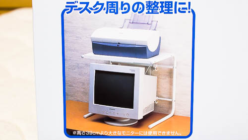

最近MacbookAirも机の上で使うようになってから、机の上が更に手狭になってしまいました。作業するたびにMacを閉じてその上にキーボードを置いて作業スペースを確保する。「あ、Macで作業すること残ってたわ」とキーボードを再度どけてMacを開く。もう面倒臭ったらありゃしない。

作業スペースを確保するムダな行動で集中力が削がれて仕方がありません。何とかならないものか・・・。そんなときにふと、<a href="https://wantit.gcreate.jp/monitorarm-greenhouse/" title="モニタアームを使って机の上のスペースを有効活用するぞ">以前モニタアームを購入して空間を有効活用した</a>ように、机の上空スペースを利用することに思い至りました。

ご覧のように、Surface自体のサイズはそこまで大きくはないのですが、ケーブルのせいもあって意外とスペースを専有しています。この上空を有効活用すれば机の上は広くなるはずです。

私はこのSurfaceを置くことができ、その下でMacが操作できるようなパソコン台を探すことにしました。

## レンジ台だけどパソコン台としても使える

Google画像検索で理想的な形した商品を探してみました。似たような形のものはいくつかあったのですが、私はこのレンジ台を選びました。

<table cellpadding="0" cellspacing="0">
<tr>
<td valign="top">

<a href="http://hb.afl.rakuten.co.jp/hgc/1316fb52.6fe2c5e2.1316fb53.189b3749/?pc=http%3a%2f%2fitem.rakuten.co.jp%2fstylishlife%2f101404%2f%3fscid%3daf_link_tbl&m=http%3a%2f%2fm.rakuten.co.jp%2fstylishlife%2fn%2f101404" target="_blank">レンジ台 レンジラック 電子レンジ ラック 上置き棚トースターラック キッチンラック キッチン 棚横幅伸縮式 レンジ上 ラック オーブンラック【あす楽対応】【ご紹介レビュー投稿超特価！税込3,800円⇒税込2,300円！】</a>

</td>
</tr>
</table>
理由は、私が探した中で幅が40cm台の製品がこれだけだったからです。50cmくらいの幅のものだと、Cintiqやモニタの場所を圧迫してしまうので、できるだけ幅をとらないものがよかったのです。

レンジ台ということですが、ちゃんとパソコン関連の使い方も想定されています。（写真ではモニタの上にプリンタを置くような使い方ですが）

## 高さを考えるの忘れていた

幅と奥行は事前にシュミレーションしておいたので、思った通りちょうどいい具合に収まってくれました。台の上にSurfaceを置き、その下にMacbookを置く。いい感じです。

ただ高さをシュミレーションし忘れていました。実際にSurfaceを台の上に置くと、高すぎて首が微妙に疲れます。ドッキングステーションを使うとどうしても画面が斜め上を向くので、台の高さと相まって余計に残念なことになってしまいました。

台の上にモニタを置く使い方をするのは、おそらく私くらいのものでしょうね。しかし、ノートパソコンとSurfaceのどっちを台の上に置くかと言ったら、キーボードを使うMacを上に置くわけにはいきません。

## パソコン台としてもなかなか優秀

このレンジ台は横幅を広げることもできるので、もう少し幅を取るものを置くのにも使えます。また、レンジ台の奥にあるフレームが配線を整理するのにいい働きをしてくれます。（写真ではカオスですが・・・）

Surfaceのドッキングステーションを利用している人で、その上部空間を有効活用したいなという人にはちょうどいいアイテムだと思います（Surfaceの上空にプリンタを置くという使い方であればの話ですけどね）。

ただ机の上で利用するには、台の下に免震材とかシリコン素材などの滑り止めを置いたほうがいいかなと思いました。台の足がスチールのパイプなので机の上を滑りやすいのです。すべり止めを下に敷くか、何かに縛り付けて固定するかしておかないとちょっと怖いです。

## カスタマイズしてみた

台の左右の部分をもうちょっと活用できないものかと、100均（セリア）でワイヤーラティスを買ってきて取り付けてみました。ちょうどいいサイズ（26cm☓40cm）のものがありまして、びっくりするくらいピッタリはまりました。フックを取り付けて小物をひっかけることができます。

台の下の空間が圧迫される感じがしますが、ノートパソコン使うときは少し引き出して使うので問題ありません。

ワイヤーラティスは、上部はパイプと台の間にはさみ、下部は結束バンドでパイプと固定しました。

パイプと机の接する面には、これまた100均で買ってきたフェルト材をとりつけました。取り付けたところで結局滑るので、動かないようにするならゲル状の免震材を使うのがいいと思います。ただ、免震材は正方形サイズの物が多いので、パイプからはみ出る部分が出ていやだなと思ったので私は避けました。

台の固定に関してはすぐ隣にあるモニタアームの支柱に結束バンドで括りつけることで対処しています。多少動きますが、地震で机の上から落ちてしまうことは防げると思います。

  