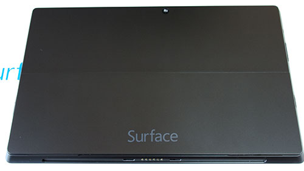
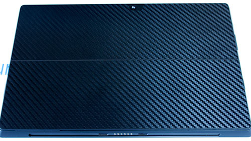

特に必要性に迫られたわけでもないのですが、Surface PRO 2の背面保護フィルムを購入しました。Surfaceの<em>裏面が傷つきやすいらしいと聞いた</em>ので、せっかくだから保護しておこうかなと思ったのです。Surface PRO2をデスクトップの代替として使おうと考えており、<em>頻繁にドッキングステーションに接続する</em>ので、保護しておいた方がいいなと思ったというのもあります。

保護フィルムなしの背面はこんな感じ。

## 透明ではないのでちょっと貼りづらかった

透明ではないので、<em>剥離シートをつけたままの状態で位置合わせをし</em>て、<em>マスキングテープで片側を固定</em>し、<em>剥離シートを全部はがして貼り付ける</em>と上手く貼れます。剥離フィルムを剥がしてから位置決めをしようとすると失敗します。

<a class="amazonjs_indicator_title" href="#">メイクアップ材シリーズ No.31 マスキングテープ 10mm 87031</a>

透明ではないので、<em>粘着面に多少ホコリが混入しようと問題ない</em>のは楽ですね。

## 見た目もよく肌触りもいい

<em>エンボス加工で細かい凸凹があり</em>、見た目もさることながら、手触りもよくなって実用面でも恩恵があります。

<em>フィルムなしだと手垢が目立ちそう</em>ですが、これなら気にならなくなります。フィルムが貼ってあることで、<em>気兼ねなく寝かせて置ける</em>というのもいいところですね。

## 冬場は意外な活躍をしてくれる

貼り付けてから思いましたが、冬場は貼り付けておいて正解かもしれません。動作中は本体は温くなるものの、<em>起動直後は本体がとても冷たい</em>です。保護フィルムを貼ってあっても冷たいのは冷たいのですが、おそらくフィルム無しの状態だともっと冷たいでしょう。

タブレット状態での使用頻度が多い人には、背面保護フィルムはSurfaceを保護するだけではなく、使用感も改善してくれるいいアイテムだと思います。

  