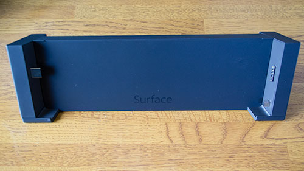
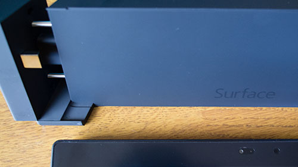
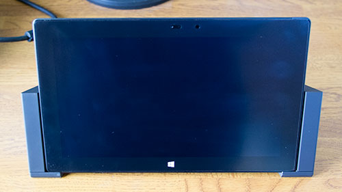

私はSurface PRO 2をデスクトップの代わりとして購入したので、ドッキングステーションがないと始まりません。Surface PRO 2本体には、USBのポートが1つついているだけなので、明らかに<em>周辺機器を接続するのに不便すぎるのです</em>。

<em>ミニディスプレイポートとUSBが1つずつある</em>ので、人によっては不要かもしれません。しかし私の場合は、Cintiq、モニタ、ワイヤレスマウス＆キーボードなどを繋ぐので、とてもじゃないがドッキングステーションがなければやっていられません。というより、<em>ドッキングステーションのポートでも足りないくらい</em>です。

## 本体との接続

てっきりSurfaceを<em>上から差し込んで接続する</em>のだとばかり思っていたのですが、<strong>左右から挟み込むような形で接続します</strong>。

ドッキングステーションの側面を開く。シャコっという音とともに開き、なんか<em>無駄にかっこいい</em>。

Surface本体を置く。

ちなみに底の部分に、Surfaceがちょうどハマるように<em>溝が付いている</em>ので、本体の位置がずれたりしません。

後はドッキングステーションの側面を本体に接続すれば完成。

### 接続・取り外しは電源をいれたままでも大丈夫そうだが、自己責任で

最終的に、ドッキングステーションにはSurfaceの電源入れたまま付け外ししています。

電源を入れたまま付け外しをすると、<em>筆圧を検知するソフトウェアを使う際</em>、<strong>キャンバス上でポインタの位置がずれる症状が発生</strong>しました。しかしこれは、<em>ドッキングステーションとの接続が原因で生じているわけではなく、ドライバの競合によって起こっている問題</em>のようでした。

Surfaceの電源をオフにした状態でドッキングステーションとの付け外しをしたところで、この症状は発生することがあります。であれば、わざわざドッキングステーションにつなげるのに電源を切るのも面倒なので、<em>Surface起動中のまま繋ぐようにした</em>というわけです。

私がドッキングステーションに接続しているデバイスは、ワイヤレスキーボードとマウス、USB-VGAアダプタ経由の外部モニタ、有線LAN、ミニディスプレイポート変換コネクタを経由したCintiq 13HDです。電源をつけたまま付け外しをしても、これらのデバイスは正常に認識され使えています。

## ドッキングステーションのコネクタ

右側から、USB3.0、有線LANポート、スピーカー端子、マイク端子、USBポートが3個、ミニディスプレイポート、アダプタ端子です。

アダプタは、Surface本体に接続するマグネット形式のものとは端子の形が違ので、ドッキングステーションに別途付属しています。本体付属のアダプタは持ち運び用に使えるというのは嬉しいところですね。

## 不満点

有線LANが驚きの<strong>100BASE-T</strong>です。今どき100ってありえない・・・なぜギガビットではないのでしょう。しかもこんなに高いのに・・・。

それだけが不思議でなりません。

## 実のところ、USBハブ使えばいいだけの話では？

何も考えずに勢いで買ってしまいましたが、正直な話、これで2万円するというのは<strong>高い</strong>です。USBハブを使えばなんとかなるんじゃないのと思わなくもありません。

細かくいうと違うのかもしれませんが、結局このドッキングステーション自体もUSBハブのようなものでしょう。SurfaceとはUSBポート、ミニディスプレイポートで繋がっているだけなのですから。

ケーブルの抜き差しの手間が減るというのと、見た目がかっこいいことは満足ですが、冷静に考えると<em>USBハブと何が違うのだろうか</em>と思ってしまいます。

もしUSBハブで運用されている方がいらっしゃったら、どんな感じなのか教えてもらえるとうれしいです。

  