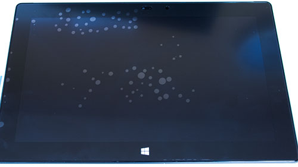
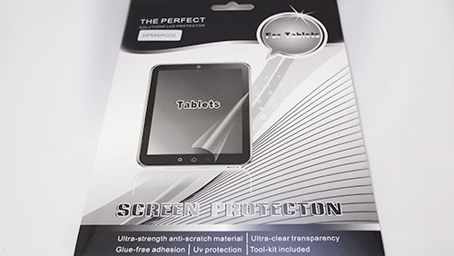

Surface PRO 2を購入して、保護フィルムを貼ることは決めていたのですが、<em>どれにするか非常に迷いました</em>。Cintiq 13HDの場合は選択肢が少なく迷う余地がなかっただけに、Surface PRO 2の保護フィルムは<em>いろいろありすぎて</em>どれを選べばいいのやら・・・。

<em>機種によって違ったり</em>、<em>光沢</em>やら<em>ノングレア</em>やら、とにかく種類が多い。値段もいろいろあって、どれがいいのかと悩んだ挙句、とりあえず<em>一番安いのをチョイス</em>することにしました。

<iframe style="width:120px;height:240px;" marginwidth="0" marginheight="0" scrolling="no" frameborder="0" src="//rcm-fe.amazon-adsystem.com/e/cm?lt1=_blank&bc1=000000&IS2=1&bg1=FFFFFF&fc1=000000&lc1=0000FF&t=illusionspace-22&language=ja_JP&o=9&p=8&l=as4&m=amazon&f=ifr&ref=as_ss_li_til&asins=B00C3AODVC&linkId=068f749d478db75d0b77bb31f7ed17bf"></iframe>

というのも、モニタを接続するための変換コネクタやら、他にも用意するものが思いの外いっぱいありまして・・・。すごい勢いで値段が膨れ上がっていってしまい、保護フィルムは消耗品だし、最初は安いものから試していこうということで予算を抑えたのです。

## PRO用だが、PRO2にも対応している

他の製品も同じだが、Surface PRO用のフィルムではあるが、<em>PRO 2でも問題なく使用できました</em>。フィルムにフロントカメラ用の穴が開いていいるのですが、位置はピッタリ合っています。サイズも合っているので、PRO用のフィルムであればPRO2にも使えるようです。

## 貼りづらい

値段が値段だけに、<em>かなり貼りづらかった</em>です。空気がだいぶ入りこむ上に、押し出しにくい。

キレイに貼れたと思っても、表面の剥離シート（2番目に剥がすやつ）を剥がすときに、フィルムが微妙に浮いて空気が入り込んでちょっとショックでした。

押し出し作業ですが、剥離シートを剥がしたあとであまりゴシゴシやるとフィルムが傷つくだろうし、おっかなびっくりやったせいで<em>かなり手間取りました</em>。空気押し出し用のプラ板などついていないので、製品に入っていたクロスを使って、地道に空気の押し出し作業。<em>今まで貼ってきた保護フィルムの中で、一番苦労した気がします</em>。

最終的には気泡はすべて対処し終えて、とてもキレイになりました。

ちなみに作業の際には、ぜひマスキングテープを使うことをオススメします。セロハンテープより粘着力が弱く、<em>非常に使い勝手が良かった</em>です。

<iframe style="width:120px;height:240px;" marginwidth="0" marginheight="0" scrolling="no" frameborder="0" src="//rcm-fe.amazon-adsystem.com/e/cm?lt1=_blank&bc1=000000&IS2=1&bg1=FFFFFF&fc1=000000&lc1=0000FF&t=illusionspace-22&language=ja_JP&o=9&p=8&l=as4&m=amazon&f=ifr&ref=as_ss_li_til&asins=B0000WS000&linkId=9a862e97e6234b099ec6231664027354"></iframe>

## 値段の割にいい感じ

滑り心地がよく、<em>値段が安い割にいい仕事をしている</em>気がします。指の滑りも阻害せず実にいい感じです。

ノングレアのフィルムのため<em>ややくすんで見える</em>ものの、特に問題は感じません。

### お絵かき用としてはちょっと滑りすぎかな

<em>お絵描きするにはちょっとすべり過ぎ</em>かと思います。<em>個人的にはもうちょっと抵抗が欲しい</em>のですが、人によるかもしれません。

ペン入れ等できれいな線を引こうとするときに、少し滑りすぎて思ったように線が引けない感じ。ただ、下書きとかでシャッシャッと線を引くのにはちょうどいいので、この辺りは慣れの範疇かもしれません。

### 文字入力にはちょうどいい

<em>手書き入力するにはすごいしっくりきます</em>。滑りがいいので、筆圧をかけない状態での速いストロークに向いています。<em>Surface PRO 2の手書き入力の認識精度がいいこともあり</em>、Surfaceでの文字の手書き入力が捗ります。

走り書きでささっと書いても、いい精度で認識してくれます。アルファベットの入力はキーボードの方が早いでしょうけれども・・・。

## 特にこだわりがない人にはオススメできそう

このフィルムは何と言っても<em>安いのが魅力</em>です。迷ったらとりあえずチョイスしてしまっても問題ないくらいの品質だと思います。

<em>値段相応に貼りづらいこと</em>と、この<em>パッケージの簡素な感じ</em>に目をつぶれば、充分に及第点でしょう。

ちなみに、このパッケージの持ち手の部分（フックとかに引っ掛ける上部の穴の部分）に、<em>フィルムが露出している</em>ので注意が必要です。剥離シートで保護されているとはいえ、こんなところに露出してて怖いなぁ・・・と、手にとった時に思いました。
