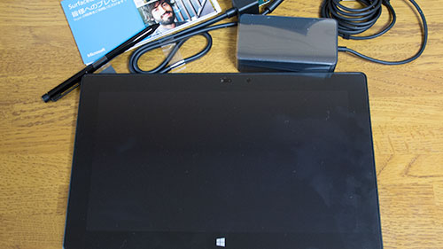

Surface PRO 2は<em>お絵描きもできる</em>し、<em>性能的にもいい</em>らしいという話を聞いて、前々からとても気にはなっていました。そして店頭で128GBモデルを実際に触ってみて、そのあまりの<em>動作のヌルヌル具合に惚れてしまいました</em>。

<strong>これは素敵なパソコンだ！</strong>

しかし、私はノートPCとしてMacbook Airを使っています。ノートパソコンはしばらく必要ないしなぁ・・・なんて思っていました。

ただよくよく考えてみると、デスクトップパソコンの調子が悪いことを思い出しました。そこで、いっそのこと<strong>Surface PRO2をデスクトップPCの代替として導入するのはどうだろうか</strong>と考えたのです。

私のデスクトップは<em>自作してかれこれ5年</em>ほど経ちます。スペックだけでみたら、Surface PRO2の方が高いくらいです。これはありかもしれないと、購入に踏み切りました。

## 256GBモデルをチョイス

128GBモデルでは、メモリが4GBしかないので選択肢に入らず、512GBモデルは高すぎる。というわけで購入するのは<em>256GBモデル</em>にしました。

<em>品薄状態で手に入りにくい</em>ですが、最近ではMicrosoftストアで<em>少しずつ供給され始めているようです</em>。年明けから<em>毎日暇を見つけてはアクセスした</em>甲斐があり、思いの外早く手に入れることができました。

## ファーストインプレッション

<ul>
<li>かなり軽い（907g）。</li>
<li>動作が早い。起動は早いしヌルヌル動く。</li>
<li>ソフトウェアキーボードだけでも結構行ける。</li>
<li>筆圧対応でお絵描きできる。Clip Studio Paint PROなら何もしなくとも筆圧対応。</li>
<li>付属のペンは細すぎてちょっと気に食わない。</li>
</ul>

### こいつ早いぞ！

動作速度はかなり早い。シャットダウン状態から10秒位で起動してしまいます。

iPadに比べると<em>ゴツくて重い</em>ですが、<em>キビキビ動く</em>し、<em>デスクトップで使っているソフトが普通に使える</em>し、<em>画面解像度も1920&#215;1080ピクセルと広く</em>ていい感じです。

タブレットスタイルでずっと持って使うと、さすがに手が疲れますけどね。

### キーボードなくても意外となんとかなる

私はタッチカバーは購入しませんでした。デスクトップの代替のつもりで購入したので、ワイヤレスキーボードを使えばいいやと思っていたからです。

しかし、思いの外<em>ソフトウェアキーボードの動作がよくて</em>いい意味で驚きました。キーボードスタイル、手書き、アルファベット順などの入力携帯の切り替えがスピーディだし、<em>フリック入力ができ</em>て結構便利です。

<em>手書き入力の認識精度がかなり高く</em>、走り書きで書いてもかなりの高精度で認識してくれます。<em>下手にキーボードで入力するより早い</em>かもしれません。手書きだとよくやる、門構えの省略書きをしても、ちゃんと文字を認識してくれます。

### 特に何もしなくてもお絵描きできる

Clip Studio Paint PROであれば、インストールすればすぐに筆圧対応でお絵描きができます。

<em>SAIも使用することができます</em>が、<em>Windows7で使っていたような軽快感は感じられません</em>。それも当然で、<em>SAIはWindows8での動作はまだ考慮されていない</em>ためです。現在開発中とのことではあるが、Windows8では無理にSAIを使うより、CLIP STUDIO PAINT PROを使った方がいいかもしれません。

ちなみにSAIを使用する場合、<em>画面のスケーリングを150％以外に設定</em>し、<a href="http://us.wacom.com/en/feeldriver" target="_blank">ワコムのアメリカサイト</a>からドライバをダウンロードしてインストールすれば、<em>一応筆圧を感知するようになります</em>。

## Windows8に慣れない

Surface PRO2のハードウェア的なところに不満はないどころか、むしろ感動するばかりである。ただ、Windows8.1の操作性には戸惑うばかりです。

単純に慣れの問題ではあるのですが、操作性がガラッと変わってしまっているので、「あの操作がしたいのに、Windows8だとどうやるんだっ」とモヤっとするばかりです。

モダンUI、アプリについてとりあえず覚えたこと。

<ul>
<li>画面右端からスワイプすると設定が出てくる。モダンアプリ起動していると、そのアプリの設定になっている。（常にパソコン自体の設定のことだと思っていました）</li>
<li>アプリ起動中に画面上から画面下へスワイプすることでアプリを終了できる。</li>
<li>アプリ起動中に画面上から少しスワイプするとメニューが表示される。</li>
<li>画面左端から右にスワイプすると、タスクの切り替え（Windows7とかでのAlt+TABと同じ）ができる。</li>
<li>画面左端から右にちょっとスワイプした後、そのまますぐに左端へスワイプすると現在起動中のタスクが一覧表示される。</li>
</ul>

これらを覚えさえすれば、Windows8の操作性も悪くないなと感じはじめました。それもこれも、Surfaceの動作がかなりキビキビしているからだと思います。

## お絵描きする人でノートPCを買い換えようと思っている人はマストバイ

絵描きさんに普通におすすめできるパソコンではないでしょうか。<em>気が向いた時にお絵描きできる</em>し、<em>動作も早い</em>。

今まで使っていたソフトウェアも普通に使えるため、私のように<em>デスクトップの代替として購入するのも全然あり</em>だと思います。

デスクトップPCでWindows8を使うとなると、ストレスしか感じませんが、Surface PRO2だと「モダンUIも悪くない」と思えます。それくらい、<em>タッチ操作＋ペンでの操作がものすごい便利</em>。

前のモデルだと発熱がひどかったらしいですが、<em>Surface PRO2はそんなに気になりません</em>。

Microsoftストアで在庫ありになったのを見て、反射的に購入してしまいましたが、新年早々いい買い物ができたと思います。

  