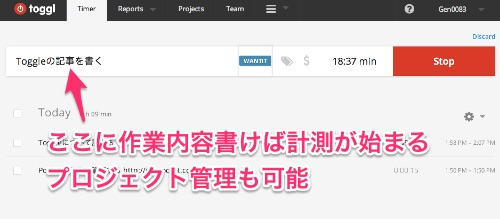

なんかTogglが便利らしいというのは聞いてはいました。今までは「ふーん、そうなんだ」で流していたのですが、実際に使ってみると想像をはるかに超えて便利でした。

きっかけは、私がタスク管理ツールとして使っているTodoistと連携できるということを知ったからでした。

<a href="https://blog.todoist.com/ja/2015/01/16/todoist%E3%81%A7%E3%82%BF%E3%82%B9%E3%82%AF%E3%81%94%E3%81%A8%E3%81%AB%E4%BD%9C%E6%A5%AD%E6%99%82%E9%96%93%E3%81%AE%E8%A8%88%E6%B8%AC%E3%81%8C%E5%87%BA%E6%9D%A5%E3%82%8Btoggl%E3%83%97%E3%83%A9/" rel="nofollow">Todoistでタスクごとに作業時間の計測ができるTogglプラグイン</a>

Toggleを利用開始して、Chrome用のプラグインをインストールすれば、こんな感じでTodoistのタスクリストに計測開始ボタンが表示されます。

ボタンを押すとToggl側にもTodoistで登録したタスクが送られる仕組みです。

これの何が便利かというと、Todoistに登録したタスクの処理時間が記録できる上に、勝手に作業ログもでき上がってしまうということです。なんと便利なことか。

私はTodoistを無料で使える範囲でしか使っていないので、この「タスクを処理したログが見れる」のがとても便利に感じます。何にどれだけ時間をかけたのかが一目瞭然です。

Todoistで管理していない作業についてはToggl側で記録していけばいいです。Togglの使い方もとてもシンプルで、これからやる作業をToggleに入力すると勝手に作業時間の記録が開始されます。

非常にシンプルでいいですね。

AndroidやiOSアプリもあるので、スマホから記録を取るのも簡単です。

ライフログをとるのに<a href="https://wantit.gcreate.jp/litelogfree/">AndroidのLitelog freeを使ってみた</a>りもしたのですが、断然Togglの方が使いやすいです。

パソコンのブラウザから作業開始の登録を行い、Chromeのプラグインで記録を停止し、スマホで確認したらちゃんと止まっていて、同期はかなりシームレスにとれているようです。その場その場でアクセスしやすい媒体から操作すればちゃんと反映されます。

終了としてしまったけどやっぱりもうちょっと追加で作業したいと思えば、終了した作業をクリックして再開してやれば追加で記録できます。おっちょこちょいな人でも安心ですね。

同じ作業を小分けにやる場合でも同じです。作業した時刻は別々に記録されるので、1日の作業内容を後から俯瞰することも可能です。この日はこういう流れで作業してたのか・・・なんて感じで振り返りもできます。

この手の記録を取るようになると、自然と作業に集中できるようになるのでオススメです。特にTodoistを使っている人はくっそ便利になること間違いなしなので、ぜひぜひ試してみてください。
