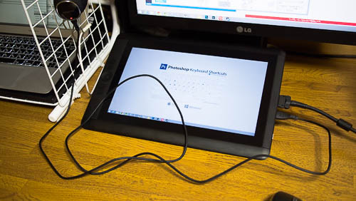
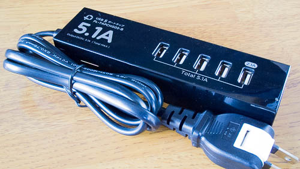
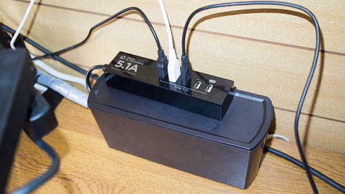
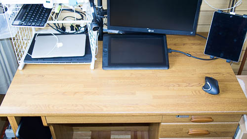

机の上が片付いてスッキリしてきたのですが、1つ気になることがありました。それは、USB機器の充電についてです。

今使っているパソコン（Surface PRO2 + ドッキングステーション）のUSBポートは全部使い切っていまして、唯一CintiqについているUSBポートが空いているだけの状態です。

今までは机の右側にサーバを置いていたので、そのサーバにUSBケーブルを繋いで充電させていました。しかし部屋を模様替えしてサーバの置き場所が変わってしまったので、現状ではCintiqに繋いで充電するしかありません。するとこうなります。

Cintiqから伸びるUSBケーブルの邪魔なこと邪魔なこと・・・。マウスはまだ充電の頻度が少ないので我慢できなくはありませんが、ヘッドホンはだめです。1日おきくらいの頻度で充電するので、毎回こんな状態になると考えると気が狂いそうです。

そこで、USBの電源タップを購入して対策することにしました。

## 5ポート接続可能なタップ

見た目は普通のOAタップですが、つなげるのはUSBケーブルというところが違います。ちなみにタップのケーブル長は1m20cmとちょっと短いです。購入前にはちゃんとメジャーなどで長さの感覚を掴んで配線計画を立てておきましょう。私のように「何とかなるだろう」と見切り発車すると後で泣きをみます。

こんな感じで配線して各USB機器に繋げます。充電しようと思った時に毎回タップに繋ぐのは面倒くさいので、予め普段ヘッドホンの近くまでケーブルを引っ張っておきました。充電時にはヘッドホンにケーブルさせばすみます。

タップにはせっかく5つもケーブルを繋ぐことができるので、iPadを繋いだり、ノートパソコンの冷却ファンを繋げたりしてみました。1つあれば充分と思っていたのですが、あったらあったで使ってしまいますね。

USBハブも考えないではなかったのですが、iPadやスマホを充電することを考えると、充電専用のものにした方がいいかなと思いました。充電だけしたいのに、パソコンの電源を入れないといけないというのも面倒ですからね。

ともかく、これで机の上がスッキリと片付きました。1週間前と比べるとかなり快適になり、個人的に満足しています。

## 音について

USBの電源タップを探していると、中には高周波音がするというような製品も見かけましたが、この製品は今のところ気になるような音は出ていません。ケーブルの配線に悩まされなくなっても、音で新たな問題がでたら困りますもんね。

  