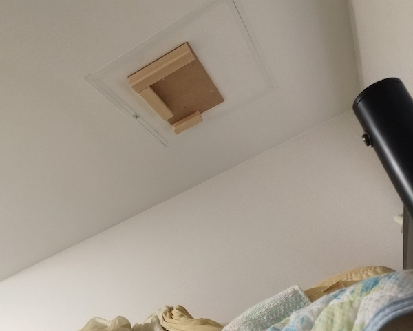

パソコンを操作していて肩こりに悩まされる人は多いだろう。その原因のひとつに、マウスを操作するときの姿勢が悪いからというのがある。

私はパソコンを操作するときに関してはある程度気をつけていたのだが、ここ最近悩まされているのが布団の中でのiPadの操作だった。

<!--more-->

## 横になりながらiPad

布団に潜ったらさっさと寝ろというのはまさに正論である。

事の起こりはなかなか眠りにつけないからiPadで動画を見ながら眠くなるのを待とうという程度のことだったと思う。いつしかそれは習慣となった。

さらに冬になったら寒い。それまでは布団に入る前にやっていたネットサーフィンやらゲームやらが、いつしか布団に潜ってからやることになってしまった。

徐々に布団の中でiPadを操作する時間が長くなり、そうして肩が限界を迎えたのである。

このままではいかん。

ベストは布団に入ったらさっさと寝るようにすることというのは理解していても、一度習慣化してしまったものはなかなかやめられない。どうにかして、布団の中でのiPadをやめるのではなく、肩を痛めず自然な姿勢でiPadを操作する方向で解決したかった。

・・・寝ながら自然な姿勢というのもおかしな話ではあるが。

## iPadの天井吊り

まず思いつくのはモニタアームを使ってiPadを空中に吊り下げる作戦だろう。

しかし重力に逆らうように配置するのは保持力の面から難しそうだと早々にこの線は捨てた。安物のアームを買っても、どうせiPadの重さに負けて垂れ下がってくるだろう。そもそもAmazonでは中華製のあやしいものしか見当たらないし。

幸い私の寝床はロフトベッドで、部屋の天井が比較的近い。ここにiPadを置ければ解決するのだから自分で作ることにした。

適当に余っている木材を利用してiPadをひっかけられるようにした。そのマウントを天井に固定するためには天井にビス止めするしかなかったが、比較的うまくいった。

見てくれはあれだし途中ミスって変な形になったが、結果オーライである。

三方を囲っている木材に溝が掘ってあって、そこにiPadを差し込んで吊るす。安定感はばっちりだし、一応USBケーブルをさしたままでも吊るせるように右側の木材が短くなっている。

## マウス

天井にiPadを固定することには成功したが、そのままでは操作できない。天井が近いとはいえ結構な距離があるので、タッチ操作は手が届かず不可能だ。

とりあえず手元にあったワイヤレスマウスで操作してみたが、これはこれでしんどい。マットレスの上でポインタを動かすには、肘を反らしてマットレス表面に押し付けるような形になる。肩は楽だが肘が痛い。

となるとトラックボールかとなり、探した結果が今回紹介するRelaconである。

- 手に持って操作できる（平面に置かなくても操作できる）
- Bluetooth対応
- 小型

こういった条件を備える製品はなかなか見当たらず苦労した。ちなみに同じRelaconでもUSBレシーバで接続するタイプがある。そちらはiPadでは使えないので要注意だ。

ちなみに私は寝転がって使う目的で買ったが、このマウスであればキーボードをほとんど使わない人なんかにもお勧めできると思う。マウス操作のために肩を前に出すような形でパソコンと向き合っている人なら、このマウスを使うことで椅子にふんぞり返りながらPC操作が可能となるだろう。

欲をいえばマルチペアリングには対応しておいてほしかった。ワイヤレスマウスとしてみればミドルクラスの価格帯なので、複数機器とペアリングして随時切り替える機能は欲しかった。

あとはクリックするためのボタンがマウスの前面にあるため、クリックする際にポインタも一緒に動かしてしまいがちである。この操作感は若干慣れが必要となるだろう。

個人的にはメディアコントロール機能は不要なので、マルチペアリングできれば文句なかったなぁ。
