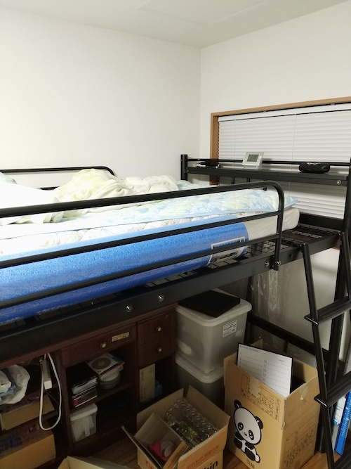
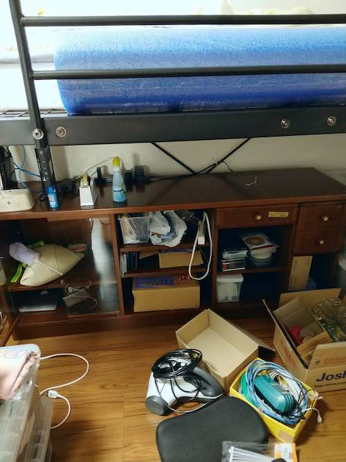

引越し先の自分の部屋にロフトベッドを置くことにした。部屋には収納スペースがないので、せめてロフトベッドを使って、ベッドの下側を収納空間として活用したかったのである。

<!--more-->

## ロフトベッド選び受難

ちなみにロフトベッドを選ぶ際に、私には1つの条件があった。それはベッドの横幅が101cmあることだった。理由としてはふとんコンディショナーフトコンを設置しようと考えていたからである。

<iframe style="width:120px;height:240px;" marginwidth="0" marginheight="0" scrolling="no" frameborder="0" src="//rcm-fe.amazon-adsystem.com/e/cm?lt1=_blank&bc1=000000&IS2=1&bg1=FFFFFF&fc1=000000&lc1=0000FF&t=illusionspace-22&language=ja_JP&o=9&p=8&l=as4&m=amazon&f=ifr&ref=as_ss_li_til&asins=B07B64VMTZ&linkId=6aaff2dc3b64a591c187b86c35b8733a"></iframe>

当たり前だがこの製品、ロフトベッドで使うことは想定されていない。事前に販売会社に相談したが、そんな使い方は保証外なのでとやんわりとエクスキューズされた。そのあたりは問題ない。問題ないが、それより価格のほうが問題である。14万て・・・。

ともかく、このフトコンを設置するのにベッド幅101cmは欲しかったのである。しかしながら世に出ているロフトベッドのシングルタイプは、そのほぼすべてがベッド部分の横幅90cmくらいであり、フトコンを設置しようと思うと横幅が全然足りないのだ[^1]。

よって私はセミダブルを選んだのであった。当たり前だが、セミダブルだと今度は横幅が大きすぎる。実際に設置してみて大きすぎると改めて思っている。いつも仕舞う場所に困って立て掛けていたピラティスポールがロフトベッドに設置したマットレスとの間にすっぽり収まっていい感じになった。それくらい横幅に余裕がある。

ちなみにベッド下が散らかっているのは勘弁して欲しい。まだようやくロフトベッドが設置できただけなので、部屋は全然片付いていない。というより必要な家具がまだ揃っていないのだ。

## 組立作業は超ハード

ちなみにこのベッドは組み立ては自分でやるタイプの製品だ。組み立てサービスなどがあるのかは知らない。

荷物のサイズがでかいうえに2個口でやってくるので、あらかじめ部屋の中のものというものを別の部屋に退避させてから配達当日を迎えた。この手のものは、設置スペースの倍くらいの作業場所を確保しておかないと、まともに組立作業ができないのだ。覚えておくといい。

組み立て用の工具はすべて付属しているので、自分で別途用意が必要な工具は存在しない。・・・と言いたいところだが、宮の部分にあるコンセントの位置を固定したければドライバーが必要だ。他にベッドの高さをミドルからハイタイプの切り替えたり、ミドルタイプで使う場合のベッドの足の保護材を埋め込むために、ゴムハンマーもあるとよいだろう。手で押し込むのは無理があるので、ゴムハンマーは必須と言ってよい。

ちなみにゴムハンマーは家具の組み立て時に重宝するので、一家に一本あるとよい工具だと思う。素材がゴムであればなんでもいいので、適当なのを買っておくとよいだろう。メタルラックの組み立てなどにも活躍するので、安いのでいいから持っておくとぜんぜん違う。

<iframe style="width:120px;height:240px;" marginwidth="0" marginheight="0" scrolling="no" frameborder="0" src="//rcm-fe.amazon-adsystem.com/e/cm?lt1=_blank&bc1=000000&IS2=1&bg1=FFFFFF&fc1=000000&lc1=0000FF&t=illusionspace-22&language=ja_JP&o=9&p=8&l=as4&m=amazon&f=ifr&ref=as_ss_li_til&asins=B01AXMMT0I&linkId=c2a9a7c228e9cccaa04563abb35be268"></iframe>

電動ドライバーがあると作業がかなり楽になる。ただし、先端工具としてヘックスビットがなければ役に立たないので注意が必要だ。

このベッドの組立に使うネジは例外なく六角レンチを使う。ナットを固定しておくためのスパナも一応用意されているが、柄の部分が短いので、別途スパナもあったほうがいいかもしれない。確か私の記憶によると13mmのスパナでサイズちょうどだった気がする。

以前に弟のベッドの組み立てを手伝った際に、ヘックスビットがないと電動ドライバーが役に立たなかったことがあった。それを教訓としてあらかじめヘックスビットを用意していてよかったと思った。電動ドライバーがないと作業時間がさらに倍くらいに伸びていただろう。

締め付けすぎてもよくないらしいので、ある程度のトルクの出る電動ドライバーでよいと思われる。間違っても18Vのインパクトドライバーフルパワーなんかやらないように。絶対にネジがネジ切れるか、製品がひん曲がるかのどっちかである。[^3]

ちなみに私は弟と二人で組み立てを行った。開梱作業、とにかくダンボールがでかいので、この開梱作業も時間がかかった。それから実際の組み立て。完成後の設置。あわせて3hくらいはかかった。

ひとりで組み立ては、よほど組み立て方を工夫しない限り不可能だろう。なんせ説明書通りにやるなら、ベッドの床面を組み立て、その後ロフトベッドの足に床を固定するのである。この部分が一番大変だった。

たぶん床面を固定する前にロフトベッドの足に固定する順番で組み立てたほうが楽だったような気がする。なんせ重い床面を絶妙な高さまで持ち上げて、その上でネジで固定しなければならない。この部分はかなりのスピード勝負になるので、下手をするとえらいこっちゃになる[^2]。

私の部屋ではハイタイプで使えたら使いたいと思っていたのだが、ハイタイプにしたところでベッドの床下に配置したいものがないことに気づいたので、ミドルタイプで組み立てた。ハイタイプにするには別途足の部品を追加でくっつけなければならないので、作業的にはひと手間減る形になった。逆に言うと、ハイタイプで組み立てたい場合はプラスアルファの作業時間が必要ということである。

組み立ては2人以上でとのことだったが、正直なところ3人いた方が安全である。常にいる必要はないが、床面とロフトベッドの足を組み上げる際は3人いた方が絶対にいい。シングルタイプはいざしらず、セミダブルタイプをひとりで組み立てられるなんていう人の意見は参考にしてはいけないと思う。そもそも運び入れがひとりでは無理だしね・・・。

あと説明書にははっきりとは書いていなかったが、ベッド床面とロフトベッドの足をネジ締めする際は、仮止めにしておいたほうがよい。ロフトベッドの足の下にくるフレームを接続する際に、ベッド部分のネジをがっちり締めていると下の長さが足りなくなるからだ。

とはいえ届いた商品は特に歪みもなく、目立つような不良は存在せずその点は良かったなと思う。加工精度も問題なく、普通にネジも締められた。この点ちょっと不安があったので一安心である。

## 寝てみた感想

ベッドの支柱となる足下のフレームと筋交いを組み上げたら、ベッドは一切ぐらつかない。耐荷重も120kgと私にとっては余裕があり、ロフトベッドの上で寝ても快適である。使っているマットレスがよくないので寝心地はよくないけれど、それはロフトベッドとは関係がない。

ベッドの頭がくる位置に宮、いわゆる物置スペースがあるのだが、これもなにげに便利である。というより、こういう物を置くスペースがないと困る。特にロフトベッドだとそうだ。コンセントがついているので、携帯を充電したりできるのもよい。ただし、ふとした弾みで宮から物が落ちそうなので、落下防止用にネットなりを別途取り付けようかなと思っている。しかし、いいアイデアが湧いてこないので、今のところは物が落ちないように願いながら使っている感じだ。スマホ用の充電ケーブルが長すぎて邪魔なので、別途短いやつを買おうかなとか思わなくもない。

寝心地に関しては本当に文句の付け所がない。しっかりと安定して上り下りの際もガタツキがないので安心感がある。はしごはそのままでは素足でもかなり滑るので、付属の蛍光テープをはりつけて置いたほうがいいだろう。はじめは変に光って邪魔じゃないかと思ってつけなかったのだが、ベッドの上に上がってしまえば気にならないし、なにより滑り止めとして重要な意味があった。

## ベッド下の収納

こちらも散らかりっぱなしなのであまり参考にしてほしくないが、ベッド下の収納はこんな感じである。

ちょうど引越し前からあったサイドボードを格納し、その横に服をしまっておく衣装ケースが格納できて、収納スペースとして十二分に役立っている。衣装ケースは写真に写っていないが、サイドボードの右にちょうど収まっている。

サイドボードとベッドの床面との間はだいたい30cmちょっと空いているので、ある程度のものなら置いておくことができる。今のところは光回線のルータなどを置く場所として利用している。

ただ、ミドルタイプだと床下が低いので、中腰にならないと頭をぶつける。しかもセミダブルタイプだと奥行きも長いので、若干活用方法が難しい。

後はベッド下は部屋のライトが届かないので、別途照明を用意しておいたほうがいいかもしれない。ちょうど使いみちに困っていたUSB給電式の簡易照明が余っていたので、これを配置した。もっとも、基本的に頭を打ちそうなのであまり近寄らないスペースと化してしまっている。本格活用は、部屋に設置予定の家具が全部揃ってからになりそうだ。

## まとめ

総合的に見て満足行く買い物となった。あえて文句を言うとすれば、組み立て説明書の手順はもうちょっとやりやすい方法を考えて書いてほしかったというところだろうか。

あとはこのロフトベッドに限らないが、シングルとセミダブルのちょうど間くらいの横幅のベッドがあると文句がない。これはこの商品にと言うよりは、商品ラインナップに対しての注文だ。シングルだと横幅が狭すぎるし、セミダブルだと広すぎる。この中間のサイズがあればよかったのにと思うのだが、私は探し当てることができなかった。無念である。

もっとも、写真のようにピラティスポールがすっぽり収まっているので、マットレスの横ずれ防止と収納が兼ね備えられたのは不幸中の幸いである。しかし床下のスペース活用にも影響があるので、やはりジャストサイズが一番望ましい。シングルとセミダブルのちょうど中間のサイズがあれば良かったなと心底思う。それとも存在していて、私の検索力不足で見つけられなかっただけだろうか・・・。

とはいえ、総合的には満足のいく買い物である。セミダブルにしたおかげなのかもしれないが、ベッドの安定感は想像を超えていた。多少は揺れるかなと思っていたのだが、びくともしないのには驚いた。

ロフトベッドの導入は、組み立てを考えて引っ越し直前にあらかじめ配送および組み立てをしておくのがよいと思う。すでに利用している部屋に設置するのは、組み立て場所を確保するのが困難であろうから大変だと思う。

あと気になるのは、使っていないハイタイプにするための足の部品たちである。これの処理をどうすればよいのだろうか・・・。また引っ越すことを考えてとっておくのか、それとも切断砥石など使って細切れにして、その他鉄ゴミで処分してしまうか。今の所保留として置いたままにしてるんだけどね。宮の下の空間にさりげなく配置してあるので邪魔にはならない。ホコリをかぶりだすと邪魔になるかもしれんがね。

[^1]: フトコンのオーバーマットレスが置けない、もしくは窮屈になるという意味である。
[^2]: ベッドの床面を下から持ち上げる人の体力的な問題である。とにかくまずは仮止めしてやらなければならないが、この仮止めさえも結構手間取る。あらかじめネジを足の穴に差し込んでおいたりといった工夫が必要だ。
[^3]: 私は加減がよくわからなかったが、マキタのマルチモード電動ドライバーTP141のネジ締めモードのパワー7でネジ締めを行った。まあまあいい感じに仕上がったのではと思っている。