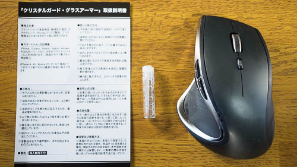
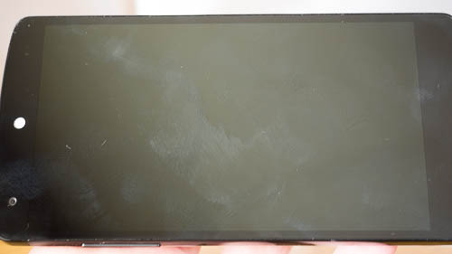

ガラス表面につけると水晶化して傷がつきにくくなるという、それだけ聞くとどういう仕組なんだとあやしく感じる製品です。

個人的には傷がつきにくいかどうかは割りとどうでもよく、指紋がつきにくくなるらしいのでそっちがメインです。傷がつきにくいっていうのは、どうせだから試してみようって感じでした。

スマホ使っていると、汗とホコリで表面がザラザラした感じになる経験がありませんか？　グラスアーマーでコーティングしてやれば、ああいうのも軽減されるのかしらと思って試してみることにしたわけです。

製品はかなり小さいです。

そしてなぜか私の買った製品には施工用クロスが入ってませんでした。どういうことなんだってばよ・・・。

## 実験状況

実験の様子を動画にしました。

<iframe width="480" height="270" src="https://www.youtube.com/embed/jiEz3JL0Nak" allowfullscreen></iframe>

使わなくなった古い端末（Xperia Arc）を使って傷のつきにくさ、指紋のつきにくさの試験を行いました。

Xperia Arcには飛散防止フィルムが貼られているので、これを剥がしてから実験しました。

施工の仕方によって違いが出るかもしれないと、下地処理を4種類用意しました。

<ul>
<li>何もしない（施工しない）</li>
<li>手垢そのままで施工する</li>
<li>表面をティッシュでキレイにしてから施工する</li>
<li>無水エタノールを使ってキレイにしてから施工する</li>
</ul>

の4面を用意して、無水エタノールでキレイにしてから施工した面が最も傷がつきにくくて、やっぱり表面はキレイにしてからやらないとダメだねっていうのを表現したかったのです。

しかし施工は3面同時に行ったため、違いが分からないどころかうまく施工できていない可能性すらあり、実験の仕方としてはよくありませんでした。

うまく施工できていない可能性もありますが、私は施工面と無施工面での明確な差を実感できませんでした。

値段が値段だけに、過剰な期待を込めて買うのは止めた方がいいんじゃないかなと思います。

今回Nexus5、9、実験に使ったXperia Arcの3機種を施工したので、保護フィルム3枚分と考えれば値段相応といえるかもしれません。

手持ちの複数の端末に施工するのであれば試してみてもいいかもしれませんね。（だからといって効果があるかは分かりませんが）

## 対傷性能について

今回ガラス表面を傷つけようとして初めて分かりましたが、カッターナイフで力を込めて引っ掻いても、ガラス表面はそう簡単に傷つかないということでした。光のあて具合で引っ掻いたような痕が肉眼で見えるかなというレベルです。

カッターナイフで引っ掻いて、「ほらキズつかないでしょ？」というのは眉に唾つけてみたほうがいいです。そもそも無施工の状態でも、動画で分かるような傷はつきませんから。（実際に試すのなら自己責任でやってくださいね）

公式動画のようにガラス片を使って傷をつけてみるか、ガラスカッターを使わない限りは、傷のつきにくさは体感できないのではないかなと思いました。

私はデザインナイフの根本部分を使ってゴリゴリしましたが、施工の有無にかかわらずガラス面は傷だらけになりました。そもそもこの傷の付け方では、施工の有無による差異を感じられません。傷のつきにくさの実験というより、単にガラスを傷つけているだけです。

施工したからといって、絶対に傷つかなくなるわけではありませんから、傷防止の観点からは素直に保護フィルムを使った方がよいと思います。

## 対指紋性能

指紋のつきにくさについてですが、こちらも明確な差異は感じられません。

フリックすれば指紋の筋が残って曇ったような感じになりますし、ペタペタ触っても当たり前のように指紋がつきます。

心なしか無施工面と比べると、施工した面の方が指がペタペタくっつかない感じがするかもしれませんが、やっぱり気のせいかもしれません。

使う指に気を使うとあまり指紋がつかないような気もします。親指の腹でこするとさすがに指紋がべったりつきますが、人差し指だとつきにくい気がします。しかしこれは指先の皮脂の差によるものなようの気もします。

ジーパンのポケットに突っ込んでから取り出した時に、そういえば表面の指紋が目立たなくなっている気がしました。指紋がつきにくくなるというより、指紋が取れやすくなるのかもしれません。

はっきりしない意見で申し訳ありませんが、「明らかに違って素敵！」とは思えないけれども、心なしか効果があるような気はするんです。なんかそんな感じなんです。

しばらく継続して使ってみると何か違いが感じられるかもしれませんので、しばらく使ってみて追記したいと思います。（まだ施工して数日なので・・・）

施工前に撮ったNexus5の写真

写真にして明確な違いが分かるかどうかは微妙な気もしますけどね・・・。

## 全体的に微妙な差異

傷についても指紋についても、施工することによって明らかな違いが生まれるとは、私には感じられませんでした。何となく効果があるような気もするので、買ったのを後悔するほどではありませんが・・・。

明確な違いを感じられないのは、買った製品に施工用のクロスが付属していなかったせいで、施工の仕方がまずかったからかもしれません。（そもそもクロスちゃんとつけとけよっていう話ですけどね）

ネットのレビューを見ても、絶賛しているものもあれば「傷がついたじゃねえか」というのもあります。

そもそもこれを施工したからといって、絶対に傷がつかなくなるわけではないです。実験動画のように、悪意を持って表面をゴリゴリしたら傷はつきます。

一方でカッターナイフでひっかく程度では、施工してなくとも簡単にはキズつかないものです。傷がつかないと絶賛している人は、施工前に同じように試してみてから言っているのかなと疑問に思います。

液晶保護という観点から言うと、保護フィルムを使った方が確実でしょう。

液晶保護フィルムと比べてグラスアーマーが優れているのは、保護フィルムの間にホコリが混入して変な気泡が生じないということと、段差のないフラットな面で運用できるということでしょう。しかし傷がついたらどうしようもないので、それがメリットなのかと言われると微妙なところです。

ただ、運用途中の端末に使うならアリだと思います。私は中古で購入したNexus5と9にも施工しましたが、これに液晶保護フィルムを貼るのは難しかったと思います。表面のホコリを完全に取り除いてキレイにフィルムを貼るのは大変な作業です。それを考えると、多少ホコリがついていようが溶液を塗るだけのグラスアーマーは施工が簡単です。

それに複数の端末に使えるというのも1つのメリットです。1台にだけ使う場合、明らかに液晶保護フィルムの方が安上がりですが、2台だとトントン、3台以上ならグラスアーマーの方が安上がりです。施工する端末が何台あるのかも検討項目として大事でしょう。

効果が無いわけではないと思うのですが、傷防止性能についてはちょっと未知数です。実験の仕方がまずかったので効果がよく分かりません。

しかし絶対に傷つかなくなるわけではないので、それを考えたら液晶保護フィルム貼った方が確実に保護できます。

ただ、液晶保護フィルムのない端末を操作するのはとても快適です。フィルムによる段差はないし、触り心地も滑らかでいいですしね。

現時点でのこの製品に対する評価はニュートラルです。しばらく運用してみてまたレポートしたいと思います。

ちなみに、<a href="https://wantit.gcreate.jp/nitorirutebukuro/" title="手の汚れる作業に便利なワーキングクインニトリル手袋をレビュー">施工時に使ったワーキングクインニトリル手袋</a>なら自信を持ってオススメできます。

油で手が汚れてしまう自転車のチェーン掃除に使えますし、料理の際に手が油臭くなったり魚臭くなったりすることを防いでくれる便利な手袋です。

<a class="amazonjs_indicator_title" href="#">クイン ワーキングクイン ニトリル手袋 （パウダーフリー） L  50枚入り</a>

  