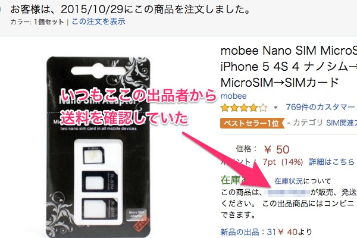
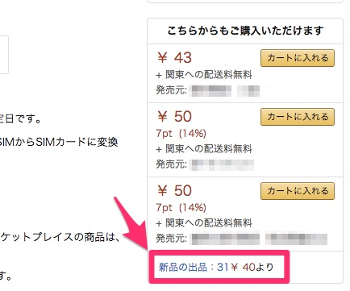
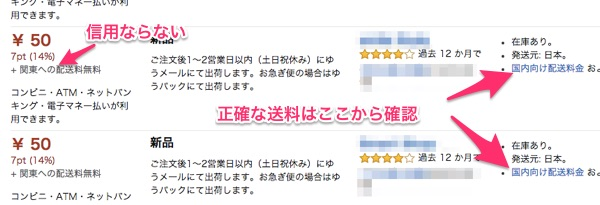

今私が使っているスマホはNexus5で、これはマイクロSIMの端末になります。今度新しくNexus6Pを購入し、これがナノSIM端末であるためSIMを変更しました（というかMNPで回線ごと変えたのですが）。

しかし新しい端末が届くまで電話が使えないのは不便だと、SIMアダプターを購入しました。

元々、「SIMはナノSIMにして、アダプタを使ってマイクロや通常サイズのSIMの端末でも使えるようにするのが最強じゃね？」と思っておりました。ナノSIMさえあれあれば、後はアダプタでどんな端末にも対応できるようになるわけです。リーズナブルかつスマートです。絶対にアダプタを使うほうが便利だと思っていたのですが、今回アダプタを購入して実際に使ってみて、ちょっと考えを改めた方がいいのかもしれないと感じました。

## かっちりはまるわけではない

そもそもアダプタの品質が良くありません。1を見て全を語るのは早計かもしれませんが、私の考えていたイメージから言うとこれはアダプタと呼べるようなシロモノではないと思います。

私はSIMアダプターに対して、SDカードのアダプタのようなものをイメージをもっていました。かっちりハマって安定感がある、そういうやつを思い描いていたのです。

しかし実物は全く違いました。ハマるというか載せてるだけです、これ。押し込んでも微妙に浮いているし、下に向けたらそのままナノSIMが重力で落ちます。

アダプタを使うとスロットを損傷する可能性があるから使うな、なんていう端末の話を聞いていましたが、実際にアダプタ使ってみてわかりました。たしかにこれはSIMスロットを傷つけるんだろうなと。

SIMスロットに差し込むのに、ナノSIMが上側にくるようにしながら、やや浮かんでいるナノSIMを爪で軽く抑えつつズレないように気を配りながら、慎重にSIMスロットへ差し込む。そもそもナノSIM自体小さいので、結構気を使う作業です。これは素直に端末が要求するサイズのSIMを用意するのが賢いと思いました。

私は今後これを使わないと思います。もっともそれは、今後買うであろう端末がナノSIM端末であろうからそもそもアダプタの出番がないからではありますが、そうでなくともこんなちゃちな作りのアダプタにSIM乗せて出し入れしたくないという思いが強いです。

アダプタ使うんだという人は、SIMが傷ついて使えなくなっても文句言わない、そもそも端末のSIMスロットが壊れて端末自体を買い替えなくてはならなくなっても文句言わない、そういう精神でお望みいただければと思います。

単に私の掴んだ製品が粗悪品だったというだけかもしれませんが。ついているはずのSIMピンすら入ってなかったですし。この前マーケットプレイスで買った商品も、付属していると表示されてたクロスが入ってなかったりしたけど、粗悪品しか扱われてないのかと勘ぐりたくなりますね・・・。

## Amazonのマーケットプレイスはひどい

正直商品自体も不満ですが、それよりなにより、Amazonのマーケットプレイスで購入した事自体が間違いだったという思いでいっぱいです。

AmazonでSIMアダプタを検索すると、50円とかで出てきます。50円のものに対して粗悪品だ何だと騒ぐのもあれな気はしていていますし、そもそも品質悪いなというのは覚悟の上で買っています。「SIMピン入ってなかった、返品する！」とかそんなことを言うつもりは毛頭ありません。品質悪いとは思っていたけど、ここまでちゃちなものだとまでは思ってなかったというだけで。

たぶん友人が「俺SIMアダプタ買うんだ」って言いだしたら、やめといたほうがいいと思うよとゆるく思いとどまらせるよう働きかけるかなくらいの気持ちでいるだけです、商品自体に対しては。

ただ、Amazonとマーケットプレイスの出品者に対しては今回一気に不信感を募らせることとなりました。なぜなら50円で送料がかからないと思って注文したら、実際には320円の送料が加算されて請求がきたからです。

## 商品専用の送料設定

私はマーケットプレイス（Amazon以外の出品者）から購入する際には、必ず出品者の情報を確認します。送料も当然確認するわけですが、私はいつも出品者の情報から送料を確認していました。

ここから辿れる出品者のストアフロントページには、地域ごとの商品の送料（商品1点ごとにかかるのか、重量でかかるのか、配送1回ごとにかかるのか）が表示されています。私はいつも送料はそこで確認しています。今回もそうしました。送料は0円と表示されていました。

しかし実際には320円が請求されたのです。さすがに「なんでやねん！」と出品者に確認を取りました。すると、「うちは商品個別に送料設定してて、ストアフロントにはAmazonのシステム上正しい送料が表示されないです。正確な送料は商品一覧ページで提示しています」との回答。なん・・だと・・・。

商品一覧ページに送料を記載している、と言われたので探しました。一体この出品者はどこのことを言っているのだろうかと。30分くらい探しまわってようやく意味が分かりました。

この出品者の言っていた送料を確認するには、まず該当の商品を出品している他の業者の一覧ページを開きます（新品の出品のリンクをたどる）。そして各業者の「国内向け配送料」を確認します。ここが正しい送料の記載されたページです。

私の購入した出品者の国内向け送料を確認した所、確かに320円の送料がすべての地域で必要と書かれていました。

この専用の送料、ストアフロントのページに表示されるのですが、この下には送料全部0円とした、私が今まで確認していた送料が表示されています。私は今日の今日まで、リンクを辿る順番を守らなければ確認できない送料が存在することを知りませんでした。

商品に紐付いていて、かつ業者ごとに違う送料が設定されているわけですから、このリンクを辿らなければシステム上送料が表示できないのは分かります。しかしだからといって納得できるわけがありません。

50円の買い物、320円の送料でここまで熱くあるのも大人げない気もしますが、これ卑怯だと思いませんか？

マーケットプレイスの出品者が全てこんなことをしているわけではありません。ちゃんとストアフロントのページ（私がいつも確認しているといっていた方法）で正しく送料を表示している業者はいます。そんな中で、基本的には0円の送料であると表示しておきながら、こんなわかりにくい方法でしか確認できない場所に送料を設定している業者もいるわけです。

出品者の観点で見れば、商品個別に送料を設定する必要性もあるでしょう。ですから商品別に送料を設定していることについてはしょうがないかなと思います。ただし今回の業者のような設定の仕方だと、送料0円と勘違いして注文してもらえたら儲けモンみたいな悪意を感じますけれども。

それよりも憎むべきはAmazonです。正直ストアフロントのページで送料が確認できなければ、今回のような悔しい思いをしなくて済みました。ストアフロントのページに分かりやすく、「この出品者は商品個別に送料を設定しています」というような注意書きがあればもっと気をつけていました。

送料がかからないからと思って注文したら、さり気なく請求時に加算される送料。そもそも注文時に送料が表示されない事自体もおかしいと思います。つまり「送料わかりにくすぎんだろAmazonふざけんな」というのが今回の結論です。

私がいつも送料を確認せずに購入していたのであれば、ああ、自分のミスだなと納得できるのですが。ちゃんと送料確認したにも関わらず、まさかそんな特定のリンクを辿らないと確認できる送料があるなんて思わないじゃないですか。

そういう意味で、今回の買い物は非常に悔しいです。商品が思ったよりちゃちかったということよりも、購入前に送料の存在に辿り着けなかったことが悔しい。送料が追加されて請求されるまでは、「50円で送料無料とか、どうやって利益出してるんだろう、すごい努力してんだなぁ」とか出品者に関心すらしていた事も悔しい。こんなの二重表示じゃないか。

金額ベースで言えば、Amazonからの買い物最小金額であるレベルの買い物なんですが。いい勉強になったわと、自分の中だけで消化しきれないので、愚痴をつらつらと書かせていただきました。お目汚し申し訳ございません。みなさんもマーケットプレイスで買い物するときはお気をつけ下さい。

## 追記：ちょっと勘違いがあった

二重表示じゃないかっていう考えに変わりはありませんが、ちゃんと最終確認画面に送料が表示されていたことを補足しておきます。

私の場合、決済にAmazonポイントを使用していたため、送料が0円と表示されていて勘違いしてしまったようです。注文確定時にはちゃんと送料は表示されるので、最終的にそこで確認しろってことのようです。

  