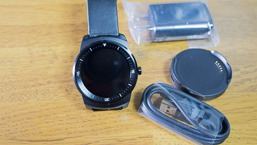
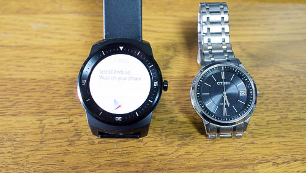
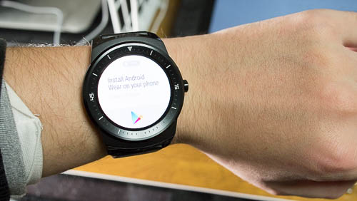
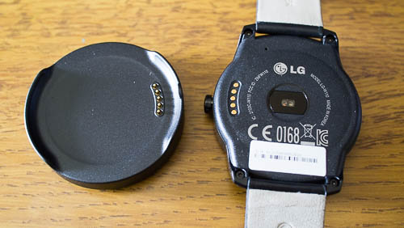

円形ディスプレイのスマートウォッチ、LG G watch Rを購入しました。

Google Playで端末の購入ははじめてですが、注文から2日後には商品が届きました。海外からの発送の割に早いなぁと思いました。

早速使ってみようと思ったものの、私の持っているスマホが古くてLG G watch Rとペアリングすることができませんでした。詳細は私が対応端末購入してから改めて書きたいと思います。

## 見た目はちょっと大きい腕時計

比較対象は私が持っている腕時計です。

並べてみると文字盤が1回り大きいです。（遠近法ではないです）

見た目に反して軽いのがせめてもの救いです。本体は大きい割に軽く、ベルトが革なのもあって、重さは隣に置いている腕時計と同じくらいです。（LG G watch Rが62g、隣の腕時計が52gでした）

手に持ってみると、小さい腕時計の方が重く感じるくらいでした。

文字盤のサイズが大きいので、手首の骨に当たってちょっと気になります。

## 充電用クレードルと端子で接続

充電用クレードルにマグネットが仕込んであるようで、腕時計に軽く吸着する感じで収まります。

充電用の端子が腕時計本体についているので、そこがクレードルの端子と接触することで充電できます。

LG G watch R自体にはUSBの端子はついていないので、充電するにはクレードルが必須となります。

説明書にも「端子の腐食に注意しろ」と書いてありましたが、夏場これを腕に装着しっぱなしにしておくと汗でえらいことになりそうなのが怖いですね。

本体をクレードルに置くにはベルトが邪魔になってかなりスペースを取ります。クレードルは机の上に直置きするより、何か台座のようなものの上に載せて、ベルトを垂らせるようにした方がスマートでいい気がします。

実際に試したわけではありませんが、これを毎日クレードルの上に置いてやるのはやや手間なように思います。

## Android4.3以上を搭載した端末が必要

自分の使っている端末が対応しているかどうかは<a href="https://g.co/WearCheck">ここでチェックできます</a>。（ペアリングしようと思っている端末でアクセスしてくださいね）

<a href="https://support.google.com/androidwear/answer/6056390?hl=ja">GoogleのAndroid Wear向けのよくある質問</a>。

ちなみに私は自分の使っている携帯が対応していないということに、これを注文したあとで気づきました。

ペアリングできなくても時計としてくらいなら使えるだろうと思っていました。しかし、LG G watch Rの電源を入れたら最初に出てくるのが「ペアリングしろ」という画面です。対応した端末を持っていないと何の役にも立たない文鎮でした。

## どうにか使おうと悪あがきをしてみた

エミュレータを使ってなんとかできないものかと思って試してみたのですが、どうにもなりませんでした。

<ul>
<li>Android SDK Emulator　→　Bluetoothが使えない</li>
<li>Genymotion　→　Bluetoothが使えない</li>
<li>BlueStacks　→　Bluetoothで接続できない。Bluetoothなどの設定ができない。</li>
</ul>

状ではAndroid 4.3以上を搭載したBluetoothに対応した実物を用意しなければ、Android Wear製品を使用できないようです。

ちなみにペアリングしない状態で電源を入れたまま放置していると、「リセットするまでデモモードで動かす？」と聞いてきます。

と言っても、デモモードにしたところで現在時刻を表示できるわけではありません。こんなかんじで画面が表示されるよというだけのモードなので、ペアリングしない限り本当に何もできないです。ここまで何もできないとは思いませんでした。

早急に端末を調達しようかとも思ったのですが、Nexus6を買うつもりだったので素直に1か月ほど待つことにしました。実際の使い勝手はまた改めて書きたいと思います。
