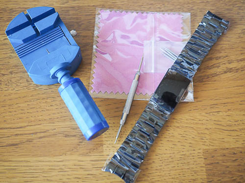
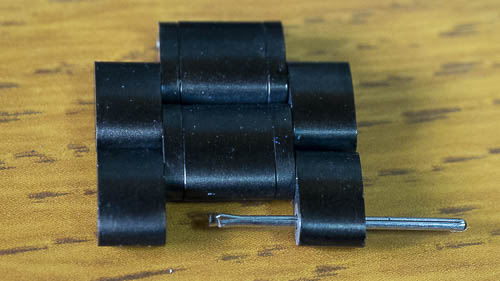
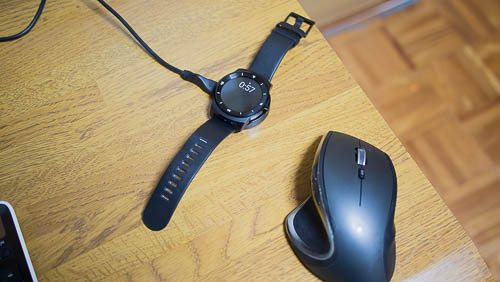
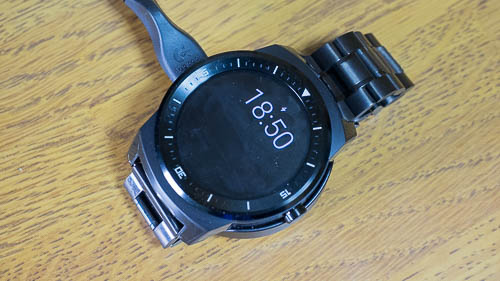

G watch Rのバンドは革のベルトなんですが、これだと付け外しが面倒くさいのと、きっちり締めるのが難しいんですよね。腕のサイズにピッタリにしようとすると、留穴に爪をいれるため一時的に腕を締め付けなければいけませんし、そこまできっちりしてしまうと外すときも痛いです。

そんなこともあって、最初からついている革のバンドをメタルバンドに交換することにしました。黒のメタルバンドならG watch Rによく似合うだろうとか、そんな軽い気持ちで挑戦してみたのです。

結論から申しますと、思ったほどイケてませんでした。

そもそも革のベルトを外すところから苦戦しました。

<iframe width="480" height="270" src="https://www.youtube.com/embed/2_fiA1Wrnsk" allowfullscreen></iframe>

取り替えたメタルバンドで腕にはめてみると、革のベルトは革のベルトで非常に優秀なんだということに気付かされました。

更に事前の下調べを怠ったせいで無駄な買い物をしてしまったとか、想像以上に調整が大変だったとかいう心理的な要因のせいもあるんですが、当初思っていたほど「サイコー」って気分にはなりませんでした。

## 弓カンと直カン

G watch Rはベルトの交換ができるタイプの腕時計です。ただし、本体との接続部分の形状に注意が必要です。

弓カンと直カンという2種類があって、G watch Rに使えるのは直カンの方です。私はそんな違いがあるとは知らずに弓カンの方を買ってしまいました。弓カンだとアーチ状になっていて、はまらないんですよね・・・。

<a class="amazonjs_indicator_title" href="#">腕時計 ベルト ステンレス ３連 プッシュ式　直カン 22mm Dバックル 【 時計 バンド ＋ バネ棒 ＋ バネ棒外し】 3点 セット 黒 ブラック 22</a>

私はAmazonで買ったのですが、ベルトの品質も決していいとはいえません。私の手元に届いた商品はメッキが一部剥がれてましたし。

どうしてもベルトを交換したいというのであれば、可能なら高くとも時計屋さんで買って交換してもらうのがいいと思います。

私も初めはそうしようとしたんですけど、見に行った時計屋さんに黒で22mmのメタルバンド置いてなかったんですよね・・・。

## ベルトの長さの調整について

ベルトの長さの調整は、初めてやる人にはハードルが高いと思います。専用の道具なしには大変な作業です。

これは間違って買った弓カンのベルトについていたコマ外しです。こういう道具を使っても、長さの調整は素人には難しいです。

ちなみにこのセットについていたコマ外しは、原価10円くらいじゃないかというくらいのおもちゃみたいなものでした。そのせいで余計にコマ調整に手間取りました。やるならちゃんとした道具を揃えてからやった方が精神的にも優しいと思います。（むしろ素直にお店に持って行って調整してもらってください）

ちなみに、コマ外しの際にはピンを抜く方向にも注意が必要です。

分かりづらいかもしれませんが、コマを止めているピンは一本の棒ではなく、ピンを折り曲げた形状になっています。割れている方を押して外そうとすると非常に外しにくいです（というより外せないと思います）。押す向きがあることも知らなかったので、コマ外すのにもえらい苦労しました。

ピンの両端をよくよく観察してみると、丸い面と平らな面（割れてる面）があると思います。丸い面を押して外すようにしてください。（ちなみに写真は逆側から外そうとして、にっちもさっちもいかなくなった状態です）

ちゃんとした道具とそれなりの知識が必要なので、経験者でもない限り、専門家にやってもらった方が絶望に苛まれなくてすみます。

## 充電クレードルに置くときの問題

これは革のバンド、メタルバンドでどちらも一長一短あるのでどちらがいいとは一概には言えません。

革のバンドはベルト部分が開放されてるので、クレードルに置きやすいのが良い所です。代わりにベルトが上下にベロンと飛び出るせいで、設置場所のスペースが余分に必要になるのが残念なところです。

クレードルが小さいのに上下に倍以上の空間をとっているのがお分かり頂けるかと思います。このクレードルの下に土台を置いて、ベルトを下に垂らすような設計になっていたら印象はずいぶんと違うんですけどね・・・。

対してメタルバンドにした場合ですが、クレードルに置いて充電するのが面倒くさくなります。

正確にはクレードルに「置く」というより、クレードルを腕時計の間に「はさむ」と表現するのが正しいです。マグネットでG watch Rにくっついてくれるので、クレードル自体が多少浮いていても充電はできます。それでも革ベルトに比べると、充電ができているのかどうか確認しなければならないという意味で気を使います。

写真では分かりづらいですが、腕時計本体とバンドの間にクレードルがはさまってます。

革バンドと比べると省スペースで見た目もいいのはいいところなんですが、充電は毎日やっておくべきことなので、手間が増えるのはよろしくないかもしれません。

余談ですが、Android Wearに限らずスマートウォッチは、本体のデザインとかより充電方法の仕組みとかクレードルのデザインを重視した方がいいかもしれません。実際に毎日使っていると、充電の手間が結構めんどうくさいです。

## 革ベルトは革ベルトで優秀

メタルバンドに交換してみて、サイズがピッタリになり、付け外しも簡単にできるようになって、そういう意味では良かったです。

ただこれを実際に使ってみると、つけた瞬間に違和感が走りました。当たり前なんですけど、メタルバンドになったことによって、時計の重みがずしりとくるんです。

それまで革ベルトで1週間くらい使っていたわけですが、重さという意味では存在を感じさせませんでした。1日つけっぱなしでも苦にはなりません。（ゆるめに締めざるをえないせいで、動きまわって邪魔に感じることはありましたけどね）

しかしメタルバンドは重い。常にベルトの重さを感じてしまいます。

普段から重めの腕時計を使っていて、それが普通な人であるとか、重さよりも見た目やジャストフィット感を重視する人でないとつらいものがあるかもしれません。

私の場合は買い物に失敗してしまったことと、長さ調整が予想以上に難航したこともあったせいで、よけいに評価がマイナスに振れている気もします。

それらマイナス要因を排除して考えば、メタルバンドも悪くはないかもしれません。ただ、革ベルトは革ベルトで充分高性能だったのです。両方試してみないとどちらが自分に合うのかは分からなかったので、そういう意味ではいい経験になりました。

最後に、「自分でベルト交換して長さも調整してみようかな」なんて人へ、私からのアドバイスをもってこの記事を締めたいと思います。

<ul>
<li>G watch Rには直カンタイプのベルトを使う</li>
<li>ちゃんとした専用の道具を用意した方がいい</li>
<li>道具があっても非常に苦戦する</li>
<li>使わないメタルバンドの腕時計があれば、それでコマ外して試してみるといい</li>
<li>ちゃんと事前に下調べしてからやるべし</li>
<li>素直に時計屋さんにやってもらった方がいい</li>
</ul>

  