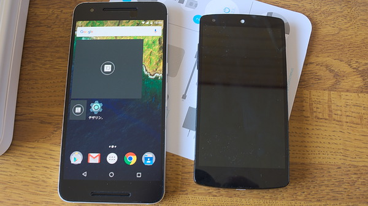
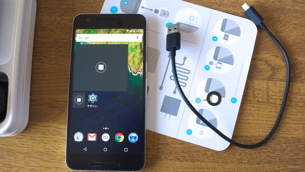
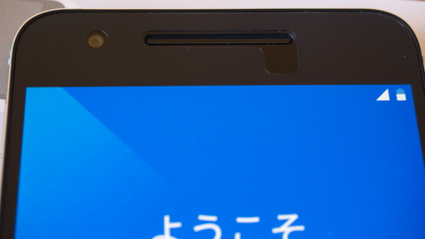

私が以前使っていた端末が中古のNexus5だったこともあって、バッテリの持ちがすごく良くなったことがうれしいです。以前はバッテリがヘタっていたせいで、一日どころか半日ももたないレベルだったのが、6Pになってからは2日間くらい持ちそうな勢いです。新品いいわぁ。

新品なんだからバッテリは当たり前としても、他に指紋認証によるロック解除がすごい便利で素敵です。Nexus6Pを買う前に、値段のこと以外で心配していたサイズの問題は、そこまで気にならないレベルだったので、総合的には満足しております。

高い買い物だったので、傷つけないようおっかなびっくりな取り扱いになってしまっているのが、ちょっと気になるくらいでしょうか。

最新端末だけあって性能もよく、デレステの3D標準モードでの動作もスムーズです。

## サイズと重さ

重さはNexus5が130g、Nexus6Pは180gとおおよそ50gの差があります。しかし6Pはサイズが大きいものの、厚みでみればNexus5より薄いので、そんなに重さの違いは気にならないかなぁという印象です。むしろアルミボディの手触りとこの重みがあることで、安定感が感じられて逆にいいかもしれません。

持ち比べてみれば5の方が小さいし軽いのですが、6Pを持った後に5を触ると頼りない印象を持ってしまいます。Nexus6Pのこの安定感たるや、なんと素晴らしいことか・・・なんて思ったりするのは最初だけかもしれませんが。

ちなみに手触りですが、アルミボディなのでMacbookなんかと同じような手触りです。

### 大きいことによるデメリット

もっとも、やっぱり重いし大きいので片手で扱うのはちょっと大変です。例えば満員電車の中でスマホをいじろうとは思えないです。そんな使い方をすると絶対落とします。

片手で操作しようと思うと、持つ場所を工夫する必要が出てきます。画面の上部をタッチしようと思うと、スマホの下側を持った状態では指が届きません。とすると片手で持つ場所を変えたりする必要があるので、自然と不安定な持ち方になります。そうなると落としてしまう危険性が高くなるわけです。満員電車でそんなことやると、絶対落とします。

### 持ち運びについて

また、6Pを持ち運ぶときどうするんだという問題もあります。

私はスマホを普段はジーパンの前ポケットに突っ込んで持ち運びます。6Pのサイズだとそれはちょっと厳しいのかなと思っていましたが、やってみると入らないことはありませんでした。ただしボディが入りきらず、ポケットの口からちらりと端末が覗いてたりしてましたが・・・。

ポケットに入れたまましゃがみ込むのもできなくはないので、意外となんとかなるのかもしれません（ケースを使わなければ、ですが）。ですがNexus5と比べると違和感があるのは否めず、基本的にはカバンなどに入れて持ち運ぶのがいいような気がします。

## USB TypeA-Cケーブルは別途買ったほうがいい

Nexus6PはNexus5Xと異なり、最初からUSB TypeA-Cケーブル（パソコンとつなぐためのUSBケーブル）が付属しています。しかしその長さは約30cmと極端に短いです。

端末をパソコンと繋いだ状態で操作しようと思うと、少なくとも私の環境では30cmは短すぎて常用に耐えません。充電用のケーブル（両端がTypeCのUSBケーブル）は1.2mほどの長さがあって困りませんが、問題はパソコンと繋ぐ時の話。

結局、私は1mの長さのケーブルを別途購入しました。

<a href="https://www.amazon.co.jp/exec/obidos/ASIN/B00Q5VMI4O/illusionspace-22/ref=nosim/" target="_blank" rel="nofollow" >ELECOM USBケーブル USB3.1 USB2.0両対応 A-Cタイプ ノーマル 1m ブラック USB3-AC10BK</a>

posted with <a href="https://kaereba.com" rel="nofollow" target="_blank">カエレバ</a>

 エレコム 2015-01-20    

<a href="https://www.amazon.co.jp/gp/search?keywords=USB3-AC10BK&#038;__mk_ja_JP=%83J%83%5E%83J%83i&#038;tag=illusionspace-22" target="_blank" rel="nofollow" >Amazon</a>

<a href="https://hb.afl.rakuten.co.jp/hgc/0e95387f.f2aef20d.0e953880.25e412bd/?pc=http%3A%2F%2Fsearch.rakuten.co.jp%2Fsearch%2Fmall%2FUSB3-AC10BK%2F-%2Ff.1-p.1-s.1-sf.0-st.A-v.2%3Fx%3D0%26scid%3Daf_ich_link_urltxt%26m%3Dhttp%3A%2F%2Fm.rakuten.co.jp%2F" target="_blank" rel="nofollow" >楽天市場</a>

<a href="https://ck.jp.ap.valuecommerce.com/servlet/referral?sid=3085416&#038;pid=882193779&#038;vc_url=http%3A%2F%2Fsearch.shopping.yahoo.co.jp%2Fsearch%3Fp%3DUSB3-AC10BK" target="_blank" rel="nofollow" >Yahooショッピング</a>

TypeA-Cケーブルはいろんなメーカーがいろんな種類のケーブルを出していますが、中には規格を満たしていないものもあったりするらしいので購入するときには注意が必要です。素直にGoogle Storeで購入した方が安全だし、しかも安かったりするかもしれません。

私の買ったELECOMのケーブルは、とりあえずはパソコン経由からでも充電出来てるし、USBデバッグもできてます。

TypeCケーブルは、端末に接続する向きを気にしなくてもいいのが利点です。一方でケーブルが太くなっていて、私はそっちの方が気になります。ケーブル径が太いので、普通のUSBケーブルと比べると取り回ししづらい印象を持っています。

そもそもTypeA-Cケーブルだと、A側（パソコン側）では相変わらず上下を気にしなくてはいけないので、何だかメリットを感じません。むしろケーブルを新調しなければいけないので、逆に不便なんじゃないかとさえ思ってしまいます。今のところNexus6P専用ケーブルになってますからね・・・。

## 液晶保護フィルム

これまではキレイな画面をキレイなまま見たいと思って透明度を優先していたのですが、今回はノングレアを選びました。個人的に安心と信頼の、ミヤビックス・オーバーレイシリーズです。

<a href="https://www.amazon.co.jp/exec/obidos/ASIN/B015Z8AI44/illusionspace-22/ref=nosim/" target="_blank" rel="nofollow" >OverLay Plus for Nexus 6P 2015 低反射 アンチグレア ノングレア 非光沢 液晶 保護 シート フィルム プロテクター OHNEXUS6P</a>

posted with <a href="https://kaereba.com" rel="nofollow" target="_blank">カエレバ</a>

 ミヤビックス     

<a href="https://www.amazon.co.jp/gp/search?keywords=OverLay%20Plus%20for%20Nexus%206P%202015&#038;__mk_ja_JP=%83J%83%5E%83J%83i&#038;tag=illusionspace-22" target="_blank" rel="nofollow" >Amazon</a>

ちなみに端末が販売されてもいないのに、専用フィルムの方が先に世に出回るのは一体どういう仕組みなんでしょうか。端末の画像を元に寸法とか割り出して作ってるんですかね？

実機で確認しながら作ったわけではないからなのか、私が買ったオーバーレイプラスだと「なぜそこに切り込みが入っているんだ」という謎の空間が存在してました。

どうもこの部分に近接センサーがあるから空いてるらしいんですが、ぱっと見た限りでは、不必要にこの部分だけ空いているので気になります。ここを除いては、フィルムのサイズ、フロントカメラ、スピーカーとマイク部分の位置関係は見事のピッタリで、その精密さに惚れ惚れします。過去最高の美しい貼り方ができたので、フィルムのジャストサイズ感もあって非常に気持ちいいです。

ちなみにノングレアを選んだ理由ですが、透明度を優先しても画面の映り込みのせいで見づらかったら意味ないなぁと思ったからです。Nexus5はフィルムを貼っているわけではありませんでしたが（クリスタルガードグラスアーマーを塗布していた）、太陽光下だと画面が見づらくてツライものがありました。そこで今回はノングレアを試してみることにしたというわけです。

実際に使ってみると、画面がやや白っぽく見えるのですが、映り込みがない分見やすいと思います。さらに映り込みが少ないがゆえに、指紋が目立たない気がします。

再掲ですが、左の6Pにはこのノングレアのフィルムを貼っています。対して右のNexus5はフィルム貼ってない状態です（クリスタルガードグラスアーマーでコーティングしてはいますが）。同じ状況下で写真を撮ってこれだけ映り込みに違いがあり、その分指紋が目立つかどうかにも関わってくるわけです。ちょっと白っぽく見えるのが難点ではありますが、それを差し引いてもノングレアいい感じです。

## 画面ロック解除に指紋センサー大活躍

Nexus6Pには背面に指紋センサーがあります。実はこれがすごい便利です。何にって、画面ロックの解除に、です。

画面ロックからの解除（画面が真っ暗になった状態から操作できるようにする）には、今までは電源ボタンを押して（Nexus9だと画面ダブルタップ）ディスプレイをつける→ロック画面が表示されるのでスライドしてロック解除、という手順を踏んでいました。地味に面倒くさい。

これが6Pだと、指紋センサーを使うことでロック解除まで一気に行われます。これがくっそ便利です。ロック画面使っていない人にとっては関係ないことですが、端末をパスワードかけて保護しつつも、自分で使う分には指紋センサーで素早く使えるっていうのは非常に便利です。

この指紋センサーは端末ロック以外にも、この端末で入力するパスワードの代わりに指紋を使うことができます。支払いの認証とかにも指紋を使えます。しかし指紋認証の精度がよく分からない（他人の指紋を誤認識しないのか分からない）ので、私は端末ロック解除にだけ使ってます。

指紋センサーの位置が端末を手に持ったときに人差し指がくるような位置なので、端末を持ったら画面が点灯、すぐに使える状態になるというイメージです。パスワードでプライバシーを守りつつも、自分は快適に使える、素敵じゃないですか。

別に使わない、むしろ要らないよと思っていた指紋センサー。だからこそ余計に便利に感じてしまうのかもしれません。

  