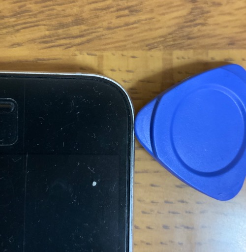

Nexus6Pのバッテリを交換した。

電源を入れるとバッテリ残量が80%以上残っているにもかかわらず電源が落ちるようになり、最終的にはケーブルから給電していないと即座に落ちるようになった。おそらくバッテリの寿命なのだと思う。

電源ケーブルを繋ぎっぱなしにしていれば使えなくはない。アプリ開発の検証機としてはそれで十分である。

しかし電源ケーブルを繋ぎっぱなしと言っても、それはコンセントに接続していればの話だ。パソコンとUSBケーブルでつないだ状態では、起動時に必要な電力が賄えないらしく、OSすら立ち上がらない。仕方がないのでコンセントから給電しながら起動→しばらくそのままにしておく→頃合いを見計らってパソコンのケーブルに差し替えるという手順を踏んでいた。これもケーブルの繋ぎ変えに手間取ったら電源が落ちるのであまりいい解決方法でもない。なにより面倒くさくて仕方がない。

普段使っている端末は別にあるし、アプリ開発時もそちらでやることの方が多くなり、Nexus6Pはずっと放置していた。しかしそれもいい加減にもったいないので、バッテリ交換をすることにした。

業者を利用するか自分で交換するかで少し迷ったが、端末を郵送で送ったりするのは手間なので、壊れて再起不能になることも覚悟の上で自分で交換することにした。

結果的には、壊れることもなく無事に交換することができた。交換後の状態は、遠目から見れば分解したのかわからないような状態である。

近寄ってみれば、ところどころ傷が入ったりしているのが分かるが、分解によらない傷も多いのであんまり目立たない。

買ったのは交換作業に使えるちょっとしたツールとセットになって1980円というバッテリ。

<table cellpadding="0" cellspacing="0">
<tbody>
<tr>
<td>

<table>
<tbody>
<tr>
<td style="width:240px"></td>
<td style="vertical-align:top;width:248px;">

<a href="https://hb.afl.rakuten.co.jp/hgc/17d35250.d38cb7b9.17d35251.4a35c1b4/?pc=https%3A%2F%2Fitem.rakuten.co.jp%2Fairnetjapan%2Fgoogle_607%2F&m=http%3A%2F%2Fm.rakuten.co.jp%2Fairnetjapan%2Fi%2F10000527%2F&link_type=picttext&ut=eyJwYWdlIjoiaXRlbSIsInR5cGUiOiJwaWN0dGV4dCIsInNpemUiOiIyNDB4MjQwIiwibmFtIjoxLCJuYW1wIjoicmlnaHQiLCJjb20iOjEsImNvbXAiOiJkb3duIiwicHJpY2UiOjEsImJvciI6MSwiY29sIjoxLCJiYnRuIjoxfQ%3D%3D" target="_blank" rel="nofollow noopener noreferrer" style="word-wrap:break-word;">(YP)B-607【GOOGLE 互換品】【送料無料】 NEXUS 6P 高品質　専用互換バッテリー 交換用 取り付け工具セット付 バッテリー 電池パック google nexus6P （ビッグハート）P23Jan16</a>
価格：1980円（税込、送料別) (2019/2/5時点)

<a href="https://hb.afl.rakuten.co.jp/hgc/17d35250.d38cb7b9.17d35251.4a35c1b4/?pc=https%3A%2F%2Fitem.rakuten.co.jp%2Fairnetjapan%2Fgoogle_607%2F%3Fscid%3Daf_pc_bbtn&m=http%3A%2F%2Fm.rakuten.co.jp%2Fairnetjapan%2Fi%2F10000527%2F%3Fscid%3Daf_pc_bbtn&link_type=picttext&ut=eyJwYWdlIjoiaXRlbSIsInR5cGUiOiJwaWN0dGV4dCIsInNpemUiOiIyNDB4MjQwIiwibmFtIjoxLCJuYW1wIjoicmlnaHQiLCJjb20iOjEsImNvbXAiOiJkb3duIiwicHJpY2UiOjEsImJvciI6MSwiY29sIjoxLCJiYnRuIjoxfQ==" target="_blank" rel="nofollow noopener noreferrer" style="word-wrap:break-word;">

楽天で購入

</a><a href="https://hb.afl.rakuten.co.jp/hgc/17d35250.d38cb7b9.17d35251.4a35c1b4/?pc=https%3A%2F%2Fitem.rakuten.co.jp%2Fairnetjapan%2Fgoogle_607%2F%3Fscid%3Daf_pc_bbtn&m=http%3A%2F%2Fm.rakuten.co.jp%2Fairnetjapan%2Fi%2F10000527%2F%3Fscid%3Daf_pc_bbtn&link_type=picttext&ut=eyJwYWdlIjoiaXRlbSIsInR5cGUiOiJwaWN0dGV4dCIsInNpemUiOiIyNDB4MjQwIiwibmFtIjoxLCJuYW1wIjoicmlnaHQiLCJjb20iOjEsImNvbXAiOiJkb3duIiwicHJpY2UiOjEsImJvciI6MSwiY29sIjoxLCJiYnRuIjoxfQ==" target="_blank" rel="nofollow noopener noreferrer" style="word-wrap:break-word;"></a>

</td>
</tr>
<tr></tr>
</tbody>
</table>

</td>
</tr>
</tbody>
</table>

## 参考にしたサイト

<a href="https://jp.ifixit.com/Guide/Nexus+6P+Battery+Replacement/104307?lang=en">https://jp.ifixit.com/Guide/Nexus+6P+Battery+Replacement/104307?lang=en</a>

<a href="https://blog.pathonosuke.net/entry/2018/01/26/155911">https://blog.pathonosuke.net/entry/2018/01/26/155911</a>

背面の下部パネルとカメラ部分のガラスカバーの取り外しはiFixitを、本体の取り外しは上記ブログの記事を主に参考にさせていただいた。

## 用意しておくといいもの

私は上記バッテリについてきたツールに加えて、デザインナイフとドライヤーを別途用意した。用意したというか、家にあったものを利用した。

デザインナイフはあったほうがいいと思う。デザインナイフである必要はないが、薄くて細くてそれなりの硬さがあるものとなると、デザインナイフが最適なんじゃないかと思う。普通のカッターナイフだと刃の厚みがあるので、少なくとも背面のカバーを取り外すのは大変だと思う。何より大きくて取り回しが大変だろうし。

ドライヤーは接着剤を剥がしやすくするためにカバー部分を温めるのに使う。該当箇所に5秒くらい温風を当てる→デザインナイフを差し込む→ドライヤー5秒→デザインナイフを差し込む・・・という感じで作業した。接着剤の部分に熱が加えられればいいので、カイロを使うのもいいらしい。ちなみに温める工程を踏まないと、カバーを破壊せずに剥がすのは難しいと思う。

## 分解開始

最初に断っておくが、私の場合はうまくいったがこのとおりにやればきれいに交換できることを保証するものではない。やるなら自己責任でどうぞ。

まず最初にSIMトレイを外しておく。SIMトレイ外すのは最初にやっておいたほうがいいだろう。あとに回すと間違いなく忘れる。

端末背面の白いラインっぽい部分とカバーの隙間にデザインナイフを差し込み、ドライヤーで徐々に熱しながら浮かせる。この際、無理に刃を入れるとデザインナイフが折れて危ないので気をつける（何回か切っ先が欠けた）。

デザインナイフはまっすぐ差し込むだけで、ほじくり返すようにはしなかった。やろうとしたら切っ先が間違いなく折れる。外周に沿ってデザインナイフを垂直に差し込む→ドライヤーで温めるを繰り返していれば、そのうちカバーが浮いてくる。浮きさえすればその隙間に横向きにデザインナイフを差し込み、外周に沿っていけば無事に剥がせると思う。

ガラスパネル部分も同様。パネル部分が浮くまでは根気強く垂直に差し込んではドライヤーの熱を当て・・・というのを繰り返す。

カバーとガラスパネルががはがせたらネジを外す。ネジは上部（カメラ部分）1箇所、下部の部分にも一箇所シールでネジが隠されている部分があるので注意。上部のネジを2本、下部の4本を外せば本体を取り外す作業に移る。

本体を外すのはバッテリのおまけでついてきた吸盤とぶ厚めのピックを使った。吸盤で手前に引っ張りながらケースの外周部分を分厚いピックで抑える。ある程度浮いて薄いペラペラなピックを本体とケースの隙間に差し込む。そうやりながら徐々に外していく。

吸盤であまり無理に引っ張らないほうがいいようだが、私の場合は運が良かったのか無事に外せた。液晶保護フィルムをつけたまま作業をしたのが良かったのかもしれない。

作業風景を撮影したりはしていないので画像はない。iFixitのサイトを参照するのがよいだろう。

液晶部分とケースを分離できればあとは必要なコネクタを外してバッテリをリプレースするだけである。

基盤部分に直接熱風を当てるのははばかられたので、バッテリを外す際にドライヤーで熱することはしなかった。おかげで接着剤がなかなか剥がれず苦労した。バッテリを取り外すのが一番大変だったかもしれない。バッテリのおまけで付いてきたピンセットを使ってなんとか取り外すことができた。

バッテリを交換できればあとは逆の手順で取り外したものを取り付けていけばよい。

一応両面テープっぽいものがバッテリには付属していたのだが、私は使わなかった。カバーもガラスパネルも単にはめ直しただけである。

## 交換後の状況

バッテリ交換したあとは電池の状況は改善された。少なくとも、バッテリ残量が80%以上あるのにいきなり電源が落ちることはなくなった。もっとも、すでに普段遣いする端末ではなくなっているので、バッテリがもつようになったところで特に恩恵があるわけではないのだけれど。

とはいえほぼほぼ単なる文鎮でしかない状態から、検証端末としていつでも利用できる状態には改善された。少ない出費で直ったのだからめでたしめでたしである。

## やっぱり駄目だった

6月2日追記。

基本的には動作に問題ないものの、実はカメラがうまく動作しなくなっていることにあとになって気づいた。
カメラを起動してみたら、背面カメラは初回起動時には映ることもあるのだが、前面カメラに切り替えると何も表示されなくなる。
その後背面カメラに戻すと、今度はこちらも何も表示されなくなる。そんな状態になっていた。

バッテリを交換したので、稼働時間の問題は劇的に改善された。
今も検証端末として利用はしていたのだが、カメラを使った機能はバッテリ交換してから触っていなかったので気づくのが遅れた。

内部の配線の接触でも悪いのだろうかと再度分解してみようとしたところ、今度はカメラのガラスパネル部分にヒビが入ってしまった。
そこで作業は諦めた。

やっぱり自分で作業すると、こういった細かい不具合に生じることがあるということである。
