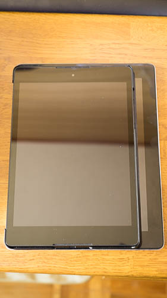
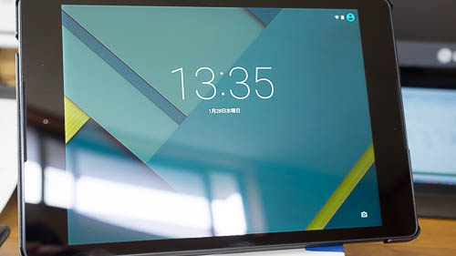

今までiPad2（Airですらない）を使っていたのですが、iOSの操作性が性に合わないこともあってAndroidタブレットを購入しました。アプリ開発用の実験機としても使えるからと、Nexus9を購入しました。新品ではなく、ヤフオクで中古購入です。

別にiPad2の性能に不満があったから買い替えたわけではありません。そもそもタブレットはそんなに活用していたわけではありません。電子書籍見たり、テレビ東京ビジネスオンデマンド見たりとか、それくらいの使い方しかしてません。

ただ、長いことAndroidスマホを使っていたことから、どうにもiOSの操作性に慣れなくて、ソフトウェアキーボード使うときにストレスを感じていたのは確かです。日本語入力なのかアルファベット入力なのか把握しきれず間違えたり、「＠」を入力するのにいちいち記号に切り替えないといけないのが不便です。

その点、Android（Google日本語入力）は、qwerty配列にしておけばスペースキーの左に「＠」ありますし、フリック入力を利用することでそのまま数字も入力できて便利です。（入力欄がemailの指定されている場合ですけどね）

iPad2とサイズを比較すると、横幅が一回り小さいです。比較している端末が古いので、比較の意味があるか微妙ですけどね。

## 電子書籍の閲覧

iPadではKindleとiBooksを使って電子書籍を見ていました。EPUBやPDF形式の電子書籍を閲覧するのにiBooksがとても便利でした。

Nexusに乗り換えるにあたって心配だったのが、EPUBやPDF形式の電子書籍がちゃんと見れるかどうかということでした。

Androidだと標準のアプリはPlayブックスになります。閲覧するためには、Google Play上にEPUBやPDF形式の電子書籍を一旦アップロードしてやる必要があります。

直接データを端末に移すことはできませんが、その代わりに閲覧状況が端末をまたいでも引き継がれるのが便利なところです。

OSはLolipopで使っていますが、Nexus5やNexus9からでも軽快に動いています。マーカーつけたりメモを入れたりも可能なので、EPUBやPDFの閲覧に問題はないです。

## バッテリの持ち

バッテリの持ちはそんなにいいわけではないかもしれません。少なくとも、iPad2のときに感じた「え、お前まだバッテリもってたの！？」というような驚きはありません。

ちょっと誇張表現が入りますが、iPad2は1か月放っといてもバッテリが残ってるイメージでした。Nexus9は使わない状態のまま放置していても1週間ちょっとというイメージです。（スリープ状態でもWi-Fiオンで運用していたせいかもしれませんが）

## 気になるところ

Nexus9のせいなのか、それともOS（Lolipop）のせいなのか今ひとつ判断がつかないのですが、アプリの動作がたまにおかしいことがあるのが気になります。

テレビ東京ビジネスオンデマンドを起動したら黒い画面のまま止まることがありました。起動しなおしたら直ったりするので、絶対に使えないわけではないところがまた気持ち悪いです。

Kindleだとフォントサイズが特定の大きさになると表示が崩れます。Kindle日本語フォントのダウンロードがうまくいってないのかもしれません。

最新端末故にか、動作がおかしかったり、そもそも対応していなかったりするアプリがあるのが残念なところです。

## カバーはあったほうがいいかも

自分で買ったわけではありませんが、中古で買ったらおまけでついていました。

<a href="http://www.amazon.co.jp/exec/obidos/ASIN/B00PTQA5LO/illusionspace-22/ref=nosim/" rel="nofollow" target="_blank">【MOKO】Google Nexus 9 超薄 軽量型ケース Google Nexus 9 8.9 インチ Volantis Flounder Android 5.0 Lollipop tablet by HTC T1用マグネット開閉式 三つ折 高品質PU レザーケース (ブラック)</a>

posted with <a href="http://kaereba.com" rel="nofollow" target="_blank">カエレバ</a>

 MOKO     

<a href="http://www.amazon.co.jp/gp/search?keywords=Volantis%20Flounder&#038;__mk_ja_JP=%83J%83%5E%83J%83i&#038;tag=illusionspace-22" rel="nofollow" target="_blank" title="アマゾン" >Amazon</a>

<a href="https://atq.ck.valuecommerce.com/servlet/atq/referral?vcptn=shpg%2Fp%2FbJklbh6QH6IgN9lcoN5ofw--&#038;sid=2219441&#038;pid=877935733&#038;vc_url=http%3A%2F%2Fshopping.search.yahoo.co.jp%2Fsearch%3FuIv%3Don%26ei%3DUTF-8%26tab_ex%3Dcommerce%26slider%3D0%26va%3DVolantis%2520Flounder" rel="nofollow"  target="_blank" title="Yahooショッピング" >Yahooショッピング</a>

本体だけで使うよりはカバーがあった方がいい気がします。手触りもいいし、簡易スタンドにもなるし、カバーを閉じれば自動的にスリープ状態になってくれます。

端末のサイズがiPad2と比べて小さいのでカバーがついていてもかさばりません。

ぶっちゃけてしまうと、必要だから買ったわけではなく、なんとなく入札したらそのまま落札出来てしまったという経緯で手に入ったので、「これだ！」ってことが書けなくて申し訳ないです。「こういうところどうなの？」というご質問があればお答えしたいと思いますので、お気軽にどうぞ。

  