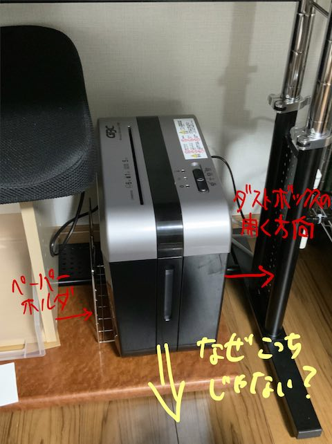

これまでは共用のシュレッダーを使っていたのだけれど、シュレッダーに掛けたい書類を溜めてから逐次持っていくのが面倒くさかった。それにシュレッダーの型が古いのもあったので、自室用に新しく買うことにした。

決め手はマイクロクロスカットとお値段のバランスである。もう1つ付け加えるならカードの裁断も紙と同じレベルでやってくれるところも決め手になった。

<!--more-->

## カードの裁断

シュレッダーも最近は多機能になり、メディア類、CDやクレジットカードなどを裁断する機能があって当たり前になってきている。ただ、メディアを裁断できますといっても実は投入口が違っていたり、メディア類だけ大まかな裁断しかできませんというモデルが多い。

実はカードに関しては、私はハサミで少しずつカットして、ゴミを出す日を分けて捨てるという慎重さで対応していた。当然とても時間がかかる上に面倒くさかった。しかもカードを処理するのに何ヶ月もかかるので、裁断中のカードがどんどん溜まっていくのであった。

別に誰かにゴミを漁られて復元されて悪用されるなんてことは現実的にはないのだが、神経質すぎると思いつつもカードの裁断は神経質すぎるほど慎重にしていた。

とはいえあまりにも面倒かつ時間がかかるので、シュレッダーを買うに当たってカードも裁断できる機能があるものを選ぶことにした。その際に引っかかるのが、カードの裁断などは別枠というのが多すぎる。一緒に裁断できてもマイクロクロスカットを満たさないというものが多い中、ようやく見つけたのがこの製品であった。

## そこに弱点があったか・・・

実はAmazonのサイトを見れば一目瞭然なのだが、この製品にはペーパーホルダーが付属している。シュレッダーにかける紙を一時的にためておくためのものだろう。

しかしこのペーパーホルダーはダストボックスが開く方向と反対についているのである。なぜそうなった。なぜダストボックスの引き出し方向を横にしなかったのだ。

これではゴミを出す度にいちいちシュレッダー本体を引き出してやらないといけないではないか。面倒くさい。

カードの裁断の面倒臭さから開放される代わりに、ゴミ捨ての面倒さが加わってしまった。本末転倒ではないか。

もっとも、この効果があるのかないのかよくわからないペーパーホルダーを使わなければ済む話なので、致命的なほどの弱点ではないのだけど。

しかしダストボックスの開く方向とペーパーホルダーの位置が真逆にあると、普通に使いづらいと思うんだがそう思うのは私だけだろうか。

## 裁断性能

文句はこのくらいにして、さっそく試し切りしてみた。これまで使っていたシュレッダーより静かだし、細かく裁断できているし、カードも同じサイズで裁断できている。性能に文句はない。価格も比較的お手頃だし、普通によい製品だと思う。

ダストボックスとペーパーホルダの位置関係がとても気になるけれども、本来の仕事はしっかりこなしてくれる。特に今まで使っていたシュレッダーがかなりやかましかったので、その静かさには驚くほどである。カットした後の紙片も小さくていい感じである。

## 重心が高すぎる

注意点としては、ものすごく頭でっかちでめちゃくちゃバランスが悪いことに気をつけよう。ちょっと足が当たっただけでコケてしまうようなほどに重心が高い位置にある。箱から取り出して設置しようとする間に何度倒しそうになったことか。ゴミが溜まれば幾分ましになるかもしれないが、たかが紙の重さなのであまり変わりはなさそうな気がする。

人の移動が頻繁な位置に置いておくと、ちょんと足が当たっただけで倒れてしまうであろう。置き場所に気を配る必要がある。

とはいえ私の写真のように配置していると、いちいちゴミを捨てる際にシュレッダーを引き出さなければならない。しかも紙を入れるのに机の天板が微妙に邪魔になるときている。置き場所はちょっと悩ましいかもしれない。

## まとめ

総じて価格と性能のバランスのよい製品だと思う。この価格帯でマイクロクロスカット、つまり細かく紙片を裁断できて、しかもカードもOKという製品にはなかなかお目にかかれないだろう。お目にかかれるんだったら買う前に教えてほしかったが。

裁断する際の音も静かで夜間に使用しても問題はないのではないだろうか。少なくともレーザープリンタの音のほうが大きいと感じる程度には静かだと思う。個人事業用のシュレッダーとしてはコスパにすぐれたよい製品だと思う。

ちなみにシュレッダーを長く使用するにはメンテナンスシートと言って専用の油を染み込ませた紙を食べさせるといいらしい。このアコ・ブランズのシュレッダーはOP12Sというものが純正らしい。

<iframe style="width:120px;height:240px;" marginwidth="0" marginheight="0" scrolling="no" frameborder="0" src="//rcm-fe.amazon-adsystem.com/e/cm?lt1=_blank&bc1=000000&IS2=1&bg1=FFFFFF&fc1=000000&lc1=0000FF&t=illusionspace-22&language=ja_JP&o=9&p=8&l=as4&m=amazon&f=ifr&ref=as_ss_li_til&asins=B001161R8Q&linkId=3777ba1e4ce582e0410b96e5062ac74b"></iframe>

12枚入りのものになるが、説明書には品番だけ書いてあって、どの程度の頻度でメンテすべきか書いてない。コスパはいいが説明書は不親切なようである。刃物用の油を直接さすという手も無きにしもあらずかもしれないが、普通に危ないのでこういったメンテナンスシートを使うべきだろう。頻度は分からんが。

この手のメンテナンスシートは公式サイトFAQにもあるんだが、摩耗を防ぐためのもので摩耗したものを復活させる効果はない。だからこそどれくらいの頻度でメンテナンスシート食べさせるべきなのか知りたいのだが・・・。一応問い合わせをしてみたので結果はのちほど追記するかもしれない。

