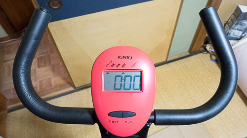
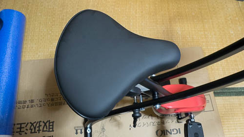

今回自分で買ったわけではないのですが、弟が買ってきたものを使ってみたので感想を綴ってみます。

## スポーツバイク経験者として

普段クロスバイクに乗っている者として言わせてもらうと、室内で運動不足を解消するために使うにはちょっとつらいものがあります。といっても、それはスポーツバイクの乗り心地を知っているからです。

疲れると思った理由は、フィットネスバイクに乗って漕ぐ姿勢が直立に近いからだと思います。

ハンドルが手前側に寄っているせいで、握っていると腕が疲れてきます。ハンドルのところに肘を置くことで前傾姿勢に近くなりますが、これはこれで漕ぐとき疲れます。

ふくらはぎあたりが辛くなってくるのは、おそらくペダルのクランク長が短いせいだと思います。ペダル位置がやや下気味にあるため、太ももで回すというよりふくらはぎで回す感じになります。

といってもこれはスポーツバイクと比べたらの話です。比較的安いサイクリングマシーンにそれを求めるのはやや酷と言えます。

サドルが幅広で、こいでいると足の付根あたりに当たって気になります。

私の使い方は、ペダルの重さを一番軽くした状態で、センサー上で速度40を目安にしたスピードでペダルを回しています。これはママチャリでスポーツバイクのように走っている状態なので、疲れるのも当たり前かもしれません。

## スポーツバイク乗ったことない人ならアリ

酷評してますが、スポーツバイクを前提としなければ充分にいい製品だと思います。

サドルが幅広でお尻や足のつけ根が痛くなるのはともかくとして、駆動音は静かでいいです。

木造2階建ての家屋の2階で使っていても、真下の部屋ではフィットネスバイクを使っていることが分かりません。さすがに何の音もしない静寂状態であればペダルを回している音は聞こえます。しかしそれは生活音で掻き消えてしまうようなレベルなので、テレビつけてたらまったく気になりません。

振動についても同様です。フィットネスバイク上で立ち漕ぎしたり、体を左右に振るほどに勢いをつけてペダルをこがない限り、ガタガタと振動が階下に響くことはありません。下の階の人に迷惑かなと思っている人でも、深夜に使わない限り迷惑になることはないでしょう。

さすがにこいでいる本人は駆動音が聞こえてしまうので、テレビを見ながら使うなら普段より多少ボリュームを上げる必要があるかもしれません。

それでも、私がサイクリングマシーンについて抱いていた「駆動音がうるさい、振動がすごい」という先入観は、いい意味で裏切られました。

寒い冬でも室内で運動不足を解消できます。外に出て車に幅寄せされたりする危険もありませんし、そういう意味では使いやすいと思います。

使わないときは折り畳んでおけば省スペースでしまえます。しまえますが、気をつけないと脱いだ服をとりあえずかけておくハンガー代わりに使われることになる未来が見えるので、そうならないようしっかりと使いましょう。

  