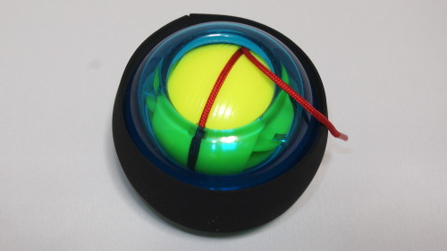

手首が細いのが気になっています。腕立て伏せをしても、手首や前腕部の筋肉というのはなかなか鍛えられません。

お風呂の中でグーパーと手を握って開いてを繰り返していると、前腕部の筋肉が太く硬くなっていいトレーニングになりますが、時間がかかることもあって面倒くさい。徐々に握るスピードが遅くなって、前腕部がパンパンになる感じは好きだけれども、しょっちゅうやりたいと思うほど楽しくはないです。

なんかいいものないかなーと探していたら、これを見つけたのです。

## お手軽にあの感覚が！

手首が太くなったりはしないけれども、握力はつくと思います。前腕部の手をぎゅっと握った時に太くなる筋肉が、一回り大きくなった気がします。

ギュインギュイン回すのも楽しくて癖になります。腕立て伏せでは鍛えにくい部分を、遊び感覚で手軽に鍛えられます。

最初は回し方がよく分かりませんでした。赤い紐を引っ張って黄色い部分を回すのですが、力いっぱい引くより、引っかからないように引きぬくことを心がけてやるのがいいでしょう。紐が途中で引っかかると充分な初速が得られず、いくらやってもうまく回転しません。初速がつきさえすれば、手で持ってぐるんぐるんと回せば回ってくれます。

ただ回し出すと、ギュインギュインとかなりやかましい。テレビを見ながらやろうと思うと、ボリュームを上げてやらないと聞こえないです。家族が見ている横でやると、間違いなく顰蹙を買います。

## ボールの周りに何か巻く必要あり

このボールを回すと手の中で暴れまわるので、かなり強く握ることになります。そうなるとこのプラスチック製の外装はかなり滑りやすく、しかも堅いので、握っているとかなり指が痛くなります。特に小指の痛みが半端ない。そのままの状態では継続して使用するのは難しいでしょう。

私は自転車のバーテープをボールの周りに巻きました。バーテープならば適度な弾力性があり、滑り止めとしても充分な働きをするので、非常に使いやすくなりました。

ローラーリストボールを使う場合、周りに<strong>何かしらの滑り止めを巻いて使うこと</strong>をおすすめします。

  