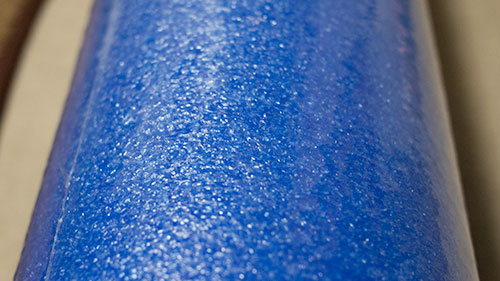
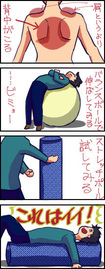

私は<em>姿勢が非常に悪い</em>です。昔から座高が高いのがコンプレックスで、椅子に浅く腰掛け、背骨を曲げるようなスタイルで椅子に座っていたせいでしょう。かなりの猫背で、時折姿勢を正そうと気をつけてみたりするが、基本的に長続きはしません。

猫背は見てくれの問題だけならず、<strong>背中が凝るのが困りものです</strong>。私は「肩が凝ったなぁ」と思ったことはほとんどありませんが、「<em>背中が凝ったなぁ</em>」というのはしょっちゅう感じます。

皆さんはどうでしょうか？

今回は、<em>猫背の矯正にいいらしい</em>という話を聞いて、ストレッチポールを買おうと思ったのですが、なんかすごい高かったので、<em>似たような商品</em>を購入してみました。あくまでストレッチポールではなく、ストレッチポールに似ている<strong>ピラティスポール</strong>という製品についてなので注意してくださいね。

## 見た目について

購入前は、ちょっと弾力性のある、サンドバッグみたいな感じのものなのかなと思っていました。

いざ届いた実物を触ってみると、予想していたものとは違ってびっくり。軽いのですが、非常に固い。<em>硬質の発泡スチロールみたいな感じ</em>で、弾力性の欠片も感じません。これで重かったら完全に凶器です。

見た目が発泡スチロールのまんまなので、<em>包装しているビニールをつけたまま</em>で使うことにしました。服とかカーペットに色移りしたりしたら嫌だし・・・。

長さは91cmとなかなか大きいですが、軽いし自立するので、<em>片付けには困らない</em>と思います。

## 背中の凝りをほぐすのにちょうどいい

簡潔にいうと、<strong>背中の凝りをほぐすのにすごいいい感じ</strong>でした。

背中が凝ったなぁと思ったときに、バランスボールに背中を預けて伸ばしてみたりしたことがありますが、あれと比べると<em>段違いの気持ちよさ</em>です。

最初の「なんだこれ、固いなぁ・・・」という感想が、そのまま長所になっています。このピラティスポールの硬さが、背中の凝り固まった筋肉をいい感じに刺激してくれます。

<em>背中をマッサージするのに、人に乗ってもらったりすることがある</em>が、あれを一人でやっている感じ。自重とポールの硬さとが相まって、ちょうどよい刺激になります。ピラティスポールに乗っかったまま、コロコロと左右に動くことで、肩甲骨の辺りなど、もみほぐしたいところに刺激を与えることができてよいです。背中限定ではありますが、<em>へたなマッサージチェアより効く</em>んじゃないでしょうか。

## 背中のマッサージ器具として優秀

これが猫背の矯正に効くのかどうかは分かりません。ただ、少なくとも背中のマッサージ器具としてはかなり優秀です。

しかし注意して欲しいのは、気持ちいいからといって、私のように調子に乗って<em>やり過ぎないようにした方がいい</em>ことでしょう。背中の凝りがほぐれても、<em>もみ返しによって違う意味で背中が痛くなってしまう</em>ので、その点は注意してください。
