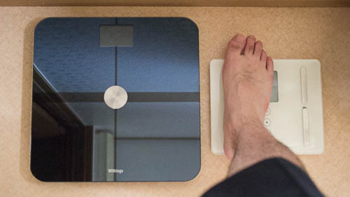

こんにちは、Genです。

最近体重の増加がヤバイことになってまいりました。足は一回り太くなり、かがめば腹がつっかえ、洗いたてのジーパンがはけなくなる。このままではイカンと慌てるに至った次第であります。

ランニングしたり自転車を乗り回したりし始めたところですが、体力がなさすぎてあまり長時間続けてできないのが難点です。いっそのことジムにでも通ってみるかと思ってみるものの、月謝が高いので二の足を踏んでいます・・・。

とりあえずは手持ちの自転車で走ってみたり、ジョギングしてみたりで運動の方はなんとかしようとしているところです。

## 何か買ってモチベーションを上げよう

ところで、ダイエットをするのはいいにしても、何かしらモチベーションを上げるためにも何か買おうかと考えてみたのです。ルームランナーとか家の中でも運動できるマシンを買おうかと思ってみましたが、「置き場所がない」とあえなく却下されてしまいました。まあ高いからいいかと諦めました。

次に心拍計とかの運動量を計測するアイテムを考えてみました。しかし運動するときに何かを装着してやるというのが抵抗があり、こちらは個人的に却下しました。運動結果のログを記録できたら面白いかなとは思うものの、面倒くさそうで長続きしないですしね。

そして行き着いたのがこのWithings Smart Body Analyzerという体重計です。体重の推移を計測するだけで勝手に記録してくれる賢い体重計です。体重計に無線LANが内蔵されており、自動的に計測したデータをサーバへアップロードしてくれるわけです。

## 体重計の初期設定について

この体重計は初期セットアップをするのにスマートホンが必須です。iPhoneかAndroidのBluetoothに対応している携帯が必要です。というのも、体重計の初期設定を行うためにはスマホのアプリを使う必要があるからです。

一応無線LANを使わずに使うこともできるようですが、無線LAN使わないなら他の製品を購入した方がいいと思います。単なる体重計としてはこの製品は高すぎます。

ちなみに初期設定ですが、意外と面倒くさかったことを付記しておきます。スマホのアプリで設定を行う関係上、イレギュラーな環境までは配慮してくれていないようです。例えば、スマホとの接続が設定途中で切れてしまうと最初から設定をやり直す必要があります。

他にも無線LANのSSIDを隠蔽していると無線の設定ができない（SSIDを直接入力して設定することができない）というのも困りました。仕方がないので親機でSSIDの隠蔽を解除してから設定を行いました。

## 使ってみた感想

とりあえず、この体重計はでかいです。でかすぎます。

右側が今まで使っていた体重計、左が本製品です。正方形の形でかなり大きいことがお分かり頂けるかと思います。置き場所を考えてから購入することをおすすめいたします。

他には高い割に計測できる項目が少ないということがあげられます。無線LANで計測結果のログを買ってとってくれるのは最高に面白いのですが、記録できる項目は体重、体脂肪率、心拍（？）、室温（？？）、部屋の酸素濃度（！？）です。なんとユニークな計測項目か・・・。

## 面倒くさがり屋は楽をすることに対してケチってはいけない

この体重計の素晴らしいところは、体重のログを取るのに何もしなくてもいいところです。ただ体重計に乗って計るだけで、自動的に計測したデータがサーバへ送信され、そのデータをログとして確認することができるのです。

こういったアプリやサーバへ体重のデータを蓄積するタイプの体重計はいくつか販売されていますが、スマホを体重計に近づける必要があったりするモデルが大半で、乗るだけでいいという製品はそうありません。正直なところ、そんな面倒臭いことをしてまでログをとりたくはないです。面倒くさくなって途中でやらなくなる未来がはっきりと見えます。

その点この体重計は、乗って計測するだけで自動的にデータが蓄積されていきます。これなら私でも簡単にデータを収集することができます。自分の体重の推移を確認することで、運動の効果を確認したりすることができます。きっとこれがダイエットへのモチベーションに繋がるはずです。・・・たぶん。

この製品のメインはスマホやWebから確認できる体重の推移データでしょう。まだ買って数日なのでこれといった変化は見られませんが、体重を計測するのが楽しく感じられます。・・・まぁ、体重が減っていなくて面白くない気持ちもありますけどね。

ログが溜まってきたら改めて紹介してみたいと思います。

  